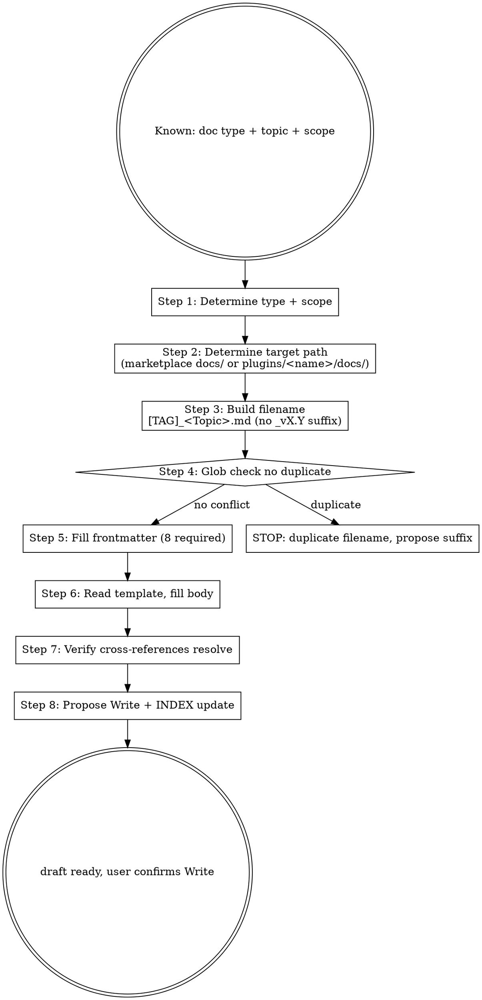

# Marketplace Doc Author

## Overview

Drafts one tag-prefixed marketplace doc per call, following:
- 6 tag prefixes (`[STANDARD]` / `[ADR]` / `[GUIDE]` / `[RUNBOOK]` / `[SPEC]` / `[POSTMORTEM]`)
- Target subdirectory (post-PR 2)
- 8-field frontmatter (type / scope / summary / owner / created / updated / state / version)
- Template-conforming body (from `docs/_templates/TEMPLATE_*.md`)

**Reference** (post-PR 2):
- `docs/rule/[STANDARD]_Documentation_Framework.md` (frontmatter schema)
- `docs/rule/[STANDARD]_GitHub_Markdown.md` (markdown style)
- `docs/_templates/TEMPLATE_*.md` (per-type body skeletons)

**Workflow position**: PR 2+ skill; before that, falls back to flat `docs/[TYPE]_Topic.md`.

## Workflow



## Step 1: Type + Scope

| Type | When |
|---|---|
| `[STANDARD]` | 元规则 / 命名约定 / commit/markdown 规范 |
| `[ADR]` | 架构 / 命名 / 拆分 / 重命名 / 删除决策 |
| `[GUIDE]` | How-to / onboarding 文档 |
| `[RUNBOOK]` | 运维 / 回滚步骤 |
| `[SPEC]` | 技术规格（schema, contract） |
| `[POSTMORTEM]` | 事故复盘 |

| Scope | When |
|---|---|
| `marketplace` | 跨 plugin / 治理 / CI / release 相关 |
| `learn-kit` | 仅 learn-kit 内部决策 / 设计 |

## Step 2: Target Path

post-PR 2 默认布局:

| Type | Marketplace 顶层 | Plugin-internal (learn-kit) |
|---|---|---|
| `[STANDARD]` | `docs/rule/` | `plugins/learn-kit/docs/rule/` (罕见) |
| `[ADR]` | `docs/adr/` | `plugins/learn-kit/docs/adr/` |
| `[GUIDE]` | `docs/guide/` | `plugins/learn-kit/docs/guide/` |
| `[RUNBOOK]` | `docs/runbook/` | `plugins/learn-kit/docs/runbook/` |
| `[SPEC]` | `docs/spec/` | `plugins/learn-kit/docs/spec/` |
| `[POSTMORTEM]` | `docs/postmortem/` | (不强加 plugin) |

PR 2 之前 (flat docs/): 所有路径退回 `docs/[TYPE]_<Topic>.md`。

## Step 3: Filename Construction

格式: `[TYPE]_<TitleCase_Topic>.md`

- `[TYPE]` 全大写带方括号
- `_` 分隔
- `<Topic>` Title_Case_With_Underscores
- **不含** `_vX.Y` 后缀（version 在 frontmatter；per active canonical path stability）

**示例**:
- `[ADR]_LearnKit_Discovery_Skills.md` ✅
- `[STANDARD]_Documentation_Framework.md` ✅
- `[ADR]_LearnKit_Discovery_Skills_v1.0.md` ❌ (no version suffix)

## Step 4: Glob Check

```bash
ls docs/<subdir>/[TYPE]_*.md 2>/dev/null | grep -i "topic"
ls plugins/learn-kit/docs/<subdir>/[TYPE]_*.md 2>/dev/null | grep -i "topic"
```

如发现疑似重复 → STOP，提示用户:
- 是更新现有 doc → 用 Edit instead
- 是新决策但 topic 相近 → 加 disambiguating suffix（如 `[ADR]_LearnKit_Discovery_v2_Skills.md`）

## Step 5: Fill Frontmatter (8 required + optional)

```yaml
---
type: <standard | adr | guide | runbook | spec | postmortem>
scope: <marketplace | learn-kit>
summary: <20-80 chars one-line purpose>
owner: <user or marketplace-maintainers>
created: <YYYY-MM-DD>
updated: <YYYY-MM-DD>
state: active   # default new docs enter as active (no draft state; PR review filters)
version: v1.0   # bump only on major rewrite
# optional:
domain: governance | release | plugin-dev | plugin-internal | infra
tags:
  - <freeform>
related:
  - ./other-doc.md
supersedes:
  - archive/rule/[DEPRECATED]_*_v0.X.md   # if replacing old version
last-verified: <YYYY-MM-DD>   # RUNBOOK only
---
```

## Step 6: Read Template + Fill Body

```bash
# Read corresponding template
cat docs/_templates/TEMPLATE_<TYPE>.md
```

| Type | Body Sections (5-6) |
|---|---|
| STANDARD | Scope / Rules / Examples / Verification / Change History |
| ADR | Context / Decision / Status / Consequences (positive/negative/risks) / Alternatives / References |
| GUIDE | Audience / Walkthrough / Further Reading |
| RUNBOOK | Preconditions / Steps / Verification / Rollback |
| SPEC | Purpose / Schema / Examples / Validation / Versioning |
| POSTMORTEM | Summary / Timeline / Root Cause / Impact / Remediation / Action Items |

Body 用 imperative mood (for RUNBOOK) / descriptive mood (for ADR/SPEC/GUIDE/STANDARD/POSTMORTEM)。

## Step 7: Verify Cross-references

```bash
# 检查 related: 指向的文件存在
grep -E '^  - \./?\S+\.md' frontmatter | while read line; do
  path=$(echo "$line" | awk '{print $2}')
  [ ! -f "<dir-of-new-doc>/$path" ] && echo "BROKEN: $path"
done

# 检查 body 内 wikilinks
grep -oE '\[\[[^\]]+\]\]' body | while read link; do
  ...
done
```

任何 broken reference → 在 propose Write 前修。

## Step 8: Propose Write + INDEX Update

```text
建议路径: docs/<subdir>/[TYPE]_<Topic>.md
内容: <frontmatter + body>

需要我:
1. Write to <path>
2. 同时更新 docs/INDEX.md 加 entry?
3. 同时更新 顶层 CLAUDE.md "v X.Y.Z Update Note"?
4. 同时更新 CHANGELOG.md [Unreleased]?
```

## Output Format

```markdown
## Doc Author Draft

### Type & Scope
- Type: <STANDARD/ADR/...>
- Scope: <marketplace/learn-kit>
- Topic: <Brief>

### Target Path
- Path: docs/<subdir>/[TYPE]_<Topic>.md
- (or post-PR 2: plugins/learn-kit/docs/<subdir>/[TYPE]_<Topic>.md)

### Glob Check
- No duplicate / 1 conflict: <details>

### Frontmatter
```yaml
---
type: ...
scope: ...
summary: ...
owner: ...
created: 2026-05-15
updated: 2026-05-15
state: active
version: v1.0
---
```

### Body Skeleton
```markdown
# <Title>

## <Section 1>
...

## <Section 2>
...
```

### Cross-references Verified
- [x] related: ./other.md exists
- [x] [[wikilink]] resolves
- [x] no broken refs

### Sync Decisions (propose)
- [ ] Write to <path>
- [ ] Update docs/INDEX.md (add entry)
- [ ] Update CLAUDE.md v X.Y.Z Update Note
- [ ] Update CHANGELOG.md [Unreleased]

### Next Step
- 用户确认 → 逐 Write / Edit
- 完成后 → /mp-doc-validate 跑合规审计
```

## What This Skill DOES NOT DO

- ❌ 不起草 SKILL.md（用 `/skill-creator:skill-creator`；SKILL.md 用 native frontmatter，与 8 字段不同）
- ❌ 不写 README.md / CHANGELOG.md / CONTRIBUTING.md (这些豁免 8-field frontmatter)
- ❌ 不写 plugin code (用 `/mp-flow-author`)
- ❌ 不自动 Write (输出 draft；用户确认 path 后 Write)
- ❌ 不修 INDEX 自动 (propose Edit; 用户确认)

## Sub-skill / Tool Calls

| Tool | 用途 |
|---|---|
| Read | Template + 相关现有 doc |
| Glob | duplicate filename check |
| Grep | cross-reference 验证 |

## Reference Files

- (post-PR 2) `docs/rule/[STANDARD]_Documentation_Framework.md`
- (post-PR 2) `docs/rule/[STANDARD]_GitHub_Markdown.md`
- (post-PR 2) `docs/_templates/TEMPLATE_*.md` (6 templates)
- [[../../../docs/rule/[STANDARD]_AI_Engineering_Execution_HITL_Prompt|HITL Standard]] §4.4 + §4.6

## Anti-patterns

- **不要** 把 SKILL.md 用 8-field frontmatter（违反 §SKILL.md policy；用 Claude Code spec native）
- **不要** filename 含 `_vX.Y`（version 在 frontmatter；active 文件 path 稳定）
- **不要** 跨多个 docs 同时起草（一次一份；scope 控制）
- **不要** 用 STANDARD 写 step-by-step 流程（那是 RUNBOOK 范畴）
- **不要** 用 ADR 写运维步骤（用 RUNBOOK；ADR 重论证）

## Handoff to Next Stage

```text
Doc draft + Write proposed
HITL Gate (用户确认) 后:
  → Write to docs/<subdir>/[TYPE]_<Topic>.md
  → /mp-doc-validate 跑合规审计
  → /mp-flow-self-review (Stage 7) commit 前
```
