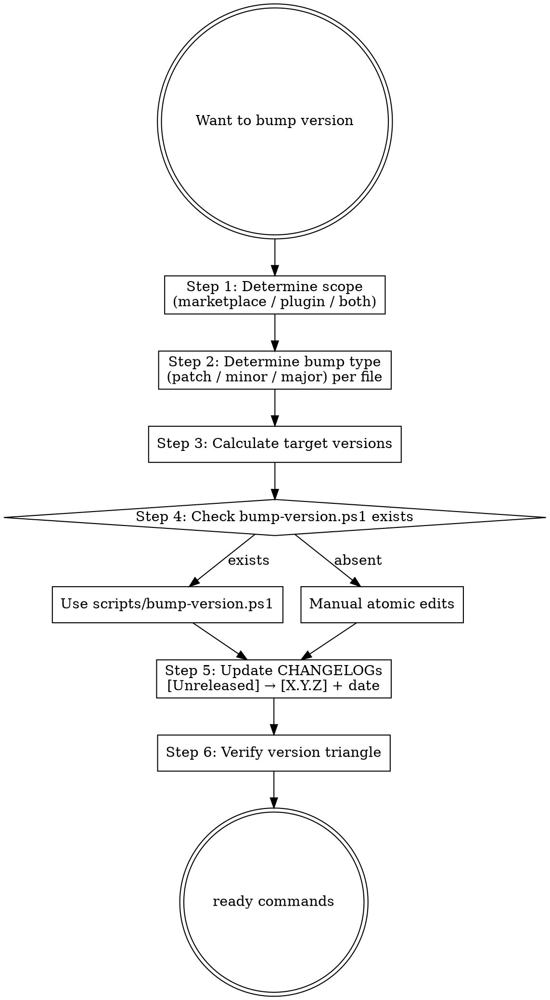

# Marketplace Doc Bump Version

## Overview

Atomically bumps versions across the marketplace's 5 version sites and aligns CHANGELOG headers. Enforces the version quintangle invariant.

**Version Quintangle (5-site invariant)**:

```text
VERSION (root file)
   ↕
.claude-plugin/marketplace.json metadata.version
   ↕                              ↘
plugins/<name>/.claude-plugin/plugin.json version  ←→  .claude-plugin/marketplace.json plugins[<name>].version
   ↕                                                                    ↕
README.md badge (L3) + plugin-table version cell    ←→    CLAUDE.md `plugins/` learn-kit line

# Why 5 sites (post-v4.5.0 lesson):
# v4.4.9 / v4.4.10 / v4.4.11 / v4.5.0 manual bumps skipped scripts/bump-version.ps1,
# leaving README badge stuck at 4.4.8 + plugin table cell at 1.1.0 + CLAUDE.md learn-kit
# line at v1.0.0 across 4 successive releases. CI now guards README badge (ci.yml step
# "Validate README badge matches VERSION"). All 5 sites are now bump-version.ps1 covered
# (Issue #110 closed by PR #115 — added CLAUDE.md plugin-line scoped regex branch +
# fixed pre-existing marketplace.json `[^}]*` regex bug that broke on description's `}`).
```

**Reference**: [[../../../docs/guide/[GUIDE]_Version_Management|Version Management]] + [[../../../scripts/bump-version.ps1|bump-version.ps1]] (if exists).

**Workflow position**: Stage 8 pre-step (typical part of release/* PR or any minor+ bump).

## Workflow



## Step 1: Determine Scope

| Scope | When | Files Affected |
|---|---|---|
| **plugin-only** | plugin 内部改动（不影响 marketplace registry） | `plugins/<name>/plugin.json` + `plugins/<name>/CHANGELOG.md` |
| **marketplace-only** | docs / CI / scripts 改动（不影响任何 plugin） | `VERSION` + `marketplace.json metadata.version` + `CHANGELOG.md` (顶层) |
| **both** | plugin 改动 + marketplace 注册条目同步 | 全部 4 个版本字段 + 2 个 CHANGELOG |
| **post-release pre-bump** (v4.6.1+) | release + sync-main-to-develop 完成后，在 develop 上推 patch | `VERSION` + `marketplace.json metadata.version` + `README.md` badge（**不**动 plugin.json / 不动 CHANGELOG / 不转节）|

**Post-release pre-bump 场景特别说明**（per [`[ADR]_Develop_PreBump_Adoption`](../../../docs/adr/[ADR]_Develop_PreBump_Adoption.md) + [`[RUNBOOK]_Release_Operations`](../../../docs/runbook/[RUNBOOK]_Release_Operations.md) §3.7）：

- **何时触发**：每次 release PR 合并 main + sync-main-to-develop PR 合并 develop 之后，72h 宽限期内执行（warn-only CI `verify-develop-prebumped.yml` 兜底提醒）
- **执行方式**：直接 `pwsh ./scripts/bump-version.ps1 -From X.Y.Z -To X.Y.(Z+1)`（pure patch，无 `-dev` 后缀）
- **Commit message 格式**：`infra(release): pre-bump develop X.Y.Z -> X.Y.(Z+1) (post-vX.Y.Z)`
- **不动的**：plugin.json（plugin 应按自身节奏 bump），CHANGELOG（不转节；新机制本身可在 [Unreleased] 段提及）
- **README badge 副效应**：badge 跟随 VERSION 自动更新到下一个 release 号；README 底部脚注 + CLAUDE.md 已澄清 "develop badge = 预计下一个 release 号" 语义

## Step 2: Determine Bump Type

Semver:
- **patch**: bugfix / typo / 小修
- **minor**: 新功能 / 新 skill / backward-compatible
- **major**: breaking change / plugin delete-rename / API 改

判断:

| 改动 | plugin bump | marketplace bump |
|---|---|---|
| 加 1 个 skill 到 learn-kit | minor (1.0.0 → 1.1.0) | minor (4.0.0 → 4.1.0) |
| learn-kit bugfix | patch (1.0.0 → 1.0.1) | patch (4.0.0 → 4.0.1) |
| 删 plugin | major (1.0.0 → 2.0.0 or 退役) | major (4.x → 5.0.0) |
| 仅 marketplace docs/CI | — | patch 或 minor (视 docs 范围) |
| 添加新 plugin | (new) 0.1.0 或 1.0.0 | minor (4.x → 4.y) |

## Step 3: Calculate Target Versions

```bash
# Read current
current_marketplace=$(cat VERSION)
current_plugin=$(jq -r '.version' plugins/<name>/.claude-plugin/plugin.json)

# Calculate target (per Step 2)
# e.g., add skill to learn-kit:
target_marketplace=4.1.0
target_plugin=1.1.0
```

## Step 4: Check `scripts/bump-version.ps1`

```bash
[ -f scripts/bump-version.ps1 ] && echo "exists" || echo "absent"
```

如 exists: prefer 用 script（保证 atomic + sync 逻辑）

```powershell
.\scripts\bump-version.ps1 -Marketplace 4.1.0 -Plugin learn-kit -PluginVersion 1.1.0
```

如 absent: manual edits

## Step 5: Manual Atomic Edits (if no script)

```powershell
# 1. VERSION
Set-Content VERSION "4.1.0"

# 2. marketplace.json
$json = Get-Content .claude-plugin/marketplace.json | ConvertFrom-Json
$json.metadata.version = "4.1.0"
($json.plugins | Where-Object name -eq learn-kit).version = "1.1.0"
$json | ConvertTo-Json -Depth 10 | Set-Content .claude-plugin/marketplace.json

# 3. plugin.json
$pjson = Get-Content plugins/learn-kit/.claude-plugin/plugin.json | ConvertFrom-Json
$pjson.version = "1.1.0"
$pjson | ConvertTo-Json -Depth 10 | Set-Content plugins/learn-kit/.claude-plugin/plugin.json

# 4. CHANGELOG (top-level)
# Promote [Unreleased] → [4.1.0] - 2026-05-15
# See Step 5 below
```

## Step 6: Update CHANGELOGs

Marketplace top-level `CHANGELOG.md`:

```markdown
## [Unreleased]
<entries 已写好>
```

Promote to:

```markdown
## [4.1.0] - 2026-05-15

<existing entries from [Unreleased]>

## [Unreleased]

(empty / next cycle starts)
```

Per-plugin `plugins/<name>/CHANGELOG.md`: same pattern。

Date: 用 `Get-Date -Format yyyy-MM-dd` 取本地日期，目前是 `2026-05-15`。

## Step 7: Verify Version Quintangle

```bash
# 5-site 一致性 (post-v4.5.0 expanded from triangle)
v_root=$(cat VERSION)
v_mp_meta=$(jq -r '.metadata.version' .claude-plugin/marketplace.json)
v_plugin_in_mp=$(jq -r '.plugins[] | select(.name=="learn-kit") | .version' .claude-plugin/marketplace.json)
v_plugin_self=$(jq -r '.version' plugins/learn-kit/.claude-plugin/plugin.json)

# NEW: README + CLAUDE.md sites (use sed for portability; grep -P locale-sensitive on Windows git-bash)
v_readme_badge=$(sed -n 's/.*badge\/version-\([0-9.]\+\)-.*/\1/p' README.md | head -1)
v_readme_plugin_cell=$(grep -oE '\*\*[0-9.]+\*\*' README.md | head -1 | tr -d '*')
v_claude_plugin_line=$(grep -oE 'learn-kit` v[0-9.]+' CLAUDE.md | head -1 | sed 's/^learn-kit` v//')

echo "VERSION = $v_root"
echo "marketplace.json metadata = $v_mp_meta"
echo "marketplace.json plugins[learn-kit] = $v_plugin_in_mp"
echo "learn-kit plugin.json = $v_plugin_self"
echo "README.md badge = $v_readme_badge"
echo "README.md plugin table = $v_readme_plugin_cell"
echo "CLAUDE.md learn-kit = $v_claude_plugin_line"

[ "$v_root" = "$v_mp_meta" ] && echo "marketplace OK" || echo "MISMATCH: VERSION ≠ metadata"
[ "$v_plugin_in_mp" = "$v_plugin_self" ] && echo "learn-kit OK" || echo "MISMATCH: plugins[].version ≠ plugin.json.version"
[ "$v_readme_badge" = "$v_root" ] && echo "README badge OK" || echo "MISMATCH: README badge ≠ VERSION"
[ "$v_readme_plugin_cell" = "$v_plugin_self" ] && echo "README plugin OK" || echo "MISMATCH: README plugin cell ≠ plugin.json"
[ "$v_claude_plugin_line" = "$v_plugin_self" ] && echo "CLAUDE OK" || echo "MISMATCH: CLAUDE.md learn-kit ≠ plugin.json"
```

> CI also enforces README badge ↔ VERSION via the `Validate README badge matches VERSION` step in `.github/workflows/ci.yml` (added 2026-05-18). CLAUDE.md remains manual-discipline (no static-pattern script can reliably parse + replace the prose plugin line).

## Output Format

```markdown
## Version Bump Plan

### Scope
- Scope: plugin-only / marketplace-only / both
- Target: marketplace=<X.Y.Z>, plugin learn-kit=<A.B.C>

### Bump Type Rationale
- marketplace: minor (added 18 mp-* skills to .claude/skills/, no plugin behavior change)
- learn-kit: none (this PR doesn't touch plugin)

### Current → Target
| File | Current | Target |
|---|---|---|
| VERSION | 4.0.0 | 4.1.0 |
| marketplace.json metadata.version | 4.0.0 | 4.1.0 |
| marketplace.json plugins[learn-kit].version | 1.0.0 | 1.0.0 (no change) |
| plugins/learn-kit/plugin.json version | 1.0.0 | 1.0.0 (no change) |
| CHANGELOG.md [Unreleased] | (entries) | promote → [4.1.0] - 2026-05-15 |
| plugins/learn-kit/CHANGELOG.md | (no entry needed) | (no change) |

### Strategy
- `scripts/bump-version.ps1` exists ✅ — use it
  - Command: `.\scripts\bump-version.ps1 -Marketplace 4.1.0`
- Or manual edits (4 atomic file changes + 1 CHANGELOG promote)

### Verification
```bash
.\scripts\bump-version.ps1 -Marketplace 4.1.0
# After:
cat VERSION  # 4.1.0
jq '.metadata.version' .claude-plugin/marketplace.json  # "4.1.0"
jq '.plugins[] | select(.name=="learn-kit") | .version' .claude-plugin/marketplace.json  # "1.0.0"
```

### Next Step
- 用户确认 → run commands
- → /mp-flow-self-review (Stage 7) 验证 version 改动是 §3.1 #7 必停 trigger (marketplace VERSION 主版本) — 本次是 minor, 不触
- → /mp-git-commit
```

## What This Skill DOES NOT DO

- ❌ 不写 CHANGELOG entry content (those should already be in [Unreleased] before bump; this skill 只 promote 段头)
- ❌ 不创建 git tag (release.yml 自动；手工创建会 race)
- ❌ 不创建 release PR (Stage 8 `/mp-git-pr`)
- ❌ 不 commit / push (Stage 8 `/mp-git-commit` / `/mp-git-push`)
- ❌ 不更新 plugin's `nlm-shared/` 或其他模板 version 字段 (那些是 plugin-internal 范畴；不在 version 三角中)

## Sub-skill / Tool Calls

| Tool | 用途 |
|---|---|
| Bash `scripts/bump-version.ps1` | 优选执行路径 |
| Edit | manual atomic edits 各 JSON / VERSION / CHANGELOG |
| Bash `jq` | parse JSON for verification |
| Bash `Get-Date` | CHANGELOG 日期戳 |
| Read | 确认当前值 |

## Reference Files

- [[../../../docs/guide/[GUIDE]_Version_Management|Version Management]]
- `scripts/bump-version.ps1` (if exists)
- [[../../../docs/rule/[STANDARD]_AI_Engineering_Execution_HITL_Prompt|HITL Standard]] §3.1 #7 (VERSION 主版本 bump 必 HITL)

## Anti-patterns

- **不要** 仅改一个版本字段（必同步全 5 sites: VERSION + marketplace.json metadata + marketplace.json plugins[] + plugin.json + README.md badge / plugin cell + CLAUDE.md plugin line）
- **不要** Major bump 自主推进（§3.1 #7 必 HITL）
- **不要** 跳 CHANGELOG promote（release.yml 抽 release notes 时会出错）
- **不要** 手工 git tag（release.yml 自动）
- **不要** 改 plugin.json 字段以外的 plugin metadata（用 `/mp-flow-author`）
- **不要** 漏掉 README badge / plugin-table cell / CLAUDE.md plugin line bump — `bump-version.ps1` v2 起（Issue #110 / PR #115 close）已 cover 全 5 sites: marketplace scope 跑 VERSION + marketplace.json metadata + README badge；plugin scope 跑 plugin.json + marketplace.json plugins[] + README cell + CLAUDE.md plugin line（scoped regex 锁定 `` `<plugin>` v<X.Y.Z> ``，不会误伤 `历史版本记录` 中的 prose version 提及）。**postmortem**: v4.4.9 → v4.5.0 4 个 release 连续手工 edit + 漏掉 README + CLAUDE.md, silent drift 直到用户截图发现; CI guard + RUNBOOK MANDATORY + script 5-site 覆盖 三层防御已就位

## Handoff to Next Stage

```text
Version bumped + CHANGELOG promoted
→ /mp-flow-self-review (Stage 7) 检查 bump 类型是否触 §3.1 #7
→ /mp-git-commit ("infra(release): bump marketplace 4.0.0 → 4.1.0")
→ /mp-git-push
→ /mp-git-pr (release PR if major; otherwise inline in current branch)
```
