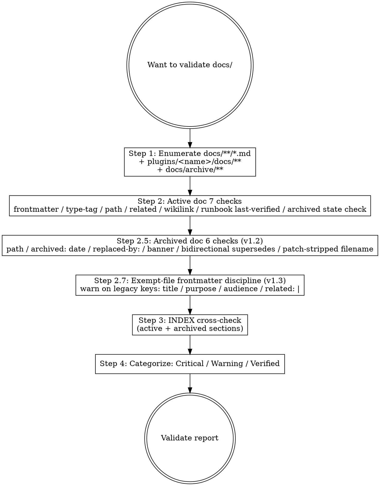

# Marketplace Doc Validate

## Overview

Audits `docs/**/*.md` and `plugins/<name>/docs/**/*.md` against the marketplace documentation framework. Includes v1.2 archive compliance checks for `state: archived` files under `docs/archive/`. Strictly structural / schema check; does NOT judge content quality.

**Reference**:
- `docs/rule/[STANDARD]_Documentation_Framework.md` v1.2+ (frontmatter schema, paths, state machine, archive triggers + frontmatter + banner + ref rules)
- `docs/rule/[STANDARD]_GitHub_Markdown.md` (markdown style)
- `docs/runbook/[RUNBOOK]_Doc_Archive_Procedure.md` v1.0 (operational archive ceremony)
- `docs/INDEX.md` (canonical doc list)

**Workflow position**: Stage 7 self-review substep + PR-pre-merge double-check.

## Workflow



## Step 1: Enumerate Files

```bash
# Active docs (top-level + plugin-internal)
find docs -type f -name '*.md' -not -path 'docs/archive/*' | grep -E '\[(STANDARD|ADR|GUIDE|RUNBOOK|SPEC|POSTMORTEM)\]_'
find plugins/learn-kit/docs -type f -name '*.md' 2>/dev/null | grep -E '\[(STANDARD|ADR|GUIDE|RUNBOOK|SPEC|POSTMORTEM)\]_'

# Archived docs (v1.2+)
find docs/archive -type f -name '*.md' 2>/dev/null | grep -E '\[DEPRECATED\]_\[(STANDARD|ADR|GUIDE|RUNBOOK|SPEC|POSTMORTEM)\]_'

# 豁免（不应有 frontmatter）
# - docs/INDEX.md
# - docs/CONTRIBUTING.md
# - docs/MIGRATION_GUIDE.md
# - docs/ai_engineering_execution_hitl_workflow.md (lowercase, generic doc)
# - README.md / CHANGELOG.md
# - plugins/<name>/CLAUDE.md
# - plugins/<name>/docs/<plugin>-NN-*.md (framework v1.1+ exempt: plugin-internal teaching series)
```

## Step 2: Per-doc Active Checks (7 checks)

For each tag-prefixed **active** doc (state: active or deprecated; not in `docs/archive/`):

### Check 1: Frontmatter Exists

```bash
head -1 <file> | grep -q '^---$' && \
  sed -n '/^---$/,/^---$/p' <file> | grep -q '^type:' && echo "OK" || echo "CRITICAL: missing or invalid frontmatter"
```

### Check 2: 8 Required Fields

```bash
fm=$(sed -n '/^---$/,/^---$/p' <file>)
for field in type scope summary owner created updated state version; do
  echo "$fm" | grep -q "^$field:" || echo "CRITICAL: missing $field"
done
```

### Check 3: Type Matches Tag Prefix

```bash
tag=$(basename <file> | grep -oE '^\[(STANDARD|ADR|GUIDE|RUNBOOK|SPEC|POSTMORTEM)\]' | tr -d '[]' | tr '[:upper:]' '[:lower:]')
type=$(echo "$fm" | awk '/^type:/ {print $2}')
[ "$tag" = "$type" ] || echo "CRITICAL: tag '$tag' ≠ type '$type'"
```

### Check 4: Path Matches Subdirectory

post-PR 2 mapping:

| Type | Expected subdir |
|---|---|
| standard | docs/rule/ or plugins/.../docs/rule/ |
| adr | docs/adr/ or plugins/.../docs/adr/ |
| guide | docs/guide/ or plugins/.../docs/guide/ |
| runbook | docs/runbook/ or plugins/.../docs/runbook/ |
| spec | docs/spec/ or plugins/.../docs/spec/ |
| postmortem | docs/postmortem/ |

```bash
dirname <file> | grep -qE "<expected-pattern>" || echo "WARNING: type=$type but in dir=$(dirname <file>) — should be in <expected-dir>"
```

### Check 5: related: Paths Resolve

Each `related:` entry MUST resolve via `realpath -m` to a real file. v4.4.4 surfaced 5 broken entries (PR #87): stale paths from cross-PR migrations + `...` typos. Reference impl uses `awk` for stop-anchor (next top-level key) so multi-line `related:` lists are correctly bounded:

```bash
related=$(echo "$fm" | awk '/^related:/{flag=1; next} /^[a-z][a-zA-Z_-]*:/{flag=0} flag && /^  - /')
echo "$related" | while IFS= read -r line; do
  rel=$(echo "$line" | sed 's/^  - //' | tr -d '\r')
  [ -z "$rel" ] && continue
  # realpath -m resolves even if the target doesn't exist (returns the normalized path);
  # the -f test on the resolved path is the actual existence check
  norm=$(cd "$(dirname <file>)" && realpath -m "$rel" 2>/dev/null)
  [ -f "$norm" ] || echo "CRITICAL: broken related: '$rel' in <file>"
done
```

Bumped to Critical (was Warning) because broken `related:` defeats navigation and contradicts the framework's explicit "related: paths must resolve" rule.

### Check 6: Wikilinks Resolve

Resolve `[[name]]` wikilinks against canonical doc set. Marketplace corpus currently uses zero wikilinks (verified 2026-05-15 dogfood); kept for future-proofing.

```bash
grep -oE '\[\[[^]|]+(\|[^]]+)?\]\]' <file> | while IFS= read -r link; do
  target=$(echo "$link" | sed 's/^\[\[\([^|]*\).*$/\1/' | tr -d '\r')
  # Resolve wikilink target: search by basename match against all tag-prefixed docs
  match=$(find docs plugins -type f -name "*${target}*.md" 2>/dev/null | head -1)
  [ -z "$match" ] && echo "WARNING: broken wikilink [[${target}]] in <file>"
done
```

### Check 7 (RUNBOOK only): last-verified

```bash
[ "$type" = "runbook" ] && {
  lv=$(echo "$fm" | awk '/^last-verified:/ {print $2}')
  [ -z "$lv" ] && echo "WARNING: RUNBOOK missing last-verified"
  # 检查 lv 是否 ≤ 90 天前
  age_days=$(( ($(date +%s) - $(date -d "$lv" +%s)) / 86400 ))
  [ "$age_days" -gt 90 ] && echo "WARNING: RUNBOOK last-verified $age_days days old (stale)"
}
```

### Check 7b (any active doc with `supersedes:` list)

Per Framework v1.2 §2.3.2, an active doc with `supersedes: [archive paths]` MUST have each listed archive file exist and be in `state: archived`:

```bash
echo "$fm" | awk '/^supersedes:/{flag=1; next} /^[a-z_-]+:/{flag=0} flag && /^  - /' | while read line; do
  arch_rel=$(echo "$line" | sed 's/^  - //')
  arch_path="$(dirname <file>)/$arch_rel"
  [ ! -f "$arch_path" ] && echo "CRITICAL: supersedes points to missing file: $arch_rel" && continue
  arch_state=$(sed -n '/^---$/,/^---$/p' "$arch_path" | awk '/^state:/{print $2}')
  [ "$arch_state" != "archived" ] && echo "CRITICAL: supersedes target $arch_rel has state=$arch_state (expected archived)"
done
```

## Step 2.5: Per-doc Archived Checks (6 checks, v1.2+)

For each file under `docs/archive/` (state: archived; flat layout per Framework v1.4 §2.3.5):

### Check 8: Archived Filename Pattern

Per Framework v1.2 §2.4:

```bash
basename=$(basename <file>)
# Expected pattern: [DEPRECATED]_[TAG]_<Topic>_v<major>.<minor>.md
echo "$basename" | grep -qE '^\[DEPRECATED\]_\[(STANDARD|ADR|GUIDE|RUNBOOK|SPEC|POSTMORTEM)\]_.+_v[0-9]+\.[0-9]+\.md$' \
  || echo "CRITICAL: filename does not match [DEPRECATED]_[TAG]_<Topic>_v<major>.<minor>.md: $basename"
```

### Check 9: `state: archived`

```bash
state=$(echo "$fm" | awk '/^state:/{print $2}')
[ "$state" = "archived" ] || echo "CRITICAL: file in docs/archive/ has state=$state (expected archived)"
```

### Check 10: `archived:` date field

```bash
archived=$(echo "$fm" | awk '/^archived:/{print $2}')
[ -z "$archived" ] && echo "CRITICAL: missing archived: field (mandatory per v1.2 §2.3.2)"
echo "$archived" | grep -qE '^[0-9]{4}-[0-9]{2}-[0-9]{2}$' || echo "CRITICAL: archived: not ISO-8601 date: $archived"
```

### Check 11: `replaced-by:` path resolves (or explicit empty for pure retirement)

```bash
rb=$(echo "$fm" | awk '/^replaced-by:/{print $2}')
if [ -z "$rb" ]; then
  echo "WARNING: replaced-by: empty — pure retirement (no successor)? Confirm in CHANGELOG"
else
  rb_path="$(dirname <file>)/$rb"
  [ ! -f "$rb_path" ] && echo "CRITICAL: replaced-by path does not resolve: $rb"
fi
```

### Check 12: Archive Banner Present

Per Framework v1.2 §2.3.3, archived docs MUST have the canonical Archive Banner immediately after H1:

```bash
# Read first 10 lines after frontmatter; look for banner pattern
body=$(sed '/^---$/,/^---$/d' <file> | head -10)
echo "$body" | grep -qE '^> \*\*Archived\*\*' || echo "CRITICAL: missing Archive Banner (per Framework §2.3.3)"
echo "$body" | grep -qE '^> \*\*Archive reason\*\*' || echo "CRITICAL: Archive Banner missing 'Archive reason' line"
echo "$body" | grep -qE '^> \*\*Archived on\*\*' || echo "CRITICAL: Archive Banner missing 'Archived on' line"
```

### Check 13: Bidirectional `supersedes:` ↔ `replaced-by:` Integrity

The successor referenced in `replaced-by:` MUST list this archive file in its `supersedes:`:

```bash
rb=$(echo "$fm" | awk '/^replaced-by:/{print $2}')
[ -z "$rb" ] && continue   # pure retirement; skip

successor="$(dirname <file>)/$rb"
my_path_relative_to_successor=$(realpath --relative-to="$(dirname $successor)" <file>)

successor_fm=$(sed -n '/^---$/,/^---$/p' "$successor")
echo "$successor_fm" | awk '/^supersedes:/{flag=1; next} /^[a-z_-]+:/{flag=0} flag && /^  - /' | grep -qF "$my_path_relative_to_successor" \
  || echo "CRITICAL: bidirectional break — successor $rb does not list this archive in its supersedes: array"
```

## Step 2.7: Exempt-File Frontmatter Discipline (v1.3+, 2 checks)

For each file matching a §1 exemption pattern, verify it doesn't carry forbidden legacy frontmatter keys. Per Framework v1.3 §1 normative clause: exempt files MAY (a) omit frontmatter entirely OR (b) carry the canonical 8-field schema (per §2.2), but MUST NOT use legacy non-canonical keys. This step does NOT promote anything to Critical because exempt files remain outside the required-field critical path (Step 2 required-field checks are still skipped for them).

Enumerate exempt files matching the §1 patterns (v1.3 audit scope is limited to two patterns; other exemption categories like README.md / CHANGELOG.md / CLAUDE.md / SKILL.md have separate format contracts and are NOT scanned by this step):

```bash
# Single-file exemption (Framework v1.0+)
echo docs/ai_engineering_execution_hitl_workflow.md

# Plugin-internal teaching series pattern (Framework v1.1+)
# Match: plugins/<name>/docs/<plugin>-*.md (filename starts with plugin name)
find plugins/*/docs -maxdepth 1 -type f -name '*.md' 2>/dev/null | while IFS= read -r f; do
  plugin=$(echo "$f" | awk -F/ '{print $2}')
  basename "$f" | grep -qE "^${plugin}-" && echo "$f"
done
```

For each enumerated exempt file, run two checks. Skip the file entirely if it has no frontmatter (omitting frontmatter is allowed per §1).

### Check 14: Forbidden Legacy Keys (v1.3)

```bash
head -1 <file> | grep -q '^---$' || continue   # no frontmatter -> silent OK

fm=$(sed -n '/^---$/,/^---$/p' <file>)

for forbidden in title purpose audience; do
  echo "$fm" | grep -qE "^${forbidden}:" \
    && echo "WARNING: exempt file <file> uses legacy non-canonical frontmatter key '${forbidden}' — per Framework v1.3 §1 use the canonical 8-field schema or omit frontmatter entirely"
done
```

### Check 15: Forbidden Literal-Block-Scalar `related: |` (v1.3)

```bash
echo "$fm" | grep -qE "^related: \|" \
  && echo "WARNING: exempt file <file> uses literal-block-scalar 'related: |' — per Framework v1.3 §1 use a regular block-style list (- item) or omit frontmatter entirely"
```

Both checks emit Warning (not Critical) per the Step 4 categorization. Exempt files with these warnings remain merge-eligible but should be cleaned up in a follow-up commit.

## Step 3: INDEX Cross-check

The regex extracts file **basenames** only (`[TAG]_<word-chars>.md`), not arbitrary `[^)]+\.md` strings. Loose `[^)]+` matches greedy across backtick-wrapped cross-references and link URLs in a single line, producing false positives (e.g., `[STANDARD]_X.md\`](../../docs/rule/[STANDARD]_X.md` matched as one entry). Strict basename pattern with `[A-Za-z0-9_-]+` is precise and well-bounded:

```bash
# 列出 INDEX.md 中所有 active [TAG] 链接 basename（exclude Archived Documents 段以下）
listed_active=$(awk '/^## Archived Documents/{exit} 1' docs/INDEX.md \
  | grep -oE '\[(STANDARD|ADR|GUIDE|RUNBOOK|SPEC|POSTMORTEM)\]_[A-Za-z0-9_-]+\.md' \
  | sort -u)

# 列出 active docs basename（exclude archive）
actual_active=$(find docs -name '\[*\]_*.md' -not -path 'docs/archive/*' -printf '%f\n' | sort -u)

# 对比 active
# 在 actual 但不在 listed → orphan in INDEX (CRITICAL after PR 3 retrofit)
# 在 listed 但 actual 不存在 → broken INDEX entry (CRITICAL)
comm -23 <(echo "$listed_active") <(echo "$actual_active")  # listed but not actual
comm -13 <(echo "$listed_active") <(echo "$actual_active")  # actual but not listed (orphan)

# v1.2+: 列出 Archived Documents 段所有 [DEPRECATED] 链接 basename
listed_archived=$(awk '/^## Archived Documents/,/^## /' docs/INDEX.md \
  | grep -oE '\[DEPRECATED\]_\[(STANDARD|ADR|GUIDE|RUNBOOK|SPEC|POSTMORTEM)\]_[A-Za-z0-9_-]+_v[0-9]+\.[0-9]+\.md' \
  | sort -u)

# 列出 docs/archive/ 下所有 [DEPRECATED] 文件
actual_archived=$(find docs/archive -name '\[DEPRECATED\]_*.md' -printf '%f\n' | sort -u)

# 对比 archived
comm -23 <(echo "$listed_archived") <(echo "$actual_archived")
comm -13 <(echo "$listed_archived") <(echo "$actual_archived")
```

**Note on Archived placeholder**: when the corpus has zero archived docs, `actual_archived` is empty AND `listed_archived` should be empty (the placeholder bullet text `*暂无 archived 文档*` doesn't match the strict pattern). Do NOT flag the empty-state as a mismatch — anti-pattern §6 explicitly exempts the empty placeholder.

Marketplace 顶层 INDEX 不需镜像 plugin-internal docs（plugin 自己的 docs/INDEX.md 是 source of truth；marketplace INDEX 仅列 "Plugin Documentation" 一段含跳转）。

## Step 4: Categorize

| Severity | Examples |
|---|---|
| **Critical** | missing frontmatter / wrong tag-type match / orphan in INDEX / archived doc missing banner / archived filename pattern mismatch / broken bidirectional supersedes↔replaced-by / supersedes points to missing or non-archived file / broken `related:` (v4.4.5 promoted from Warning — defeats navigation) |
| **Warning** | stale RUNBOOK last-verified / broken wikilink / empty replaced-by (pure retirement, requires CHANGELOG confirmation) / exempt file with forbidden legacy frontmatter keys (v1.3 §1 discipline — `title / purpose / audience / related: \|`) |
| **Verified** | all checks pass |

## Output Format

```markdown
## Doc Validation Report

### Files Audited
- N marketplace active docs
- M plugin-internal active docs
- K marketplace archived docs (under docs/archive/)

### Results — Active Docs
| File | Severity | Issue |
|---|---|---|
| docs/rule/[STANDARD]_X.md | Critical | missing frontmatter |
| docs/runbook/[RUNBOOK]_Y.md | Warning | last-verified 120 days old |
| docs/adr/[ADR]_Z.md | Verified | — |
| ... |

### Results — Archived Docs (v1.2+)
| File | Severity | Issue |
|---|---|---|
| docs/archive/[DEPRECATED]_[STANDARD]_X_v1.0.md | Critical | missing Archive Banner |
| docs/archive/[DEPRECATED]_[ADR]_Y_v1.0.md | Critical | bidirectional break — successor does not list this in supersedes |
| docs/archive/[DEPRECATED]_[SPEC]_Z_v1.0.md | Verified | — |
| ... |

### Summary
- Active: Critical K1 / Warning L1 / Verified P1
- Archived: Critical K2 / Warning L2 / Verified P2
- INDEX sync: <pass / N orphans / M broken entries>

### Recommended Fixes
1. `docs/rule/[STANDARD]_X.md`: add frontmatter (see template `docs/_templates/TEMPLATE_STANDARD.md`)
2. `docs/archive/[DEPRECATED]_*_v1.0.md`: add Archive Banner per [RUNBOOK]_Doc_Archive_Procedure §3
3. ...

### Next Step
- Critical=0 → 进 Stage 7 self-review / commit
- Critical>0 → 修 critical（active 走 /mp-doc-author；archived 走 [RUNBOOK]_Doc_Archive_Procedure 修正）
- Warning → record follow-up
```

## What This Skill DOES NOT DO

- ❌ 不验证 SKILL.md (用 `/plugin-dev:skill-reviewer` agent)
- ❌ 不修任何文件（report-only；用户/作者修）
- ❌ 不评内容质量（subjective）
- ❌ 不替代 plugin-validator (那是 plugin.json / 目录结构合规)

## Sub-skill / Tool Calls

| Tool | 用途 |
|---|---|
| Glob | Step 1 enumerate |
| Read | Step 2 frontmatter parse |
| Grep | Step 2-6 各种 grep |
| Bash | date / diff / wc 等 |

## Reference Files

- `docs/rule/[STANDARD]_Documentation_Framework.md` v1.2+ (8-field frontmatter / state machine / archive triggers + frontmatter + banner + ref rules)
- `docs/_templates/TEMPLATE_*.md` (skeleton drafts)
- `docs/runbook/[RUNBOOK]_Doc_Archive_Procedure.md` v1.0+ (archive ceremony procedure; validator backs §5 verification checklist)
- `docs/INDEX.md` (canonical doc list including § Archived Documents)

## Anti-patterns

- **不要** 用此 skill 验证 SKILL.md（错误的 schema；用 `/plugin-dev:skill-reviewer`）
- **不要** 自动 fix（report-only；用户决定）
- **不要** 用 §2 active-doc 7 checks 的 8-field required-field 部分验证 README.md / CHANGELOG.md / CONTRIBUTING.md / INDEX.md / MIGRATION_GUIDE.md / `ai_engineering_execution_hitl_workflow.md` / plugin CLAUDE.md / plugin-internal teaching series (`plugins/<name>/docs/<plugin>-NN-*.md`) frontmatter（这些豁免，per Framework §1）。**Note v1.3+**: §1-exempt files (`ai_engineering_execution_hitl_workflow.md` + `plugins/<name>/docs/<plugin>-*.md` 系列) 的 frontmatter 仍由 Step 2.7 扫描 forbidden legacy 键（`title / purpose / audience / related: \|`），命中报 Warning（不阻 commit；exempt files 始终在 required-field critical path 之外）。其他豁免类（README / CHANGELOG / CLAUDE.md / SKILL.md）有各自的 domain-specific format contract，不在 Step 2.7 扫描范围内
- **不要** 把 archived 文件当成 active 文件查（Step 2 跳过 `docs/archive/*`）
- **不要** 在 archive 检查（Step 2.5）报告 active-only 字段缺失警告（archived 是 state-frozen，其历史 frontmatter 字段保留即可）
- **不要** 因 Archived Documents 段空表格（placeholder）而报错（marketplace 当前 0 archived 是合法状态）

## Handoff to Next Stage

```text
Validation report
- Critical=0 → /mp-flow-self-review (Stage 7) 继续
- Critical>0 (active) → /mp-doc-author 修，re-run /mp-doc-validate
- Critical>0 (archived) → 参 [RUNBOOK]_Doc_Archive_Procedure §5 verification checklist 修；re-run /mp-doc-validate
- Warning → record to PR follow-up
```
