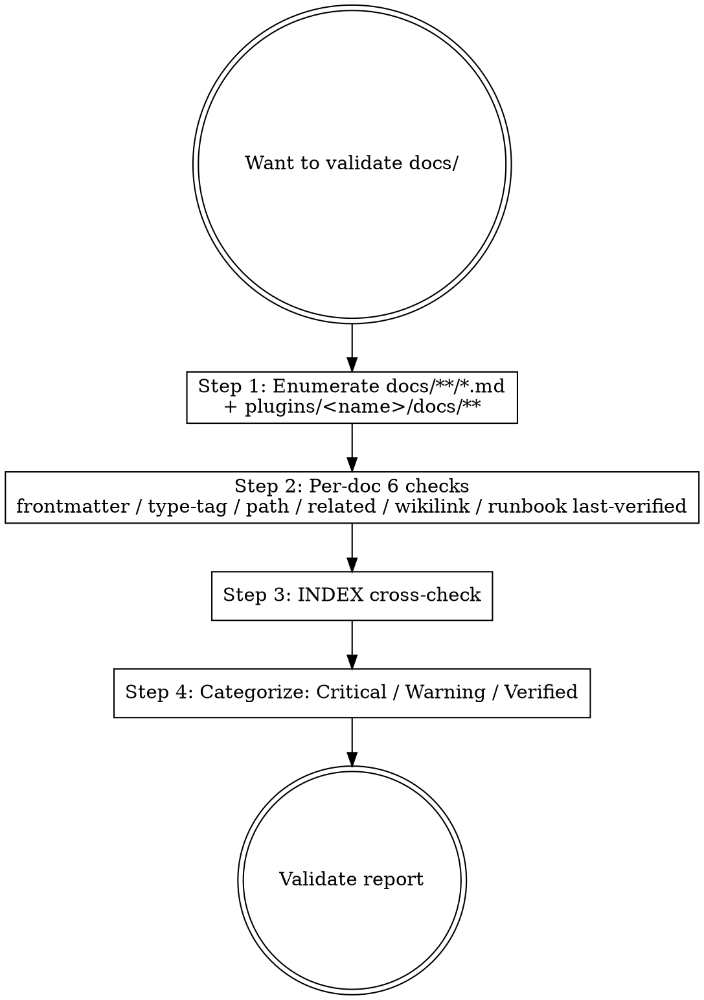

# Marketplace Doc Validate

## Overview

Audits `docs/**/*.md` and `plugins/<name>/docs/**/*.md` against the marketplace documentation framework (post-PR 2). Strictly structural / schema check; does NOT judge content quality.

**Reference** (post-PR 2):
- `docs/rule/[STANDARD]_Documentation_Framework.md` (frontmatter schema, paths, states)
- `docs/rule/[STANDARD]_GitHub_Markdown.md` (markdown style)
- `docs/INDEX.md` (canonical doc list)

**Workflow position**: Stage 7 self-review substep + PR-pre-merge double-check.

## Workflow



## Step 1: Enumerate Files

```bash
# Marketplace 顶层
find docs -type f -name '*.md' | grep -E '\[(STANDARD|ADR|GUIDE|RUNBOOK|SPEC|POSTMORTEM)\]_'

# Plugin internal
find plugins/learn-kit/docs -type f -name '*.md' 2>/dev/null | grep -E '\[(STANDARD|ADR|GUIDE|RUNBOOK|SPEC|POSTMORTEM)\]_'

# 豁免（不应有 frontmatter）
# - docs/INDEX.md
# - docs/CONTRIBUTING.md
# - docs/MIGRATION_GUIDE.md
# - docs/ai_engineering_execution_hitl_workflow.md (lowercase, generic doc)
# - README.md / CHANGELOG.md
```

## Step 2: Per-doc 6 Checks

For each tag-prefixed doc:

### Check 1: Frontmatter Exists

```bash
head -1 <file> | grep -q '^---$' && \
  sed -n '/^---$/,/^---$/p' <file> | grep -q '^type:' && echo "OK" || echo "CRITICAL: missing or invalid frontmatter"
```

### Check 2: 8 Required Fields

```bash
fm=$(sed -n '/^---$/,/^---$/p' <file>)
for field in type scope summary owner created updated state version; do
  echo "$fm" | grep -q "^$field:" || echo "CRITICAL: missing $field"
done
```

### Check 3: Type Matches Tag Prefix

```bash
tag=$(basename <file> | grep -oE '^\[(STANDARD|ADR|GUIDE|RUNBOOK|SPEC|POSTMORTEM)\]' | tr -d '[]' | tr '[:upper:]' '[:lower:]')
type=$(echo "$fm" | awk '/^type:/ {print $2}')
[ "$tag" = "$type" ] || echo "CRITICAL: tag '$tag' ≠ type '$type'"
```

### Check 4: Path Matches Subdirectory

post-PR 2 mapping:

| Type | Expected subdir |
|---|---|
| standard | docs/rule/ or plugins/.../docs/rule/ |
| adr | docs/adr/ or plugins/.../docs/adr/ |
| guide | docs/guide/ or plugins/.../docs/guide/ |
| runbook | docs/runbook/ or plugins/.../docs/runbook/ |
| spec | docs/spec/ or plugins/.../docs/spec/ |
| postmortem | docs/postmortem/ |

```bash
dirname <file> | grep -qE "<expected-pattern>" || echo "WARNING: type=$type but in dir=$(dirname <file>) — should be in <expected-dir>"
```

### Check 5: related: Paths Resolve

```bash
for rel in $(echo "$fm" | awk '/^  - \./'); do
  rel_path=$(dirname <file>)/$rel
  [ -f "$rel_path" ] || echo "WARNING: broken related: $rel"
done
```

### Check 6: Wikilinks Resolve

```bash
grep -oE '\[\[([^\]|]+)(\|[^\]]+)?\]\]' <file> | while read link; do
  target=$(echo "$link" | sed 's/\[\[\([^|]*\).*/\1/')
  # heuristic: prefix relative path
  ...
done
```

### Check 7 (RUNBOOK only): last-verified

```bash
[ "$type" = "runbook" ] && {
  lv=$(echo "$fm" | awk '/^last-verified:/ {print $2}')
  [ -z "$lv" ] && echo "WARNING: RUNBOOK missing last-verified"
  # 检查 lv 是否 ≤ 90 天前
  age_days=$(( ($(date +%s) - $(date -d "$lv" +%s)) / 86400 ))
  [ "$age_days" -gt 90 ] && echo "WARNING: RUNBOOK last-verified $age_days days old (stale)"
}
```

## Step 3: INDEX Cross-check

```bash
# 列出 INDEX.md 中所有 [TAG] 链接
listed=$(grep -oE '\[(STANDARD|ADR|GUIDE|RUNBOOK|SPEC|POSTMORTEM)\][^)]+' docs/INDEX.md)

# 列出 docs/ 下所有 [TAG] 文件
actual=$(find docs -name '\[*\]_*.md' -printf '%f\n')

# 对比
# 在 actual 但不在 listed → orphan in INDEX
# 在 listed 但 actual 不存在 → broken INDEX entry
diff <(echo "$listed" | sort) <(echo "$actual" | sort)
```

Marketplace 顶层 INDEX 不需镜像 plugin-internal docs（plugin 自己的 docs/INDEX.md 是 source of truth；marketplace INDEX 仅列 "Plugin Documentation" 一段含跳转）。

## Step 4: Categorize

| Severity | Examples |
|---|---|
| **Critical** | missing frontmatter / wrong tag-type match / orphan in INDEX (after PR 3 retrofit) |
| **Warning** | path-subdir mismatch (pre-PR 3 ok) / broken related: / stale RUNBOOK last-verified / broken wikilink |
| **Verified** | all checks pass |

## Output Format

```markdown
## Doc Validation Report

### Files Audited
- N marketplace docs
- M plugin-internal docs

### Results
| File | Severity | Issue |
|---|---|---|
| docs/[STANDARD]_X.md | Critical | missing frontmatter |
| docs/runbook/[RUNBOOK]_Y.md | Warning | last-verified 120 days old |
| docs/adr/[ADR]_Z.md | Verified | — |
| ... |

### Summary
- Critical: K (must fix before commit)
- Warning: L (advisory)
- Verified: P

### Recommended Fixes
1. `docs/[STANDARD]_X.md`: add frontmatter (see template `docs/_templates/TEMPLATE_STANDARD.md`)
2. `docs/runbook/[RUNBOOK]_Y.md`: update `last-verified: 2026-05-15`

### Next Step
- Critical=0 → 进 Stage 7 self-review / commit
- Critical>0 → 回 /mp-doc-author 修
- Warning → record follow-up
```

## What This Skill DOES NOT DO

- ❌ 不验证 SKILL.md (用 `/plugin-dev:skill-reviewer` agent)
- ❌ 不修任何文件（report-only；用户/作者修）
- ❌ 不评内容质量（subjective）
- ❌ 不替代 plugin-validator (那是 plugin.json / 目录结构合规)

## Sub-skill / Tool Calls

| Tool | 用途 |
|---|---|
| Glob | Step 1 enumerate |
| Read | Step 2 frontmatter parse |
| Grep | Step 2-6 各种 grep |
| Bash | date / diff / wc 等 |

## Reference Files

- (post-PR 2) `docs/rule/[STANDARD]_Documentation_Framework.md`
- (post-PR 2) `docs/_templates/TEMPLATE_*.md`
- `docs/INDEX.md`

## Anti-patterns

- **不要** 用此 skill 验证 SKILL.md（错误的 schema；用 `/plugin-dev:skill-reviewer`）
- **不要** 把 Warning 当 Critical（path-subdir 不一致在 PR 3 retrofit 前是 OK）
- **不要** 自动 fix（report-only；用户决定）
- **不要** 验证 README.md / CHANGELOG.md / CONTRIBUTING.md / INDEX.md frontmatter（这些豁免）

## Handoff to Next Stage

```text
Validation report
- Critical=0 → /mp-flow-self-review (Stage 7) 继续
- Critical>0 → /mp-doc-author 修，re-run /mp-doc-validate
- Warning → record to PR follow-up
```
