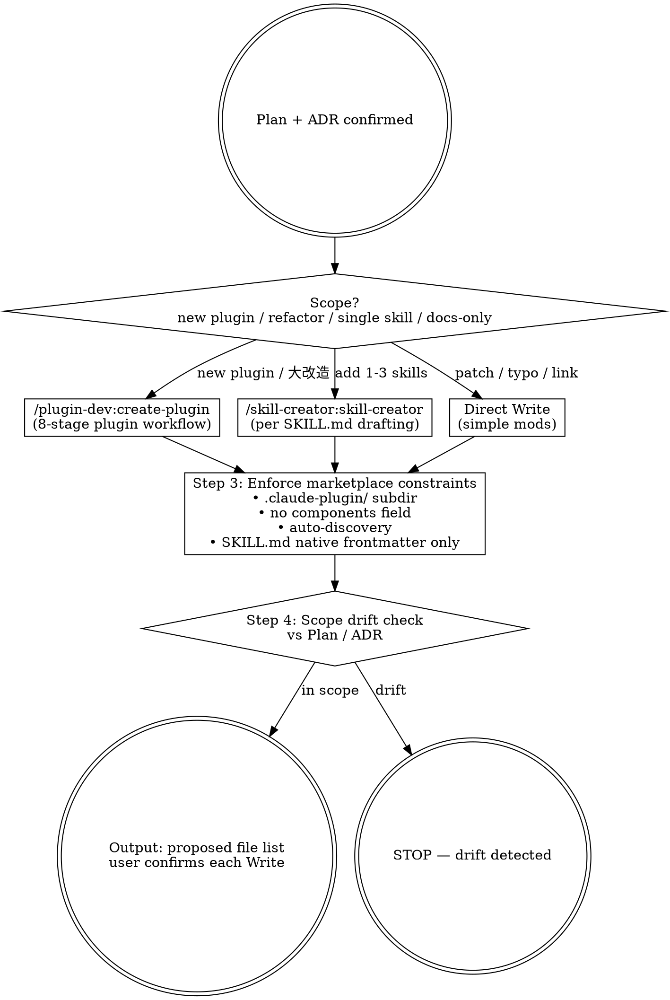

# Marketplace Flow — Plugin / Skill Authoring (HITL Stage 4)

## Overview

Stage 4 orchestrator: turns a confirmed Plan + ADR into concrete file changes (`plugins/<name>/...` or `.claude/skills/...`). The skill itself does NOT draft SKILL.md / plugin.json content — it **delegates** to:
- `/plugin-dev:create-plugin` for net-new plugin or systemic restructure (8-stage workflow)
- `/skill-creator:skill-creator` for per-skill SKILL.md authoring with description-trigger optimization
- Direct Write for simple file mods

The orchestrator's job: pick the right delegate, enforce marketplace constraints, and watch for scope drift relative to Plan / ADR.

**Reference**: [[../../../docs/rule/[STANDARD]_AI_Engineering_Execution_HITL_Prompt|HITL Standard]] §4.5 + [[../../../docs/guide/[GUIDE]_Plugin_Development_Testing_Workflow|Plugin Dev Testing]].

## Workflow



## When to Run This Skill

**MUST run** when:
- Plan §3 任务拆解含 plugin / skill 修改条目
- 用户："add skill" / "create plugin" / "改 SKILL.md" / "新增 learn-kit 第 6 个 skill"
- ADR §Implementation Plan 指向 code/skill 改动

**MAY skip**:
- 纯 docs 改动（用 `/mp-doc-author`）
- 仅 marketplace.json / VERSION bump（用 `/mp-doc-bump-version`）

## Step 1: Identify Scope

| 场景 | 推荐路径 |
|---|---|
| 新建 plugin（marketplace 当前只有 learn-kit；多 plugin 是未来场景） | `/plugin-dev:create-plugin` 全 8 阶段 |
| 给 learn-kit 加新 skill（如 mp-flow-* 18 件） | `/skill-creator:skill-creator` 逐 skill；orchestrator 批量化 |
| 改既有 skill 的 description / body / templates | `/skill-creator:skill-creator` (modify mode) |
| Skill `allowed-tools` / `disable-model-invocation` 调整 | Direct Edit (read-only frontmatter 改) |
| `.mcp.json` 改动 | Direct Edit + HITL（涉及 plugin secrets / deps） |
| 删除 skill | Direct file 操作 + HITL + ADR refs |

## Step 2: Delegate

**`/plugin-dev:create-plugin`** 流程触发条件:
- 新建独立 plugin
- 多 skill 同时落地（≥ 3 个相关 skill）
- 需要 8-stage workflow (Discovery / Component Planning / Detailed Design / Structure / Implementation / Validation / Testing / Documentation)

**`/skill-creator:skill-creator`** 触发条件:
- 单个 SKILL.md 起草（new 或 改造）
- description trigger phrase 优化需求
- progressive disclosure / 第三人称风格修正

**Direct Write** 触发条件:
- 1-2 行字段改动（SKILL.md frontmatter `name` typo / `allowed-tools` 一项）
- 已 ADR-approved 重命名 / 路径移动

## Step 3: Enforce Marketplace Constraints

每次 plugin / skill 起草后:

| Constraint | Check | Failure 后处理 |
|---|---|---|
| `plugin.json` 在 `.claude-plugin/` 子目录 | `ls plugins/<name>/.claude-plugin/plugin.json` | 移动；不在 plugin 根 |
| 不用 `components` 字段 | `grep -L '"components"' plugins/*/.claude-plugin/plugin.json` | 删字段；用 auto-discovery |
| `skills/` 自动发现 | `ls plugins/<name>/skills/*/SKILL.md` | 不在 plugin.json 内手列 skills |
| SKILL.md frontmatter 用 native（name + description） | `sed -n '/^---$/,/^---$/p'` 检查 | 删除 marketplace 8-field frontmatter（如误加） |
| description 是第三人称 + trigger phrases | grep 关键短语 | 用 `/skill-creator:skill-creator` 重写 |
| read-only skill 显式声明 `allowed-tools` | `grep allowed-tools SKILL.md` | 加 `[Read, Glob, Grep]` |
| plugin.json `repository` 是 string（per v3.2.1 bugfix） | `jq -r '.repository | type' plugins/*/.claude-plugin/plugin.json` | 改为 string |
| plugin.json 6 必需字段 | jq 检查 name/version/description/author/repository/keywords | 补齐 |

## Step 4: Scope Drift Check

对照 Plan §3 任务拆解 / ADR §Implementation Plan:

```markdown
| Plan/ADR 指定 | 实际改动 | Drift? |
|---|---|---|
| add mp-flow-intake skill | .claude/skills/mp-flow-intake/SKILL.md created | OK |
| update HITL Standard §4 | docs/[STANDARD]_AI_Eng*.md modified | OK |
| (not in Plan) updated marketplace.json schema | -- | ⚠️ DRIFT |
```

任一 drift → STOP 并提 HITL：「本次改动包含 Plan 外项 X，是否：(a) 更新 Plan (b) 撤销该改动 (c) 拆独立 PR」。

## Output Format

```markdown
## Authoring Plan

### Delegate decision
- Primary: /plugin-dev:create-plugin / /skill-creator:skill-creator / Direct Write
- Reason: <why this delegate>

### Files to create / modify
| Path | Action | Purpose |
|---|---|---|
| .claude/skills/mp-flow-intake/SKILL.md | create | Stage 0 intake skill |
| docs/[STANDARD]_AI_Eng*.md | modify | §4.1 Skill Hint 段引用 mp-flow-intake |
| ... |

### Marketplace constraints check
- [x] plugin.json 在 .claude-plugin/
- [x] 不用 components
- [x] SKILL.md native frontmatter
- [x] repository: string
- [x] 6 必需字段

### Scope drift check
- Plan §3 expected: ...
- Actual: ...
- Drift: None / <list>

### HITL Questions (if drift)
<§3.3 格式>

### Next Step
- 用户确认 → 逐 Write
- 完成后 → /mp-flow-compliance (Stage 5)
```

## What This Skill DOES NOT DO

- ❌ 不直接生成 SKILL.md body 内容（delegate 到 `/skill-creator:skill-creator`）
- ❌ 不直接生成完整 plugin scaffold（delegate 到 `/plugin-dev:create-plugin`）
- ❌ 不跑 plugin-validator（Stage 5 `/mp-flow-compliance`）
- ❌ 不跑测试 / dogfood（Stage 6 `/mp-flow-dogfood`）
- ❌ 不 commit / push（Stage 8 `/mp-git-commit` / `/mp-git-push`）

## Sub-skill / Tool Calls

| Tool | 用途 |
|---|---|
| Skill (`/plugin-dev:create-plugin`) | 大规模 plugin 起草 |
| Skill (`/skill-creator:skill-creator`) | 单 SKILL.md 起草 |
| Edit / Write | Direct mods |
| Read | 现有 plugin / SKILL.md / plugin.json 参照 |
| Glob | 枚举 plugins/<name>/skills/*/SKILL.md |
| Bash `jq` | plugin.json field 检查 |

## Reference Files

- [[../../../docs/rule/[STANDARD]_AI_Engineering_Execution_HITL_Prompt|HITL Standard]] §4.5
- [[../../../docs/guide/[GUIDE]_Marketplace_Project_Overview|Marketplace Overview]] (plugin 目录结构)
- [[../../../docs/guide/[GUIDE]_Plugin_Development_Testing_Workflow|Plugin Dev Testing]] (跨仓库测试三阶段)
- [[../../../plugins/learn-kit/skills/scaffold-learning/SKILL.md|learn-kit scaffold-learning SKILL]] (style sample)

## Anti-patterns

- **不要** 自己写 SKILL.md body —— 用 `/skill-creator:skill-creator`（除非 < 5 行 trivial 改动）
- **不要** 同时改 plugin + marketplace.json schema（拆 PR）
- **不要** 跳过 Step 4 scope drift check（让 Stage 7 self-review 抓 = 浪费一轮）
- **不要** 在 SKILL.md 加 marketplace 8-field frontmatter（违反 §SKILL.md policy）
- **不要** 把 `plugin.json` 字段写错（如 `repository: { url: ... }` 而非 string）

## Handoff to Next Stage

```text
Authoring complete (all Write done)
HITL Gate (用户确认所有 Write) 后:
  → /mp-flow-compliance 进 Stage 5 (plugin validator + skill reviewer)
  → 失败 → 回 Stage 4 修
  → 通过 → /mp-flow-dogfood 进 Stage 6
```
