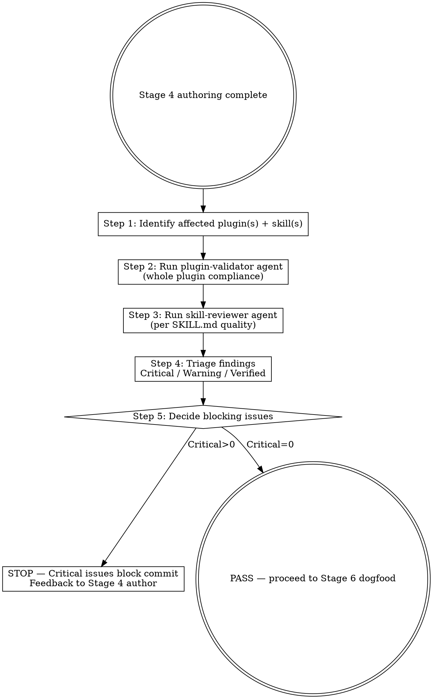

# Marketplace Flow — Plugin Compliance Audit (HITL Stage 5)

## Overview

Stage 5 orchestrator that runs the two marketplace-native compliance agents (`/plugin-dev:plugin-validator` and `/plugin-dev:skill-reviewer`), interprets their outputs against marketplace conventions, and produces a triaged report (Critical / Warning / Verified). The skill does not fix issues directly — those go back to Stage 4 author or Stage 7 self-review.

**Reference**: [[../../../docs/rule/[STANDARD]_AI_Engineering_Execution_HITL_Prompt|HITL Standard]] §4.6 + `.github/workflows/ci.yml` (6-step CI equivalence).

## Workflow



## When to Run This Skill

**MUST run before commit** when:
- Stage 4 authoring touched any SKILL.md (description / body / frontmatter)
- Stage 4 authoring touched plugin.json / marketplace.json
- New plugin added (PR-level mandatory)
- Version bump（必跑确认 plugin.json ↔ marketplace.json 一致）

**MAY skip**:
- Pure docs/ PR with no plugin / skill change
- Already passed in this branch's HEAD and no new commits since

## Step 1: Identify Affected Plugins / Skills

```bash
git diff --name-only develop...HEAD 2>/dev/null
# Map to plugins/<name>/ and skills:
git diff --name-only develop...HEAD | grep -E 'plugins/[^/]+/' | cut -d'/' -f2 | sort -u
git diff --name-only develop...HEAD | grep 'SKILL.md' | sort -u
```

Build a list:
- Affected plugins: e.g., `learn-kit`
- Affected skills (full SKILL.md path each)
- Affected `plugin.json` / `marketplace.json` / `.mcp.json`

## Step 2: Run `/plugin-dev:plugin-validator` (agent)

通过 Task tool `subagent_type: "plugin-dev:plugin-validator"` 调用。Agent 检查项（per agent description）:

- `plugin.json` 6 必需字段（name / version / description / author / repository / keywords）
- `plugin.json` 在 `.claude-plugin/` 子目录
- 不用 `components` 字段
- `repository` 是 string（per v3.2.1 bugfix lesson）
- SKILL.md frontmatter 全集（name / description / optional fields）
- 目录结构（必备 5 文件 + skills/ + .claude-plugin/）
- 版本一致性（plugin.json ↔ marketplace.json plugins[entry].version）
- CHANGELOG 存在
- Auto-discovery 工作（skills/ 内每个目录都有 SKILL.md）

**输出解读**: Validator 给 list 形式 issues，每条含 severity (critical / warning / info)。

## Step 3: Run `/plugin-dev:skill-reviewer` (agent)

通过 Task tool `subagent_type: "plugin-dev:skill-reviewer"` 调用每个改动的 SKILL.md。Agent 检查项:

- description 触发性（trigger phrases / Use When / Do not use for 三段）
- progressive disclosure（SKILL.md < 500 行；超出走 references/）
- 第三人称语气（"This skill performs..."）
- 与 sibling skill 边界清晰
- examples 充分
- anti-patterns 列出

**经验法则**（per v3.1.0 实战）:
- Round 1 通常 5-8 high-priority issues
- 全部 fix 后 round 2 确认
- W 级 (warning) 不阻 ship；critical 必修

## Step 4: Triage Findings

```markdown
| Source | Severity | Issue | Affected | Fix Owner | Block? |
|---|---|---|---|---|---|
| validator | critical | plugin.json version 1.0.0 ≠ marketplace.json plugins[learn-kit].version 1.1.0 | learn-kit | Stage 4 author | YES |
| validator | warning | CHANGELOG missing [Unreleased] section | learn-kit | author | NO |
| skill-reviewer | critical | mp-flow-intake description lacks "Do not use for" reverse-list | mp-flow-intake | author | YES |
| skill-reviewer | info | mp-doc-author could split into mp-doc-author + mp-doc-frontmatter-fix | mp-doc-author | future PR | NO |
```

## Step 5: Decide Blocking Issues

| Severity | Action |
|---|---|
| Critical | STOP commit；返回 Stage 4 修；修完后 re-run Stage 5 |
| Warning | 记录到 PR description 「待跟进」；不阻 ship |
| Info | 进 follow-up ticket，可忽略本次 |

如 Critical = 0 → PASS。如 Critical > 0 → block + 列出 fix list。

## Output Format

```markdown
## Compliance Audit Result

### Affected Scope
- Plugins: <list>
- SKILL.md: <list with paths>
- plugin.json / marketplace.json: <changed?>

### plugin-validator output
- Critical: N
- Warning: M
- Info: K
<bullet list of each>

### skill-reviewer output (per SKILL.md)
| SKILL | Issues found | Severity max |
|---|---|---|
| mp-flow-intake | 3 | critical |
| ... |

### Triaged Findings
<table from Step 4>

### Decision
- ✅ PASS: 0 critical, can proceed to Stage 6 dogfood
- 🛑 BLOCK: N critical, return to Stage 4 author

### Fix List (if BLOCK)
1. ...
2. ...

### HITL Questions
<§3.3 格式 if W 级有歧义>

### Next Step
- BLOCK → /mp-flow-author 进 Stage 4 修
- PASS → /mp-flow-dogfood 进 Stage 6
```

## What This Skill DOES NOT DO

- ❌ 不自己评判 SKILL.md 质量（delegate 给 skill-reviewer agent）
- ❌ 不自己跑 plugin.json schema validation（delegate 给 plugin-validator agent）
- ❌ 不修任何 issue（返回 Stage 4 让 author 修）
- ❌ 不跑 dogfood / 真实 plugin install（Stage 6）
- ❌ 不 commit / push

## Sub-skill / Tool Calls

| Tool | 用途 |
|---|---|
| Agent (`subagent_type: plugin-dev:plugin-validator`) | Step 2 plugin 整体合规 |
| Agent (`subagent_type: plugin-dev:skill-reviewer`) | Step 3 per-SKILL.md 质量 |
| Bash `git diff --name-only` | Step 1 affected scope |
| Read | 各 SKILL.md / plugin.json 读取（agent 也读，但 orchestrator 可独立 read for triage） |

## Reference Files

- [[../../../docs/rule/[STANDARD]_AI_Engineering_Execution_HITL_Prompt|HITL Standard]] §4.6
- `.github/workflows/ci.yml` (6-step CI equivalence)

## Anti-patterns

- **不要** 自己手工跑 6-step CI check —— delegate 给 plugin-validator agent
- **不要** 跳 skill-reviewer，仅靠 validator（skill 质量 ≠ schema 合规）
- **不要** 把 Warning 当 Critical 一并阻 ship（W 级 可 ship + 记 follow-up）
- **不要** 一次审多个无关 plugin（按 PR scope 限制）

## Handoff to Next Stage

```text
Compliance audit complete
HITL Gate (PASS) 后:
  → /mp-flow-dogfood 进 Stage 6 (真实 plugin install + 算法模拟)

Compliance audit BLOCK:
  → /mp-flow-author 进 Stage 4 (按 Fix List 修)
  → 修完 re-run /mp-flow-compliance
```
