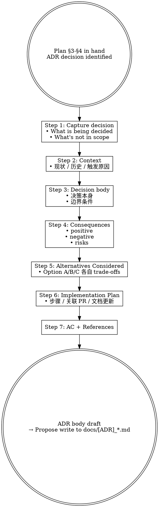

# Marketplace Flow — Design Decision / ADR (HITL Stage 3)

## Overview

Drafts an ADR markdown file from a confirmed Plan. Records the why / what / consequences of an architectural decision so future maintainers (human or AI) can understand the reasoning without spelunking PR history. Marketplace ADR style follows Michael Nygard's classic 5-section pattern, extended with Implementation Plan + Acceptance Criteria + References for completeness.

**Reference**: [[../../../docs/[STANDARD]_AI_Engineering_Execution_HITL_Prompt|HITL Standard]] §4.4 (Stage 3 ADR prompt) + sample ADRs:
- [[../../../docs/[ADR]_LearnKit_Discovery_Skills.md|ADR LearnKit Discovery]]
- [[../../../docs/[ADR]_NotebookLM_Kit_Retirement.md|ADR NotebookLM Kit Retirement]]

## Workflow



## When to Run This Skill

**MUST run** when Plan identifies:
- 架构 / 命名 / 拆分 / 重命名 / 删除 / breaking change
- plugin lifecycle 决策（add / deprecate / retire）
- 跨 plugin / docs 的结构选择（如 plugin-internal vs marketplace-level 归属）

**MAY skip**:
- 决策已在某既有 ADR 覆盖 → 更新而非新建
- 决策细节属于 SPEC / RUNBOOK 范畴 → 用 `/mp-doc-author`

**MUST NOT use for**:
- 运维操作 / 回滚步骤 → 用 `[RUNBOOK]_*.md` + `/mp-doc-author`
- 实施细节（API 调用 / 参数） → 用 `[SPEC]_*.md` + `/mp-doc-author`
- 任务编排 / 步骤排序 → 用 `/mp-flow-plan`

## Step 1: Capture Decision

明确:
- 决策对象（e.g., "learn-kit discovery skills 是 2 skills 还是 1 skill + manifest"）
- 决策语句（"采用 2 skills: locate + scan，不引入 manifest 缓存"）
- 边界条件（"不限制未来加 manifest 作为补强；本 ADR 不评 v4 之后"）
- 决策权重（reversible / one-way door / breaking）

## Step 2: Context

回答"为什么现在需要这个决策":
- 触发因素（用户痛点 / 技术债 / 新需求 / 上游变化）
- 历史背景（前一版本如何 / 为何不再适用）
- 当前选项空间（已知 A/B/C）
- 决策时机约束（必须 v4.x 内完成 / 可以延后 / 跟 PR 锁绑）

## Step 3: Decision Body

```markdown
## Decision

我们决定 **<决策内容>**:

- <要点 1>
- <要点 2>
- <要点 3>

边界条件:
- <In-scope>
- <Out-of-scope>
- <未决定的相关问题列表>
```

## Step 4: Consequences

3 子段:

```markdown
### Positive
- <积极后果 1>
- ...

### Negative
- <代价 / 妥协 1>
- ...

### Risks
- <未来可能出问题 1，缓解措施>
- ...
```

## Step 5: Alternatives Considered

```markdown
### Option A: <名字>
- 优点: ...
- 缺点: ...
- 拒绝理由: ...

### Option B: <名字>
- ...
```

至少 2 个备选；如只 1 个备选写"考虑过但快速拒绝因 X"。

## Step 6: Implementation Plan

```markdown
## Implementation Plan

1. <步骤 1> (在 PR #<NN> 或 PR-X)
2. <步骤 2>
3. ...

关联文档更新:
- <doc 1>: update §X
- <doc 2>: create
```

## Step 7: AC + References

```markdown
## Acceptance Criteria

- [ ] <可验证的合规标准 1>
- [ ] ...

## References

- Issue #<NN>
- Plan: `~/.claude/plans/<topic>.md`
- 相关 ADR: `[ADR]_X.md`
- HITL Standard §<section>
- 外部资料: <url>

## Decision Log

| Date | State | By | Note |
|---|---|---|---|
| YYYY-MM-DD | proposed | <user> | initial draft |
```

## Output Format

完整 ADR markdown（按上述 7 段）:

```markdown
# [ADR] <Decision Title>

| Field | Value |
|---|---|
| Status | proposed / accepted / superseded |
| Date | YYYY-MM-DD |
| Author | <user> |
| Scope | marketplace / learn-kit |
| Reversibility | reversible / one-way door |

## Context
...

## Decision
...

## Consequences
### Positive
### Negative
### Risks

## Alternatives Considered

## Implementation Plan

## Acceptance Criteria

## References

## Decision Log
```

后建议:
```text
ADR 草案完成。建议路径:
  - docs/[ADR]_<Topic>.md (PR 2 之前；marketplace 当前扁平结构)
  - docs/adr/[ADR]_<Topic>.md (PR 2 doc framework 落地后)
  - plugins/learn-kit/docs/adr/[ADR]_<Topic>.md (PR 4 后；如 plugin-internal 决策)

需要我用 Write 落到 <path>?
```

## What This Skill DOES NOT DO

- ❌ 不写 GUIDE / RUNBOOK / SPEC（用 `/mp-doc-author`）
- ❌ 不实施 ADR 决策（Stage 4 `/mp-flow-author` 的事）
- ❌ 不自动 Write to disk —— 输出 ADR body，用户确认路径后才 Write
- ❌ 不更新 `docs/INDEX.md` —— 那是 `/mp-doc-author` 或 self-review (Stage 7) 的责任

## Sub-skill / Tool Calls

| Tool | 用途 |
|---|---|
| Read | Plan / 现有 ADR 范例 / Issue body |
| Glob | 枚举 `docs/[ADR]_*.md` 看冲突 / 类似主题 |
| Grep | 检查决策是否被既有 ADR 覆盖（避免重复） |

## Reference Files

- [[../../../docs/[STANDARD]_AI_Engineering_Execution_HITL_Prompt|HITL Standard]] §4.4
- [[../../../docs/[ADR]_LearnKit_Discovery_Skills.md|ADR LearnKit Discovery]] (style sample)
- [[../../../docs/[ADR]_NotebookLM_Kit_Retirement.md|ADR NotebookLM Kit Retirement]] (style sample)

## Anti-patterns

- **不要** 写「我们将...」而不解释「为什么」（ADR 的灵魂是 why）
- **不要** 仅列一个 alternative —— 至少 2 个，证明决策非默认
- **不要** 把 ADR 写成 RUNBOOK（步骤为主） —— ADR 重在论证，步骤指针化即可
- **不要** ADR 标题用动词（"Use X for Y" 优于 "Using X for Y"）
- **不要** 把多个独立决策塞同一 ADR —— 应拆多份

## Handoff to Next Stage

```text
ADR draft ready + 路径确认
HITL Gate (用户确认 ADR 写盘) 后:
  → Write to docs/[ADR]_*.md
  → /mp-flow-author 进 Stage 4 (按 ADR 实施决策)
  → /mp-doc-author 起草配套 GUIDE/SPEC/RUNBOOK
```
