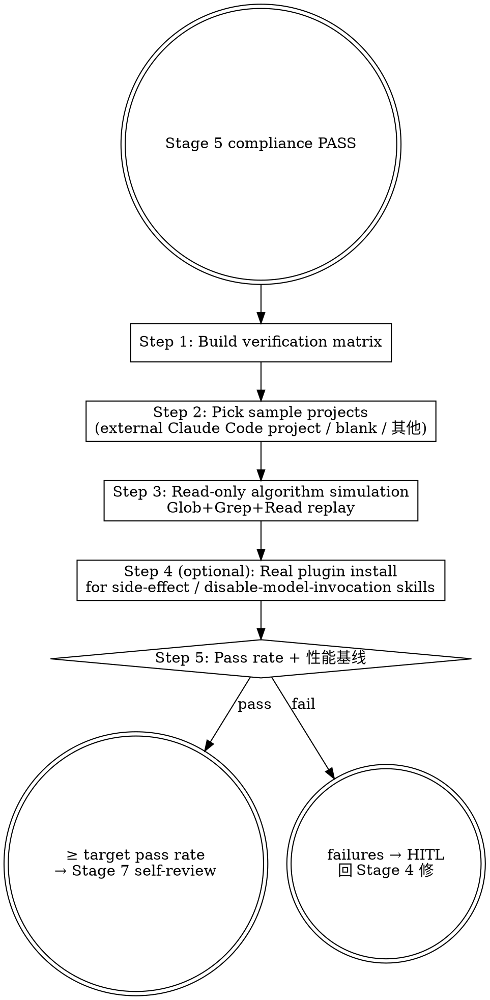

# Marketplace Flow — Local Dogfood / Verification (HITL Stage 6)

## Overview

Stage 6 verifies that newly authored skills behave as their description claims, in conditions resembling real usage. Two verification modes:

1. **Read-only algorithm simulation**: Replay the skill's internal Glob / Grep / Read steps manually against a real external project, see if the skill would arrive at the right output.
2. **Real plugin install**: `/plugin install <plugin>@mj-agentlab-marketplace --scope local` in a sample project, manually trigger via `/<plugin>:<skill>`.

Mode 1 is faster and sufficient for read-only / discovery skills; Mode 2 is required for `disable-model-invocation` skills and any skill with side effects (write / commit / install).

**Reference**: [[../../../docs/rule/[STANDARD]_AI_Engineering_Execution_HITL_Prompt|HITL Standard]] §4.7 + [[../../../docs/guide/[GUIDE]_Plugin_Development_Testing_Workflow|Plugin Dev Testing]] (cross-repo 3-stage workflow).

## Workflow



## When to Run This Skill

**MUST run** when:
- 新增 skill 含 read-only 算法（locate / scan / discovery 类）
- 新增 skill 含 side-effect（commit / install / write）
- skill description trigger phrase 改动可能影响触发率
- 跨项目通用 skill（marketplace plugin 都该跨项目验证）

**MAY skip**:
- 纯文档 PR（无 skill 行为改）
- 仅 frontmatter 字段 typo（不影响行为）
- 已在另一 PR 验证过且无后续改动

## Step 1: Build Verification Matrix

为每个改动的 skill 设计 2-3 个 test case:

```markdown
| Test | Skill | Project | Query | Expected |
|---|---|---|---|---|
| T1 | mp-flow-intake | external-data-project | "评估任务: add new ETL pipeline" | Intake Result with risk=Medium, 不适用提示 |
| T2 | mp-flow-intake | external-agent-project | "intake: refactor skill X" | Intake Result, 不适用提示 |
| T3 | mp-flow-intake | (本 marketplace) | "评估: 加 6th learn-kit skill" | Intake Result with type=feature, scope=learn-kit, version=minor |
| T4 | mp-doc-validate | (本 marketplace) | "validate docs/" | report listing frontmatter / path issues |
```

**目标 pass rate**: read-only skill 100% (3/3)；side-effect skill 至少 1 个真实安装通过。

## Step 2: Pick Sample Projects

| Project | 用途 | 路径示例 |
|---|---|---|
| 外部数据/服务架构项目 | data-domain sample（用户自选）| `<user-workspace>/<external-data-project>/develop/` |
| 外部 runtime agent 项目 | agent-domain sample（用户自选）| `<user-workspace>/<external-agent-project>/develop/` |
| blank | 零信任 / cold-start sample | 临时 `tmp/blank-project/` |
| 本 marketplace | self-dogfood | 当前 worktree |

**Boundary**: marketplace skill 设计上对外部域 (data / agent runtime / 等) **不适用**（按 description Do-not-use-for 规则）；这些项目用于 confidence-< 0.7 path 测试 —— 期望 skill 自己 detect 不适用并跳过/警示。

## Step 3: Read-only Algorithm Simulation

对每个 read-only test:

```bash
# 切到目标 project 路径
cd <target-project>

# Replay skill 的 internal Step 1-N，用 Glob/Grep/Read 跑相同算法
# 例：mp-flow-intake Step 3 Glob 'plugins/*/.claude-plugin/plugin.json'
```

记录:
- Glob/Grep/Read 输出
- Skill 内部预期决策点
- 实际算法走到哪一步

**Pass 标准**: 算法 trace 路径与 skill Output Format 描述一致；不依赖任意 AI inference。

## Step 4 (optional): Real Plugin Install

对 side-effect 或 `disable-model-invocation` skill:

```bash
# 在 sample 项目 root
/plugin install <plugin>@mj-agentlab-marketplace --scope local
# 或本地路径安装（unmerged 状态）:
/plugin add <local-path-to-mj-agentlab-marketplace>

# 手工触发
/<plugin>:<skill> <example-args>
```

记录:
- install 输出
- skill 触发的 actual 工具调用
- 是否符合 description trigger condition

**注意**: 真实 install 会改 user 的 `~/.claude/plugins/` 状态；测试结束后 `/plugin uninstall <plugin>` 复原。

## Step 5: Pass Rate + Baseline

```markdown
### Verification Matrix
| Test | Project | Pass? | Notes |
|---|---|---|---|
| T1 | external-data-project | ✅ | algorithm trace 正确 |
| T2 | external-agent-project | ⚠️ | trace 正确但 mp-flow-intake 应更强调不适用提示 |
| T3 | self | ✅ | |
| T4 | self (install) | ✅ | /mp-doc-validate 触发并跑通 |

### Pass Rate
- read-only: 3/4 (75%) — T2 trace ok 但 description 微调建议
- side-effect: 1/1 (100%)

### Performance Baseline (if applicable)
- mp-doc-validate over docs/ (12 files): ~3s
- mp-flow-repo-scan over marketplace: ~5s
```

**Decision**:
- 100% pass + 无性能问题 → 进 Stage 7
- < 100% pass → 评估 failure 类型:
  - description tweak / minor → 不阻 ship，记 follow-up
  - logical bug / wrong output → 回 Stage 4 修
  - 关键 test 失败原因不明 → HITL

## Output Format

```markdown
## Dogfood Verification

### Test Matrix
<above table>

### Pass Rate Summary
- read-only: X/Y
- side-effect: M/N

### Performance Baselines (optional)
<list>

### Failures / 待改进
1. <failure 描述 + 类型: bug / tweak / unclear>
2. ...

### Decision
- ✅ PROCEED to Stage 7 self-review
- ⚠️ MINOR ISSUES recorded as follow-up
- 🛑 HITL: 关键失败原因不明 / 性能严重劣化

### HITL Questions (if 🛑)
<§3.3 格式>

### Next Step
- PROCEED → /mp-flow-self-review (Stage 7)
- ISSUES → /mp-flow-author (Stage 4) 修
- HITL → STOP
```

## What This Skill DOES NOT DO

- ❌ 不写 SKILL.md / plugin.json（Stage 4 的事）
- ❌ 不跑 plugin-validator / skill-reviewer（Stage 5 `/mp-flow-compliance`）
- ❌ 不评 git diff / commit message（Stage 7 `/mp-flow-self-review`）
- ❌ 不真实安装 + 长跑生产用例（属 cross-project release 验证；本 skill 是开发期 dogfood）

## Sub-skill / Tool Calls

| Tool | 用途 |
|---|---|
| Bash (cd / `/plugin install` / `/plugin uninstall`) | Step 4 真实安装 |
| Glob | Step 3 algorithm 模拟 |
| Grep | Step 3 algorithm 模拟 |
| Read | Step 3 / 真实输出对照 |

## Reference Files

- [[../../../docs/rule/[STANDARD]_AI_Engineering_Execution_HITL_Prompt|HITL Standard]] §4.7
- [[../../../docs/guide/[GUIDE]_Plugin_Development_Testing_Workflow|Plugin Dev Testing]]

## Anti-patterns

- **不要** 仅在本 marketplace 内 dogfood（必须跨项目验证；marketplace plugin 是通用工具）
- **不要** 跳过 description trigger 检测（trigger 不准的 skill 永远不会被自动 invoke）
- **不要** 把 install 后不 uninstall（污染用户全局 ~/.claude/plugins/）
- **不要** 把性能基线设为「< X 秒」绝对值（机器差异；用相对比较）

## Handoff to Next Stage

```text
Dogfood PASS
HITL Gate (用户认可结果) 后:
  → /mp-flow-self-review 进 Stage 7

Dogfood ISSUES:
  → /mp-flow-author 进 Stage 4 (修 logical issue)
  或 → 记 follow-up + 继续 Stage 7（仅 tweak / 描述微调）

Dogfood HITL:
  → STOP，等用户决定
```
