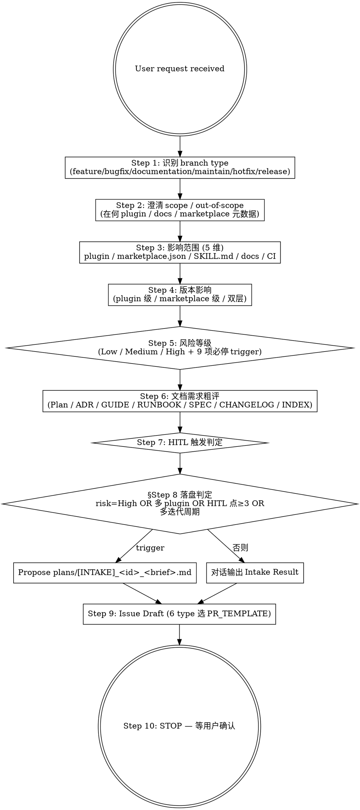

# Marketplace Flow — Task Intake (HITL Stage 0)

## Overview

Entry point for the 11-stage marketplace AI engineering loop. Converts user intent (natural language / chat / paste) into a structured Intake Result **before** any branch, worktree, or file is created. The skill's only side effect is optionally writing `plans/[INTAKE]_<id>_<brief>.md` when §Step 8 落盘判定 fires — even that is a propose-then-write pattern, not auto-write.

**Reference**: [[../../../docs/rule/[STANDARD]_AI_Engineering_Execution_HITL_Prompt|HITL Prompt]] §3.1 (HITL 必停规则) + §4.1 (Stage 0 Intake prompt) + `docs/guide/[GUIDE]_Contributing.md` (branch types).

**Workflow position**:

```text
[user request] -> [mp-flow-intake] -(HITL gate)-> [mp-git-branch + Issue] -> [mp-flow-repo-scan] -> ...
```

## Workflow



## When to Run This Skill

**MUST run intake**:
- 用户要求"创建 GitHub Issue / 启动新任务 / 根据描述开始开发 / 修复 / 文档 / 维护"
- 用户把"chat / plan / 段落 / 问题"转成工程任务
- 用户提到改动 marketplace.json schema / plugin.json 字段 / SKILL.md frontmatter / plugin 删除或重命名 / VERSION major bump / CI workflow（这些都是 §3.1 必停 trigger）

**MAY skip full intake** (仍做最小判断):

| 场景 | 处理方式 |
|---|---|
| 用户指定已有 Issue 并要求继续 | 读 Issue + 上下文 → 进 Repo Scan |
| 用户只问概念 / 解释代码 | 不 Intake，不输出 Issue Draft |
| 用户要求查看状态 / 跑命令（git status / `gh pr list`） | 直接执行 |
| 用户明确"不要创建 Issue" | 轻量分析，不输 Issue Draft |
| `documentation/*` 分支纯文档拼写 / 链接修正 | 跳过 Intake，直接编辑 |

## Step 1: 识别 branch type

Marketplace 6 branch types (per `docs/guide/[GUIDE]_Contributing.md`):

| Type | Description | Base Branch | PR Target |
|---|---|---|---|
| `feature/*` | 新 plugin / 新 skill / 重构 / 新文档结构 | develop | develop |
| `bugfix/*` | develop 上发现的 bug | develop | develop |
| `documentation/*` | 仅文档变更（无 plugin/skill 改动） | develop | develop |
| `maintain/*` | CI/CD / scripts / deps / Docker | develop | develop |
| `hotfix/*` | 生产紧急（main 直接修） | **main** | **main** |
| `release/*` | 发布 PR（VERSION + CHANGELOG 转 X.Y.Z） | develop | main |

> `release/*` 由人工发起；AI agent 不主动起 release。

## Step 2: 澄清 scope / out-of-scope

明确:
- 包含 / 不包含的具体动作
- 前置依赖（已有 ADR / GUIDE / 上游 Issue）
- 后续独立 PR（避免 scope 膨胀）

## Step 3: 影响范围（5 维）

| 范畴 | 检查重点 | 涉及时升档 |
|---|---|---|
| **plugin** | `plugins/learn-kit/{plugin.json, skills/<name>/SKILL.md, CHANGELOG, README}` | Medium 起 |
| **marketplace meta** | `.claude-plugin/marketplace.json` plugins 数组 / metadata | **High** + §3.1 必停 |
| **SKILL.md frontmatter** | name / description / disable-model-invocation / allowed-tools | **High** + §3.1 必停 |
| **docs/** | `docs/**` 含 STANDARD / GUIDE / RUNBOOK / ADR / SPEC | Low（纯 docs） / Medium（含 STANDARD/ADR） |
| **CI / Release** | `.github/workflows/{ci,release}.yml` | **High** + §3.1 必停 |

## Step 4: 版本影响（dual-layer）

| 改动类别 | plugin 级 bump | marketplace 级 bump |
|---|---|---|
| plugin 新增 skill / 增强 | minor (plugin.json) | minor (VERSION + marketplace.json) |
| plugin bugfix | patch | patch |
| plugin 删除 / 重命名 / breaking | **major** | **major** + 必 HITL |
| docs 重排（不改 plugin 行为） | — | minor 或 patch |
| CI / scripts 维护 | — | patch（除非含 release.yml 改动） |

## Step 5: 风险等级（9 项必停 trigger）

通用 + marketplace 专属 9 项（per HITL Standard §3.1）:

1. 任务目标 / 范围 / 验收标准不清楚
2. Issue / Plan / ADR 与代码现状冲突
3. **marketplace.json schema** 变更（plugins 数组结构 / metadata 字段）
4. **plugin.json 字段约定** 变更（spec compliance / 6 必需字段 / plugin 增删）
5. **SKILL.md frontmatter** 变更（name / description / disable-model-invocation / allowed-tools）
6. **plugin 删除 / 重命名 / 主版本 bump**
7. **marketplace `VERSION` 主版本 bump**
8. **CI workflow 修改**（`ci.yml` / `release.yml`）
9. **plugin secrets / 凭据** 处理（即使当前 v4.5.0 无 plugin 持有 secrets — 架构性 trigger 非时间性）
10. **merge → main**（含 release PR）
11. Review comment 改变 plugin 行为 / SKILL description / allowed-tools 边界
12. 测试失败原因不明
13. Implementation 中 scope 明显扩大

**任一触及 → 自动升 High + 必停**。

## Step 6: 文档需求粗评

每类文档评估 Action ∈ {Create / Update / None}:

| Type | 触发条件 | Default Path |
|---|---|---|
| Plan (`~/.claude/plans/`) | 多步骤任务 / 风险 ≥ Medium / scope 跨多文件 | 工作环境本地 |
| ADR (`docs/[ADR]_*.md` 或 PR2 后 `docs/adr/`) | 架构 / 命名 / 拆分决策 | docs/adr/ |
| GUIDE | 新增 how-to / onboarding 路径 | docs/guide/ |
| RUNBOOK | 新增运维 / 回滚步骤 | docs/runbook/ |
| SPEC | schema 或 contract 形式化 | docs/spec/ |
| CHANGELOG | 任何用户可见行为 | 顶层 + 各 plugin |
| INDEX | 新 doc 加入 | docs/INDEX.md |

PR 2+ 之后可调用 `mp-doc-author` 起草。

## Step 7: HITL 触发判定

按 §Step 5 9 项 + §3.1 全集核对：是 / 否 / 哪一条。任一触发 → 在 Output 「HITL Questions」段列出。

## Step 8: §落盘判定

落盘 `plans/[INTAKE]_<id>_<brief>.md` 当任一触发:
- risk-level = High
- 影响多 plugin 或 marketplace.json schema
- HITL 点 ≥ 3
- 跨多 PR / 多迭代周期

> 注：marketplace **不**维护 `plans/` 目录；working plan 落用户本地 `~/.claude/plans/<topic>.md`，不入 marketplace repo（per HITL Standard §0 working-doc 边界）。

## Step 9: Issue Draft

Marketplace `.github/ISSUE_TEMPLATE/` 含 5 类（feature/bugfix/documentation/maintain/hotfix）。Intake 输出 Issue body 用 inline structure（与 PR template 对齐）:

```markdown
## What
<feature: 做什么；bugfix/hotfix: 现象；documentation: 变更内容；maintain: 改什么>

## Why
<motivation；如对应已有 ADR / GUIDE / RUNBOOK 给链接>

## Scope
- In-scope: <list>
- Out-of-scope: <list>

## Acceptance Criteria
- [ ] AC 1 (可验证)
- [ ] AC 2

## Risk
- Risk level: Low / Medium / High
- Risk areas: <e.g., marketplace.json schema / plugin.json / SKILL.md frontmatter / CI / release>

## Verification Plan
- `git status` / `git diff` 等本地验证
- `/plugin-dev:plugin-validator` (agent) 跑过
- 跨项目 dogfood（如适用）

## Related Docs
- HITL Standard / GUIDE / ADR 链接
```

bugfix / hotfix 加 Reproduction / Expected vs Actual / Environment 段。

## Output Format

```markdown
## Intake Result

### Task Classification
- Type: feature / bugfix / documentation / maintain / hotfix / release
- Base branch: develop / main
- 估计影响范围: <plugin / marketplace meta / SKILL.md / docs / CI>

### Version Implication
- plugin (learn-kit) bump: none / patch / minor / major
- marketplace VERSION bump: none / patch / minor / major

### Risk Assessment
- Level: Low / Medium / High
- Triggered §3.1 必停项: <list 编号>
- 升档原因: <e.g., High 因 marketplace.json plugins 数组结构改动>

### Documentation Decision (粗评)
- Plan (~/.claude/plans/): Create / Update / None
- ADR: Create / Update / None
- GUIDE / RUNBOOK / SPEC: 同上
- CHANGELOG (顶层 / plugin): 同上
- INDEX: 同上

### Issue Draft
<inline body, Step 9>

### Verification Plan
- Level A read-only: <commands>
- Level B side-effects: <commands；HITL 确认后跑>

### HITL Questions
<§3.3 格式，0-5 个>

### §Step 8 落盘判定
- 是否建议落盘 plans/[INTAKE]_*.md (user local): 是 / 否
- 原因: <若是>
- 建议路径: ~/.claude/plans/<topic>.md

### Next Step
- HITL 确认后调 `/mp-git-branch` 创建 worktree + 分支
- 或先调 `/mp-flow-repo-scan` 做事实核查
```

## What This Skill DOES NOT DO

- ❌ 不创建 GitHub Issue（用 `gh issue create` 或 `/mp-git-pr` 的 Issue 子流程）
- ❌ 不创建 branch / worktree（用 `/mp-git-branch`，Stage 8 前置）
- ❌ 不写代码 / 改 plugins/ / 改 docs/
- ❌ 不进 Repo Scan / Plan / ADR 内容（Stage 1 / 2 / 3 的事）
- ❌ 不自动落盘 plans/[INTAKE]_*.md（仅 propose；用户用 Write 落盘）
- ❌ 不在 marketplace repo 内创建 `plans/` 目录（marketplace 不维护此目录）

## Sub-skill / Tool Calls

| Tool | 用途 |
|---|---|
| Read | 用户提供的描述 / 现有 Plan / Issue 链接 |
| Bash `gh issue view <num>` | 用户引用已有 Issue 时核对 |
| Bash `git status` / `git branch --show-current` / `git worktree list` | Step 1 当前上下文 |
| Glob / Grep | Step 3 影响范围粗扫；深扫给 Stage 1 |

无 sub-skill；intake 是 11-stage 闭环的源头。

## Reference Files

- [[../../../docs/rule/[STANDARD]_AI_Engineering_Execution_HITL_Prompt|HITL Standard]] §3.1 + §4.1 (含 §0 universal skeleton heritage)
- [[../../../docs/guide/[GUIDE]_Contributing|CONTRIBUTING]]（branch / commit）
- [[../../../docs/guide/[GUIDE]_Marketplace_Project_Overview|Marketplace Overview]]（plugin 结构）

## Anti-patterns

- **不要** 跳过 Step 5 风险评估（缺风险信息会让下游 self-review / merge gate HITL 误放）
- **不要** 在 Intake 阶段写完整 ADR / 实现计划（Stage 2 / 3 的职责）
- **不要** 自动调用 `/mp-git-branch`（HITL Gate 1 在 Stage 0；用户确认后才进 Stage 1）
- **不要** 把工作 plan 写进 marketplace repo（用 `~/.claude/plans/`）
- **不要** 把 issue draft body 直接 commit 进 repo

## Handoff to Next Stage

```text
Intake 完成
HITL Gate（用户确认）通过后:
  → /mp-git-branch 创建 worktree + 分支
  → 可选: 用户/AI 用 gh issue create 把 Issue Draft 落地
  → /mp-flow-repo-scan 进 Stage 1 事实核查
  → /mp-flow-plan 进 Stage 2 写 plan
```
