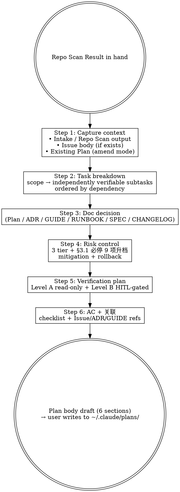

# Marketplace Flow — Plan Body Authoring (HITL Stage 2)

## Overview

Drafts the working Plan body for a marketplace task. The Plan answers "how do we proceed?" — it does NOT contain detailed plugin contract / SKILL.md content (that belongs in Stage 4 implementation outputs). Output is markdown text that the user (or AI with user consent) writes to `~/.claude/plans/<topic>.md` — marketplace repo deliberately does NOT keep a `plans/` folder.

**Reference**: [[../../../docs/[STANDARD]_AI_Engineering_Execution_HITL_Prompt|HITL Standard]] §4.3 (Stage 2 Plan prompt) + §0 (working-doc boundary).

## Workflow



## When to Run This Skill

**MUST run**:
- Stage 2 plan authoring after Stage 1 Repo Scan for non-trivial tasks
- 用户 "写 plan body" / "draft plan" / "执行计划" / "任务拆解"
- Amending 现有 Plan 反映 Repo Scan 修正

**MAY skip**:
- Trivial single-file change（typo / link fix）— 直接 commit 不写 Plan
- 用户已有完整外部 Plan 仅要执行（直接 Stage 4）

**MUST NOT use for**:
- 形式化 GUIDE / ADR / RUNBOOK 起草 → 用 `mp-doc-author` (Stage 6) 或 `mp-flow-design-adr` (Stage 3)
- Documentation gap 分析 → 嵌入本 skill Step 3，不单列
- Repo state fact-check → Stage 1 `mp-flow-repo-scan`

## Step 1: Capture Context

```bash
# Repo Scan Result 在对话内；如缺，提示先跑 /mp-flow-repo-scan
# Issue 关联
branch=$(git branch --show-current)
issue=$(echo "$branch" | grep -oE '[0-9]+' | head -1)
[ -n "$issue" ] && gh issue view "$issue" --json title,body

# Existing local plan (amend mode)
ls ~/.claude/plans/*.md 2>/dev/null
```

如 Stage 1 Repo Scan **未运行** → 提示先用 `/mp-flow-repo-scan`，再回本 skill；或低风险任务下显式跳过（记录跳过理由）。

## Step 2: Task Breakdown

| 拆解原则 | 说明 |
|---|---|
| 单一职责 | 每子任务专注一个目标（不混"加 X + 改 Y"） |
| 可独立验证 | 每子任务有 grep / `/plugin-dev:plugin-validator` / Glob 命令验证 |
| 依赖排序 | 拓扑顺序，前置先做 |
| 命名一致 | Step 4a / 4b / 4c... 编号便于跟踪 |
| **风险边界识别** | 标注每子任务是否触及 §3.1 必停 trigger（marketplace.json schema / plugin.json field / SKILL.md frontmatter / CI / release） |

**输出格式**（写入 Plan §3 任务拆解）:

```markdown
### 3.1 <子主题>
- 含: <具体动作>
- 不含: <边界外的事项>
- 风险触点: <e.g., marketplace.json schema 改 / 仅 plugin docs / N/A>
- 验证: <grep / validator / build / dogfood 命令>

### 3.2 <下一子主题>
...
```

## Step 3: Documentation Decision

按 scope 评估 8 类文档（marketplace 适用集）每类 Action ∈ {Create / Update / None}:

| Type | 默认 Path | 触发条件 |
|---|---|---|
| Plan (~/.claude/plans/) | user-local | 跨多 step / 风险 Medium+ |
| ADR | `docs/[ADR]_*.md` 或 PR2 后 `docs/adr/` | 架构 / 命名 / 拆分决策 |
| GUIDE | `docs/guide/` | 新增 how-to |
| RUNBOOK | `docs/runbook/` | 新增运维步骤 |
| SPEC | `docs/spec/` | schema / contract 形式化 |
| CHANGELOG (顶层) | `CHANGELOG.md` `[Unreleased]` | 任何用户可见行为 |
| CHANGELOG (plugin) | `plugins/<name>/CHANGELOG.md` | plugin 改动 |
| INDEX | `docs/INDEX.md` | 新 doc 加入 |

输出嵌入 Plan §4 (doc decision) 或 §3 task list 末尾。**不**直接写 doc 内容（那是 Stage 3 / 6）。

## Step 4: Risk Control（含 §3.1 必停升档）

| Risk | 触发条件 | Plan §5 内容 |
|---|---|---|
| Low | 局部、可逆；不动 schema / secret / prod；不触 §3.1 必停 | 1-3 行风险表 + 简要缓解 |
| Medium | 改 plugin 内部行为 / 多 skill 影响 / 非生产配置 | 风险表 + 详细缓解 + 监控点 |
| **High** | marketplace.json schema / plugin.json fields / SKILL.md frontmatter / plugin delete / VERSION major / CI workflow / secrets / merge→main；**或 §3.1 必停 9 项任一** | 风险表 + 缓解 + rollback 计划 + ADR/RUNBOOK 链接 + **必 HITL** 显式标注 |

**输出格式**（Plan §5）:

```markdown
| 风险 | 等级 | 缓解 / Rollback |
|---|---|---|
| <风险描述> | Low/Medium/High | <缓解措施 / Rollback / monitoring> |
```

## Step 5: Verification Plan

| 类别 | 接受？ | 例 |
|---|---|---|
| Level A read-only | ✅ 任何时候跑 | `git status` / `git diff` / `Get-ChildItem` / `Grep` / `gh pr checks` |
| Level B side-effects | ⚠️ HITL 确认后 | `/plugin-dev:plugin-validator` (agent) / `/plugin install` / `git commit` / `git push` |
| 跨项目 dogfood | ⚠️ HITL 后 | 在外部 sample 项目 `/plugin install <plugin>@mj-agentlab-marketplace --scope local` 验证 |
| CI checks | 自动 | PR 推送后 GitHub Actions 跑 6 步 |

## Step 6: AC + 关联

```markdown
## 验证 (AC)
- [ ] AC 1 (可验证命令: <command>)
- [ ] AC 2
- [ ] ...

## 关联
- Issue: #<NN>
- Repo Scan: <link to Stage 1 output>
- ADR: <if exists>
- HITL Standard §<section>
```

## Output Format

完整 Plan body（6 段，markdown）:

```markdown
# Plan — <Topic>

## 1. Context
<why this task, intended outcome, why now>

## 2. Linked Artifacts
- Issue: #<NN>
- Repo Scan output (Stage 1)
- Existing ADR / GUIDE refs

## 3. Task Breakdown
### 3.1 ...
### 3.2 ...

## 4. Documentation Decision
| Type | Action | Path |
|...|...|...|

## 5. Risk Control
| Risk | Level | Mitigation |
|...|...|...|

## 6. Verification & AC
- Level A: ...
- Level B: ...
- AC checklist: ...

## 7. HITL Gates
- <Gate 1>: <when, what to confirm>
- ...
```

输出后建议用户:
```text
Plan 完整草案如上。建议落到:
  ~/.claude/plans/<topic>.md
或嵌入即将创建的 PR description（压缩版）。
marketplace repo **不**维护 plans/ 目录。
```

## What This Skill DOES NOT DO

- ❌ 不写 plugin/skill 代码 / SKILL.md 内容（Stage 4 `/mp-flow-author` 的事）
- ❌ 不写 formal ADR / GUIDE / RUNBOOK / SPEC 文档（Stage 3 / 6 / `/mp-doc-author`）
- ❌ 不自动 Write to disk —— 输出在对话；用户决定何处落盘
- ❌ 不创建 GitHub Issue / branch / worktree
- ❌ 不跑 validator / dogfood —— 那是 Stage 5 / 6

## Sub-skill / Tool Calls

| Tool | 用途 |
|---|---|
| Read | Issue body / Repo Scan output / Existing plan |
| Bash `gh issue view` / `git branch --show-current` | Step 1 context |
| Glob / Grep | Step 3 doc decision 时枚举现有 docs |

无 sub-skill；Plan 是 Stage 2 单点输出。

## Reference Files

- [[../../../docs/[STANDARD]_AI_Engineering_Execution_HITL_Prompt|HITL Standard]] §4.3
- [[../../../docs/[GUIDE]_Marketplace_Project_Overview|Marketplace Overview]]
- [[../../../docs/[GUIDE]_Version_Management|Version Management]]
- [[../../../docs/[GUIDE]_Plugin_Development_Testing_Workflow|Plugin Dev Testing]]

## Anti-patterns

- **不要** 在 Plan 内写完整 SKILL.md / `plugin.json` 内容（实施细节属 Stage 4）
- **不要** 把 Plan 写进 marketplace `plans/` 目录（该目录不存在；与 mj-system 不同）
- **不要** 跳过 §3.1 必停 trigger 升档评估
- **不要** 一次 Plan 跨多个无关 plugin（应拆 PR）

## Handoff to Next Stage

```text
Plan body draft ready
HITL Gate (用户确认 Plan) 后:
  → /mp-flow-design-adr 进 Stage 3 (若需要 ADR)
  → /mp-flow-author 进 Stage 4 (plugin/skill authoring)
  → 或 STOP (若 Plan §7 HITL Gate 触发暂停)
```
