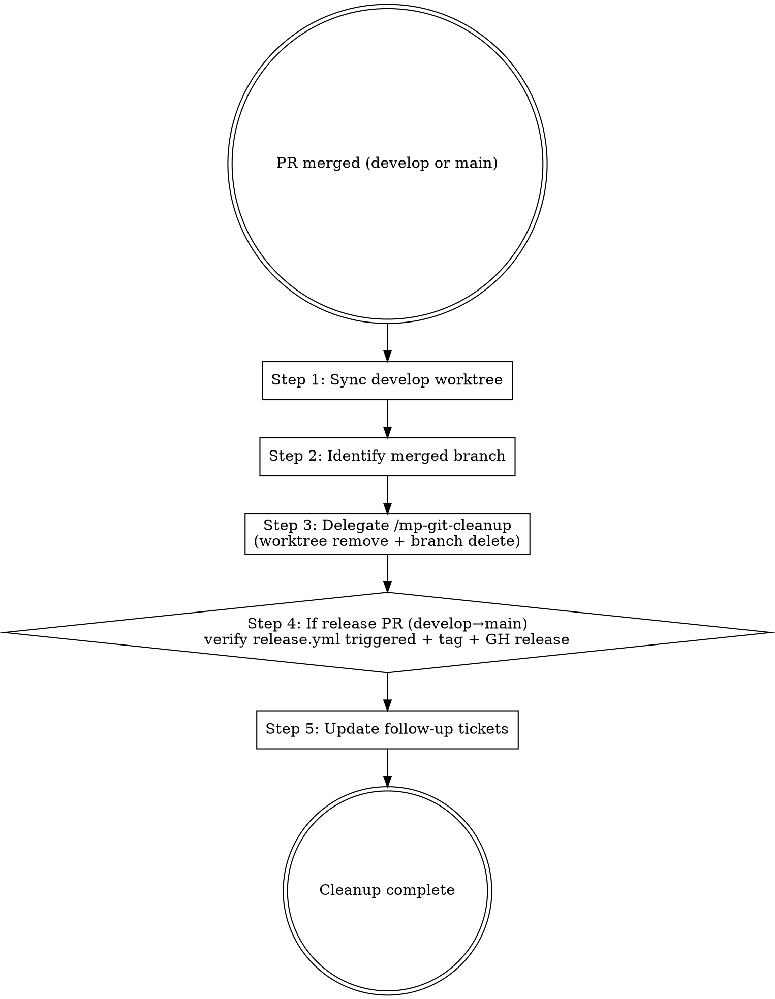

# Marketplace Flow — Post-merge Cleanup Orchestration (HITL Stage 10)

## Overview

Stage 10 orchestrator: after PR merges to develop or main, coordinates local cleanup (worktree remove, branch delete) and release verification (tag, GitHub Release). Delegates the actual git operations to `/mp-git-cleanup`; this skill's role is sequencing + verification.

**Reference**: [[../../../docs/rule/[STANDARD]_AI_Engineering_Execution_HITL_Prompt|HITL Standard]] §4.11 + [[../../../docs/runbook/[RUNBOOK]_Release_Operations.md|Release Operations RUNBOOK]].

## Workflow



## When to Run This Skill

**MUST run** after:
- feature/bugfix/documentation/maintain PR merged to develop
- hotfix PR merged to main (含 main → develop 同步)
- release PR merged to main (含 release.yml 验证)

**MAY skip**:
- 已被 prior 同分支 PR 处理（worktree 已清理）
- 用户明确"keep worktree for future work"（仍至少跑 `git fetch`）

## Step 1: Sync develop Worktree

```bash
cd D:\workspace\10-software-project\projects\mj-agentlab-marketplace\develop
git pull origin develop                         # 取回 merge commit
git status                                       # 确认 clean
git log --oneline -3                             # 验证 merge commit 在 head
```

如 merge 到 main (hotfix / release):
```bash
# 切到 main worktree（若存在）
git fetch origin main:refs/remotes/origin/main
# main worktree 路径通常 ../main/，可能不预创建；用 fetch 即可
```

## Step 2: Identify Merged Branch

```bash
# 已 merge 到 develop 或 main 的 feature/bugfix/documentation/maintain 分支
git worktree list

# 验证待清理分支已合并:
git branch -a --merged | grep -E '^\s*(feature|bugfix|documentation|maintain|hotfix|release)/'
```

记录:
- 待删 worktree 路径
- 待删本地分支名
- 远程分支不删（让 GitHub 保留历史）

## Step 3: Delegate `/mp-git-cleanup`

调用 `/mp-git-cleanup` 执行实际命令:

```bash
git worktree remove <worktree-path>
git branch -D <branch-name>                  # 已 merge 安全删；本地分支不与 remote 同步
git fetch --tags                             # 取 release.yml 新建 tag（如适用）
```

## Step 4: Release Verification (release PR 专用)

如本次是 release PR (develop → main) 触发的 post-merge:

```bash
# 1. 等待 release.yml 完成（~10s）
sleep 15

# 2. 验证 tag 已创建
git fetch --tags
git tag -l "v$(cat VERSION)"
# 期望输出 vX.Y.Z

# 3. 验证 GitHub Release
gh release view "v$(cat VERSION)" --json url,tagName,createdAt,name

# 4. 验证 Release notes 从 CHANGELOG [X.Y.Z] 段抽取
gh release view "v$(cat VERSION)" --json body | jq -r '.body' | head -20
```

如 release.yml **未** 在 30s 内完成 / tag 未创建 / Release 未生成 → HITL（检查 Actions workflow logs）。

## Step 5: Update Follow-up Tickets

```bash
# 若 PR description / Stage 7 self-review 记录了 follow-up:
gh issue list --state open --label follow-up
# 关闭已完成 follow-up；新建未完成的
```

可选: 在 Release notes 或 CHANGELOG 增加 "Known issues / Follow-ups" 段落。

## Output Format

```markdown
## Post-merge Cleanup Result

### Context
- Merged PR: #<NN> (<title>)
- Target branch: develop / main
- Worktree to remove: <path>
- Branch to delete: <name>

### Cleanup Actions (delegated to /mp-git-cleanup)
- [x] git worktree remove <path>
- [x] git branch -D <name>
- [x] git fetch --tags

### Release Verification (if release PR)
- [x] tag v<X.Y.Z> created at <ISO timestamp>
- [x] GitHub Release v<X.Y.Z>: <url>
- [x] Release notes from CHANGELOG [X.Y.Z] (lines <N-M>)

### Follow-up
- Open: <list>
- Closed: <list>

### Next Step
- 回 develop worktree 准备下一个任务
- 或: 检查 `/mp-flow-intake` 启动新 PR

### HITL Questions (if 异常)
<§3.3 格式>
```

## What This Skill DOES NOT DO

- ❌ 不真正跑 git worktree remove / git branch -D（delegate `/mp-git-cleanup`）
- ❌ 不删 remote branch（GitHub 上保留历史）
- ❌ 不 amend / rebase 已 merge commit
- ❌ 不创建 release.yml workflow（基础设施，独立 PR）
- ❌ 不写 release notes（CHANGELOG 已是源；release.yml 自动抽取）

## Sub-skill / Tool Calls

| Tool | 用途 |
|---|---|
| Skill (`/mp-git-cleanup`) | Step 3 actual cleanup |
| Bash (`git pull` / `git fetch --tags` / `git tag -l` / `gh release view`) | Steps 1, 4 |
| Bash (`gh issue list` / `gh issue close`) | Step 5 follow-up |

## Reference Files

- [[../../../docs/rule/[STANDARD]_AI_Engineering_Execution_HITL_Prompt|HITL Standard]] §4.11
- [[../../../docs/runbook/[RUNBOOK]_Release_Operations.md|Release Operations]]
- `.github/workflows/release.yml`

## Anti-patterns

- **不要** 用 `rm -rf <worktree>` 替代 `git worktree remove`（留 stale metadata 在 `.bare/worktrees/`）
- **不要** 跳 `git fetch --tags`（错过 release.yml 创建的 tag）
- **不要** 手工创建 tag（release.yml 自动；手工创建会 race condition）
- **不要** 删 remote branch（让 GitHub 保留历史；本地够了）
- **不要** 在 main worktree 直接 commit / push（必经过 PR + hotfix 流程）

## Handoff to Next Stage

```text
Post-merge cleanup complete
→ 回 develop 准备 /mp-flow-intake 下一个任务
或 → 监控 release.yml 完成（release PR 后 ~10s）
或 → STOP（task 闭环结束）
```
