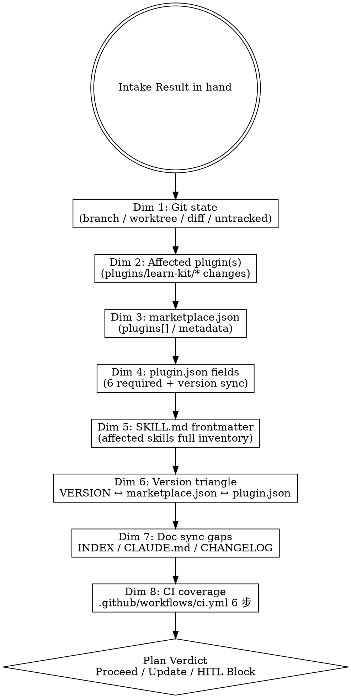

# Marketplace Flow — Repo Scan (HITL Stage 1)

## Overview

Read-only 8-dimension fact-check against the marketplace repo. Establishes ground truth for the upcoming Plan (Stage 2) so the AI's assumptions are calibrated against real file contents — not inferred from naming or stale memory. Skill is **strictly read-only**; it never modifies files.

**Reference**: [[../../../docs/[STANDARD]_AI_Engineering_Execution_HITL_Prompt|HITL Standard]] §4.2 (Stage 1 Repo Scan prompt) + `.github/workflows/ci.yml` (6-step validation that defines what counts as "compliant").

## Workflow



## When to Run This Skill

**MUST run** before:
- Plan body authoring (Stage 2) for non-trivial tasks
- ADR (Stage 3) when decision depends on current schema state
- Any task that touches `marketplace.json` or `plugin.json` schema

**MAY skip**:
- Pure typo / link fix (`documentation/*` lite)
- User explicitly provides scan output to import

## Dimension 1: Git State

```bash
git branch --show-current
git worktree list
git status --short
git diff --stat
git log --oneline -5
```

Flag: untracked files / staged but uncommitted / wrong branch (e.g., on develop trying to write feature work).

## Dimension 2: Affected Plugin(s)

```bash
git diff --name-only develop...HEAD 2>/dev/null
# or for in-progress: git status --short | grep plugins/
```

Map changed paths to plugin: marketplace currently has 1 plugin (`learn-kit`). Any change under `plugins/learn-kit/**` is plugin-scope.

## Dimension 3: marketplace.json

```bash
cat .claude-plugin/marketplace.json
```

Verify:
- `metadata.version` matches `VERSION` file
- `plugins[]` array has exactly the plugins existing in `plugins/` directory
- Each `plugins[]` entry has `name`, `source`, `description`, `version`, `author`, `category`, `keywords`, `license`
- `plugins[].version` matches the matching `plugins/<name>/.claude-plugin/plugin.json` `version` field

## Dimension 4: plugin.json Fields

For each affected plugin:

```bash
cat plugins/<name>/.claude-plugin/plugin.json
```

6 required fields (per Claude Code plugin spec):
1. `name`
2. `version`
3. `description`
4. `author`
5. `repository` (must be **string** since v3.2.1; per `[ADR]_NotebookLM_Kit_Retirement` / commit history)
6. `keywords`

Optional but checked: `license`, `homepage`, `categories`.

## Dimension 5: SKILL.md Frontmatter

For each affected skill:

```bash
ls plugins/<name>/skills/<skill>/SKILL.md
# read frontmatter:
sed -n '/^---$/,/^---$/p' plugins/<name>/skills/<skill>/SKILL.md
```

Native Claude Code spec fields:
- `name` (required) — matches skill directory name
- `description` (required) — has trigger words / Use When / Do not use for
- `allowed-tools` (optional)
- `disable-model-invocation` (optional)

⚠️ marketplace-level doc framework's 8-field frontmatter does NOT apply to SKILL.md (per HITL Standard §SKILL.md frontmatter policy).

## Dimension 6: Version Triangle

Triangle must hold:

```text
VERSION (root file)
   ↕
.claude-plugin/marketplace.json metadata.version
   ↕
plugins/<name>/.claude-plugin/plugin.json version  →  matches  →  .claude-plugin/marketplace.json plugins[<name>].version
```

Common drift (per v3.1.0 实战教训): `plugin.json` 未与 marketplace.json `plugins[]` 同步 → `/plugin-dev:plugin-validator` (agent) 会 catch；PR 前必跑一次。

## Dimension 7: Doc Sync Gaps

```bash
ls docs/
cat docs/INDEX.md
grep -E "^## v?[0-9]" CHANGELOG.md | head -5
grep -E "^## v?[0-9]" plugins/learn-kit/CHANGELOG.md | head -5
```

Verify:
- 新建 docs 是否在 `docs/INDEX.md` 出现
- 顶层 `CHANGELOG.md` `[Unreleased]` 或对应版本段是否含本次改动条目
- 各 plugin `CHANGELOG.md` 同样
- 顶层 `CLAUDE.md` "v X.Y.Z Update Note" 段是否对齐

## Dimension 8: CI Coverage

```bash
cat .github/workflows/ci.yml
```

6 步 validation（per HITL Standard §4.2）:
1. `marketplace.json` schema valid (JSON parse + Anthropic schema)
2. 每 `plugins/*/.claude-plugin/plugin.json` valid (6 required fields)
3. 每 SKILL.md 含必需 frontmatter `name` + `description`
4. 版本一致性（version triangle）
5. CHANGELOG.md 包含 `[Unreleased]` 或当前版本 entry
6. 各 plugin CHANGELOG.md 同上

判断本次改动是否被这 6 步覆盖 —— 如发现缺口（如改 `.github/workflows/`），是 §3.1 必停。

## Output Format

```markdown
## Repo Scan Result

### Current State Table
| Dim | Field | Value | Issue? |
|-----|-------|-------|--------|
| 1 | branch | feature/<X> | OK |
| 1 | worktree | feature-X/ | OK |
| 3 | marketplace.json.metadata.version | 4.0.0 | matches VERSION ✅ |
| 4 | learn-kit plugin.json version | 1.0.0 | matches marketplace.json[learn-kit].version ✅ |
| 6 | Version triangle | 4.0.0 / 4.0.0 / 1.0.0 | consistent ✅ |
| 7 | INDEX.md sync | needs update for new doc X | ⚠️ |
| ... |

### Affected Areas
- plugin: learn-kit (5 skills, .mcp.json)
- docs: <list>
- CI: ci.yml unchanged

### Documentation Decision (refined from Intake)
- Plan: Create
- ADR: <Create / Update / None>
- GUIDE / RUNBOOK / SPEC: <list>
- CHANGELOG: 顶层 + learn-kit

### Plan Verdict
- ✅ Proceed: Plan 可直接基于此 Scan 进 Stage 2
- ⚠️ Update Plan: Intake 假设与现实有 N 处差异，先调整 Plan
- 🛑 HITL Block: 发现 §3.1 必停 trigger，需要用户确认

### HITL Questions
<§3.3 格式，0-5 个>
```

## What This Skill DOES NOT DO

- ❌ 不修改任何文件（read-only）
- ❌ 不创建 branch / worktree
- ❌ 不写 Plan 内容（用 `/mp-flow-plan` Stage 2）
- ❌ 不评 ADR 内容（用 `/mp-flow-design-adr` Stage 3）
- ❌ 不跑测试 / lint / validator —— 那是 Stage 5 / 6

## Sub-skill / Tool Calls

| Tool | 用途 |
|---|---|
| Bash `git ...` | Dim 1 |
| Read | Dim 3 / 4 / 5 / 7 / 8 各 JSON / MD 文件 |
| Glob | 枚举 `plugins/*/.claude-plugin/plugin.json` / `plugins/*/skills/*/SKILL.md` |
| Grep | `^---` frontmatter 边界 / `^## v?[0-9]` CHANGELOG header |

## Reference Files

- [[../../../docs/[STANDARD]_AI_Engineering_Execution_HITL_Prompt|HITL Standard]] §4.2
- [[../../../docs/[GUIDE]_Marketplace_Project_Overview|Marketplace Overview]]
- [[../../../docs/[GUIDE]_Version_Management|Version Management]]
- `.github/workflows/ci.yml`

## Anti-patterns

- **不要** 假设 plugin.json / marketplace.json 字段「应该是」某值 —— 必须真实读文件
- **不要** 跳过 Dim 6 版本三角检查（这是高频漂移点）
- **不要** 一边 Scan 一边修文件（read-only 纪律）
- **不要** 把 Scan 结果用作 Plan body —— Scan 是输入，Plan 是输出

## Handoff to Next Stage

```text
Repo Scan Result ready
HITL Gate (Plan Verdict = Proceed/Update) 后:
  → /mp-flow-plan 进 Stage 2 写 Plan body
  → 或 /mp-flow-design-adr 直接进 Stage 3（若仅需 ADR 决策）
  → 或 STOP（若 Plan Verdict = HITL Block）
```
