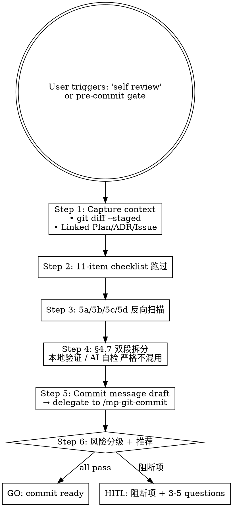

# Marketplace Flow — AI Self-review (HITL Stage 7)

## Overview

Pre-commit gate. Verifies that the staged diff matches Plan/ADR, scope hasn't drifted, no secret / debug-code / hardcoded paths slipped in, and all 11 marketplace-specific check-items pass. The output's hallmark is **strict dual-section discipline**: 「本地验证」段 lists human-objective repeatable checks (git status / git diff / version files / command output); 「AI 自检」段 lists AI-generated content trustworthiness checks (scope drift / hardcoding scan / doc-code consistency / reference paths).

**Reference**: [[../../../docs/rule/[STANDARD]_AI_Engineering_Execution_HITL_Prompt|HITL Standard]] §4.8 (含 5a/5b/5c/5d 子段 + item 10 release.yml + item 11 secrets).

## Workflow



## When to Run This Skill

**MUST run before** `git commit`:
- 非 trivial 改动（>5 文件 OR >100 行 OR 涉及 plugin.json / SKILL.md frontmatter / marketplace.json）
- Stage 6 dogfood 完成后紧接动作
- Push 前（pre-push gate）

**MAY skip**:
- 单文件 trivial 改动（typo / rename）
- 用户明确 "skip self-review, just commit"（仍记 skip 理由）

## Step 1: Capture Context

```bash
git diff --staged --name-only
git diff --staged --stat
git diff --staged                # 完整 diff（大 PR 可分批）
git log -1 --format=%s 2>/dev/null    # 上次 commit 标题（避重）
```

Locate linked artifacts:
- Plan: `~/.claude/plans/<topic>.md` (user-local)
- ADR: `docs/[ADR]_*.md` (or post-PR 2 `docs/adr/`)
- Issue: `gh issue view <id>`

## Step 2: 11-item Checklist

| # | 检查项 | 来源 |
|---|---|---|
| 1 | 改动完全对应 Plan / ADR | scope alignment |
| 2 | 不超出 Plan §3 scope | drift check |
| 3 | 是否改 plugin API / SKILL description / allowed-tools / marketplace.json schema → 必 HITL | §3.1 必停 4-6 项 |
| 4 | 无硬编码 / secret / 绝对路径 / 调试代码 | 通用 |
| 5 | 文档同步检查 (4 子项 5a/5b/5c/5d) | 见下 |
| 6 | AC 都有验证证据 (指向 Stage 6 dogfood) | AC 验证 |
| 7 | 无应排除文件 (PR_BODY.md 临时 / IDE 缓存 / .env / *.key) | git diff filter |
| 8 | **(强制)** 跑 `sh scripts/validate-commits.sh origin/<base>..HEAD`；输出粘到「本地验证」段；0 failures 才放行 | `[STANDARD]_Commit_Message_Convention` §3 / §4 / §11 |
| 9 | PR template 自检 6 项满足 | `.github/PULL_REQUEST_TEMPLATE/<type>.md` |
| 10 | 是否触发 release.yml (`VERSION` 文件变更) → 是则必 HITL 确认发布意图 | §3.1 #10 |
| 11 | 涉及 secret / 凭据 → 必停 | §3.1 #9 |

## Step 3: 5a/5b/5c/5d 文档同步反向扫描

**5a 反向扫描**:
```bash
# 本次 git diff 中 rename / move / delete 的 SKILL.md / plugin.json 字段
git diff --staged --diff-filter=RDM --name-status | grep -E 'SKILL.md|plugin.json'

# Grep 引用
for renamed in $(git diff --staged --diff-filter=R --name-only | head); do
  basename_old=$(echo "$renamed" | cut ...)
  grep -rn "$basename_old" docs/ plugins/*/CLAUDE.md plugins/*/README.md
done
```

**5b 新文档创建确认**:
- 对比 Plan §4 Documentation Decision 与实际 `git diff --staged --diff-filter=A`
- 列出 Plan 要求 Create 但未创建 / 创建但未在 Plan 的文档

**5c INDEX / CLAUDE.md / CHANGELOG 同步**:
- `docs/INDEX.md` 是否更新（新增 doc）
- 顶层 `CLAUDE.md` "v X.Y.Z Update Note" 段是否对齐
- 顶层 `CHANGELOG.md` `[Unreleased]` 或 `[X.Y.Z]` 含本次条目
- 各 plugin `CHANGELOG.md` 同上

**5d Plugin Delta Check**:
- `plugin.json` version / description / keywords 与 `marketplace.json plugins[]` 一致？
- SKILL.md 数量与 plugin 实际 `skills/` 目录一致？
- 各 `templates/` 文件 version 字段同步？

## Step 4: §4.7 双段拆分（严格纪律）

### 「本地验证」段（人类客观可重复检查）

| 类别 | 接受？ | 例 |
|---|---|---|
| `git status --short` 输出 | ✅ | 列出 staged / unstaged / untracked |
| `git diff --stat` | ✅ | 文件 + 行数 |
| 文件存在性 | ✅ | `ls .claude/skills/mp-*/SKILL.md` 18 条 |
| version triangle 一致 | ✅ | `cat VERSION` / `jq .metadata.version marketplace.json` / `jq .version plugins/*/plugin.json` |
| frontmatter 必字段存在 | ✅ | `grep "^name:" SKILL.md` 全员命中 |
| `Get-Content` / `Select-String` 输出 | ✅ | 死链 / 重复定义检查 |
| **「代码看起来正常」** | ❌ 属 AI 自检 | — |
| **「Claude 已检查」** | ❌ 属 AI 自检 | — |

### 「AI 自检」段（生成内容可信度自查）

| 类别 | 接受？ | 例 |
|---|---|---|
| Scope 漂移核对 | ✅ | Plan §3 vs 实际改动 |
| 残留调试代码扫描 | ✅ | grep `print(` / `breakpoint(` / `TODO hack` |
| 硬编码扫描 | ✅ | grep IP / password / 绝对路径 / `.env` / `*.key` |
| 文档与实现一致 | ✅ | SKILL.md description vs body workflow |
| 引用路径有效 | ✅ | wikilink target 在 docs/ 下存在 |
| 与既有规范一致 | ✅ | commit type / branch type 矩阵 |
| **5a-5d 反向扫描结果** | ✅ | 见 Step 3 |
| **「测试通过」** | ❌ 属本地验证 | — |
| **「validator 输出 PASS」** | ❌ 属本地验证 | — |

**严重违规**: 把测试结果写到 AI 自检段、或把 diff 检查写到本地验证段 → self-review 输出 FAIL。

## Step 5: Commit Message Draft

Delegate to `/mp-git-commit` Step 3 推导 type / scope / summary; 本 skill 仅在 self-review output 内列出推荐:

```markdown
推荐 commit message:
  <type>(<scope>): <summary>

  <body why-not-what>

  Co-Authored-By: Claude Opus 4.7 (1M context) <noreply@anthropic.com>
```

## Step 6: 风险分级 + Recommendation

| 触发条件 | 推荐 |
|---|---|
| All 11 items pass + 双段合规 + drift=None | **GO** |
| Warning 类问题（doc sync gap / minor inconsistency） | **GO** + 记 follow-up |
| Item 3/9/10/11 任一 / drift Severity ≥ Medium | **HITL** |

## Output Format

```markdown
## AI Self-review Result

### Context
- Linked Plan: <path>
- Linked ADR: <path>
- Issue: #<NN>
- Branch: <name>

### 「本地验证」段
| Check | 输出 | 通过? |
|---|---|---|
| git status --short | <output> | ✅ |
| version triangle | 4.1.0 / 4.1.0 / 1.0.0 | ✅ |
| ... |

### 「AI 自检」段
| Check | 结果 | 通过? |
|---|---|---|
| scope drift | None | ✅ |
| 5a 反扫 | 0 stale refs | ✅ |
| 5c INDEX 同步 | needs update | ⚠️ |
| ... |

### 11-item Checklist
- [✅] 1. Plan 对应
- [✅] 2. scope 不超
- [✅] 3. 不改 plugin API / schema
- [⚠️] 5. docs sync (INDEX missing entry for X)
- ...

### Recommendation
- ✅ GO: commit ready
- ⚠️ GO with follow-up: <list 待跟进>
- 🛑 HITL: <阻断项 + 原因>

### Commit Message Draft
<type>(<scope>): <summary>
...

### HITL Questions (if 🛑)
<§3.3 格式>

### Next Step
- GO → /mp-git-commit
- HITL → STOP
```

## What This Skill DOES NOT DO

- ❌ 不自己 commit / push（Stage 8 `/mp-git-commit` / `/mp-git-push`）
- ❌ 不跑 plugin-validator / skill-reviewer（Stage 5 已跑）
- ❌ 不跑 dogfood（Stage 6 已跑）
- ❌ 不自动修任何 issue（找到 issue → 提示用户处理）

## Sub-skill / Tool Calls

| Tool | 用途 |
|---|---|
| Bash `git diff --staged` / `git status` / `git log` | Step 1 + 本地验证段 |
| Bash `jq` | version triangle check |
| Grep | hardcode / secret / 残留扫描 |
| Read | Plan / ADR / SKILL.md / 引用文件 |

## Reference Files

- [[../../../docs/rule/[STANDARD]_AI_Engineering_Execution_HITL_Prompt|HITL Standard]] §4.8
- [[../../../docs/guide/[GUIDE]_Contributing.md|GUIDE_Contributing]] (commit format)
- `.github/PULL_REQUEST_TEMPLATE/<type>.md`

## Anti-patterns

- **不要** 把测试结果写到 AI 自检段（属本地验证；混段 = FAIL）
- **不要** 把 diff 检查写到本地验证段（属 AI 自检）
- **不要** 跳过 5a 反向扫描（rename 后未更新引用是 HITL Stage 7 高频 catch）
- **不要** 自己改 commit message 后跳 `/mp-git-commit`（type/scope/branch 矩阵校验仍需走）
- **不要** GO 时遗漏 follow-up tickets（W 级别要记录）

## Handoff to Next Stage

```text
Self-review GO
HITL Gate (用户认可) 后:
  → /mp-git-commit (Stage 8 step 1)

Self-review HITL:
  → STOP，处理阻断项
  → 修完 re-run /mp-flow-self-review
```
