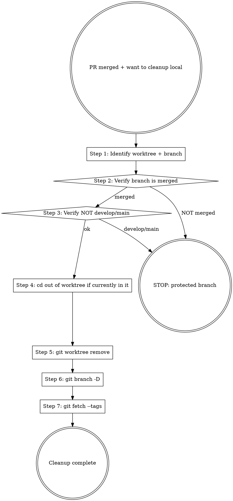

# Marketplace Git Cleanup

## Overview

Post-merge local cleanup. Removes worktree + deletes branch + fetches tags. Refuses to touch `develop` / `main` worktrees.

**Reference**: [[../../../docs/rule/[STANDARD]_AI_Engineering_Execution_HITL_Prompt|HITL Standard]] §4.11 + [[../../../docs/guide/[GUIDE]_Contributing.md|GUIDE_Contributing]].

**Workflow position**: Stage 10 substep of HITL Prompt 11-stage flow.

## Workflow



## Step 1: Identify Worktree + Branch

```bash
# 用户告知 PR number 或 branch 名
PR=<number>
branch=$(gh pr view $PR --json headRefName -q '.headRefName')

# 或: 直接告知 branch
branch=<branch-name>

# 找对应 worktree
git worktree list | grep "$branch"
# 期望输出: <path> <commit> [<branch>]
worktree_path=$(git worktree list --porcelain | awk -v b="refs/heads/$branch" '$1=="worktree" {p=$2} $1=="branch" && $2==b {print p}')
echo "$worktree_path"
```

## Step 2: Verify Branch is Merged

```bash
# 切到 develop（或对应 base）
cd D:/workspace/10-software-project/projects/mj-agentlab-marketplace/develop
git pull origin develop

# 验证 branch 已 merged
git branch -a --merged | grep -q "$branch" && echo "merged" || echo "NOT merged"

# 或：用 gh
gh pr view $PR --json state -q '.state'
# 期望 "MERGED"
```

如 `NOT merged` → STOP，不删（可能 PR closed without merge / 错 PR）。

## Step 3: Verify NOT develop/main

```bash
echo "$branch" | grep -Eq '^(main|develop)$' && echo "PROTECTED — DO NOT DELETE" && exit 1
```

Hard refuse to remove main / develop worktrees and branches.

## Step 4: cd Out of Worktree

```bash
# 如当前 PWD 在待删 worktree 内
cwd=$(pwd)
case "$cwd" in
  "$worktree_path"*) cd D:/workspace/10-software-project/projects/mj-agentlab-marketplace/develop ;;
esac
```

否则 `git worktree remove` 会失败 "working tree contains modifications" or "is currently checked out by your shell"。

## Step 5: Remove Worktree

```bash
git worktree remove "$worktree_path"
# 期望: silently success；目录从文件系统消失
```

如失败（"contains modified or untracked files"）:
```bash
# 先检查是否真有未提交内容（worktree 可能有 PR_BODY.md 遗留）
ls "$worktree_path"
# 如确认无价值，强制:
git worktree remove --force "$worktree_path"
```

⚠️ **NEVER** 用 `rm -rf "$worktree_path"`，会在 bare repo 留下 stale metadata（`.bare/worktrees/<name>/`）。

## Step 6: Delete Local Branch

```bash
git branch -D "$branch"
# -D = force delete; 安全因为 branch 已 merged (Step 2 验证)
```

不删 remote branch (让 GitHub 保留 history)。

## Step 7: Fetch Tags

```bash
git fetch --tags
# 取 release.yml 新建的 tag（如 release PR）
git tag -l "v$(cat VERSION)"   # 验证当前版本 tag 存在
```

仅 release PR 后才会有新 tag；其他 PR 这一步是 no-op，但仍跑（确保本地 tag 索引与 remote 同步）。

## Output Format

```markdown
## Cleanup Plan

### Identified
- PR: #<NN>
- Branch: feature/X
- Worktree: D:/workspace/.../feature-X

### Pre-checks
| Check | Result |
|---|---|
| Branch merged | ✅ MERGED (gh pr view) |
| NOT develop/main | ✅ feature/X |
| current PWD | not in worktree (or cd-out planned) |

### Ready Commands
```bash
cd D:/workspace/10-software-project/projects/mj-agentlab-marketplace/develop
git worktree remove ../feature-X
git branch -D feature/X
git fetch --tags
git tag -l "v$(cat VERSION)"
```

### Verification
```bash
git worktree list   # 期望: ../feature-X 已不在列表
git branch -a       # 期望: feature/X 仅 remotes/origin/feature/X
git tag -l          # 期望: 含新 tag (if release PR)
```

### Post-cleanup
- 当前 worktree: develop/ (干净)
- 准备下一任务: /mp-flow-intake 或继续待办

### HITL Questions (if 异常)
<§3.3 格式>
```

## What This Skill DOES NOT DO

- ❌ 不删 remote branch (GitHub 保留 history)
- ❌ 不删 develop / main worktree
- ❌ 不 `rm -rf` worktree（用 `git worktree remove`）
- ❌ 不删未合并 branch（除非用户强烈确认 + force flag）
- ❌ 不删 tag

## Sub-skill / Tool Calls

| Tool | 用途 |
|---|---|
| Bash `git worktree list` / `git worktree remove` | Steps 1, 5 |
| Bash `git branch -D` | Step 6 |
| Bash `git fetch --tags` / `git tag -l` | Step 7 |
| Bash `gh pr view` | Step 2 验证 merged |

## Reference Files

- [[../../../docs/rule/[STANDARD]_AI_Engineering_Execution_HITL_Prompt|HITL Standard]] §4.11
- [[../../../docs/guide/[GUIDE]_Contributing.md|GUIDE_Contributing]] (worktree 模式)

## Anti-patterns

- **不要** 用 `rm -rf <worktree>` （留 stale metadata 在 bare repo `.bare/worktrees/<name>/`）
- **不要** 删 develop / main worktree
- **不要** `git branch -D` 未合并 branch（先 `gh pr view` 确认 MERGED）
- **不要** 同时删 remote branch（让 GitHub 保留 history）
- **不要** 跳 `git fetch --tags`（错过 release.yml tag）

## Handoff to Next Stage

```text
Cleanup complete
→ /mp-flow-post-merge (Stage 10 orchestrator) 闭环
→ 或 STOP, 任务完成
```
