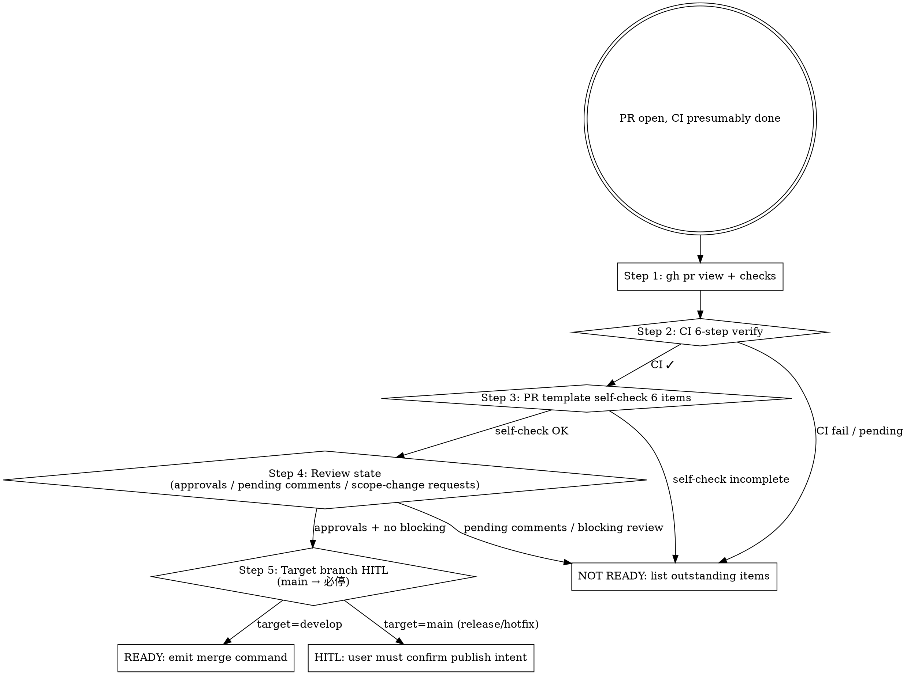

# Marketplace Git Merge Gate

## Overview

Stage 9 readiness gate before merging a PR. Verifies CI / template self-check / review state / scope alignment / publish intent (for main-target PRs). Output is a decision: READY / NOT READY / HITL BLOCK, plus the recommended merge command.

**Reference**: [[../../../docs/rule/[STANDARD]_AI_Engineering_Execution_HITL_Prompt|HITL Standard]] §4.10 + [[../../../docs/runbook/[RUNBOOK]_Release_Operations.md|Release Operations RUNBOOK]].

**Workflow position**: Stage 9 of HITL Prompt 11-stage flow.

## Workflow



## Step 1: Fetch PR State

```bash
PR=<number>
gh pr view $PR --json title,state,headRefName,baseRefName,mergeable,reviewDecision,statusCheckRollup,body
gh pr checks $PR
```

## Step 2: CI 6-step Verify

Marketplace CI (`.github/workflows/ci.yml`) 6 steps (per HITL Standard):
1. marketplace.json schema valid
2. each plugin.json valid (6 required fields)
3. SKILL.md frontmatter (name + description required)
4. version triangle consistent
5. CHANGELOG `[Unreleased]` or current version entry exists
6. plugin CHANGELOG sync

```bash
gh pr checks $PR --json name,bucket | jq '[.[] | {name, bucket}]'
# all bucket: success → CI ✓
# any bucket: fail / pending → not ready
```

## Step 3: PR Template Self-check 6 Items

Read PR body and verify 6 self-check items are all ticked (`[x]`):
1. Summary 段
2. Affected Areas 段
3. Verification 段
4. Self-review (dual-section) 段
5. Risk / Rollback 段
6. Related 段

```bash
gh pr view $PR --json body | jq -r '.body' | grep -c '\[x\]'
# 期望 ≥ 6
```

## Step 4: Review State

```bash
gh pr view $PR --json reviewDecision,reviews
# reviewDecision: APPROVED / CHANGES_REQUESTED / REVIEW_REQUIRED / null
# reviews[]: 列出每条 review state

# 拉所有 review comments
gh pr view $PR --json comments
gh api repos/MJ-AgentLab/mj-agentlab-marketplace/pulls/$PR/comments
```

> [!note]
> **Windows / Git Bash users**: omit leading slash in `gh api` endpoints (`gh api repos/...` not `gh api /repos/...`). MSYS path translation rewrites the leading slash into a Windows path (`C:/Program Files/Git/repos/...`), breaking the endpoint. Detailed reproducer + fix: [`mp-git-cleanup` SKILL §Bulk Cleanup Mode → Trap #3](../mp-git-cleanup/SKILL.md#trap-3windows-git-bash-的-gh-api-leading-slash-改写).

**判断**:
- `APPROVED` 且无 unresolved comment → 可继续
- `CHANGES_REQUESTED` → NOT READY
- pending unresolved review comment 且涉及 plugin behavior / SKILL description / allowed-tools → **HITL** (per §3.1 #11)
- review comment 改变 scope → 走 `/mp-flow-self-review` 再跑一次 + 重 push

## Step 5: Target Branch HITL

| Target | HITL? |
|---|---|
| develop (feature/bugfix/documentation/maintain) | No, AI 可 emit merge 命令；用户确认是否 click |
| main (hotfix) | **YES** — 用户必须明确确认 publish 意图 |
| main (release/*) | **YES** — release.yml 会自动 trigger tag + GitHub Release；publish 不可逆 |

Sandbox 限制: 如 Claude Code 拒绝 `gh pr merge` to main → 输出命令让用户在终端跑:

```text
请在终端执行:
  gh pr merge $PR --merge -R MJ-AgentLab/mj-agentlab-marketplace
```

## Merge Method

| Branch Type | Method |
|---|---|
| `feature/bugfix/documentation/maintain` → develop | `--merge` (默认，保留 commit 历史) |
| `hotfix/*` → main + 反向到 develop | `--merge` + 手工 `git pull` 到 develop |
| `release/*` → main | `--merge` (CHANGELOG + VERSION 已在 release branch) |
| 纯文档 PR 整理（少见） | `--squash` 偶尔可 |

不用 `--rebase`（破坏 PR history）。

## Output Format

```markdown
## Merge Gate Result

### PR State
- PR #<NN>: <title>
- Branch: <head> → <base>
- mergeable: yes / no / conflicting
- reviewDecision: APPROVED / CHANGES_REQUESTED / REVIEW_REQUIRED

### CI 6-step
| Step | Status |
|---|---|
| marketplace.json schema | ✅ |
| plugin.json | ✅ |
| ... |
- Overall: PASS / FAIL / PENDING

### Self-check (PR body)
| Item | Ticked? |
|---|---|
| Summary | ✅ |
| Affected Areas | ✅ |
| Verification | ✅ |
| Self-review (dual-section) | ✅ |
| Risk / Rollback | ✅ |
| Related | ✅ |
- Count: 6/6

### Review State
- APPROVED by <reviewer> at <date>
- Unresolved comments: 0
- Scope changes during review: None

### Target Branch HITL
- Target: develop / main
- Publish intent confirmed: yes (user said "merge to main and tag v4.1.0") / no (waiting)

### Decision
- ✅ READY: emit merge command
- ⏸️ NOT READY: <list outstanding>
- 🛑 HITL: <reason — usually target=main>

### Merge Command (if READY)
```bash
gh pr merge <NN> --merge -R MJ-AgentLab/mj-agentlab-marketplace
```

(或，如 sandbox 限 main merge:)
```text
请在终端执行: gh pr merge <NN> --merge -R MJ-AgentLab/mj-agentlab-marketplace
```

### Post-merge Expected Actions
- Auto: release.yml 触发 (~10s 后 tag v<X.Y.Z>) — 仅 release PR
- Auto: GitHub Release 创建 — 仅 release PR
- Manual: → /mp-flow-post-merge + /mp-git-cleanup

### HITL Questions
<§3.3 格式 (if HITL)>
```

## What This Skill DOES NOT DO

- ❌ 不执行 `gh pr merge` 自身（输出命令；用户确认后跑）
- ❌ 不绕过 CI failure（不会建议 force merge with red CI）
- ❌ 不 close PR / reopen PR
- ❌ 不删除 PR_BODY.md（应在 `/mp-git-pr` Step 5 已删）
- ❌ 不修 review comment（review 改 scope → 回 Stage 4-7）

## Sub-skill / Tool Calls

| Tool | 用途 |
|---|---|
| Bash `gh pr view` / `gh pr checks` / `gh api` | Steps 1-4 |
| Bash `jq` | parse JSON |
| Read | PR body (if 已 cached) |

## Reference Files

- [[../../../docs/rule/[STANDARD]_AI_Engineering_Execution_HITL_Prompt|HITL Standard]] §4.10
- [[../../../docs/runbook/[RUNBOOK]_Release_Operations.md|Release Operations]]
- `.github/workflows/{ci,release}.yml`

## Anti-patterns

- **不要** 跳过 CI 6-step 检查 force merge（破坏 marketplace 治理）
- **不要** 自动 merge to main（必经过 HITL）
- **不要** 用 `--rebase` 破坏 PR history
- **不要** 把 review comments unresolved 当作 NOT READY 阻塞（comment 解决了即可；APPROVED 后 unresolved comment 是 reviewer 个人 note）
- **不要** 把 sandbox 限制当作 BLOCK（输出命令给用户跑）

## Handoff to Next Stage

```text
Merge command emitted / user confirmed
→ user runs `gh pr merge`
→ /mp-flow-post-merge (Stage 10)
→ /mp-git-cleanup (Stage 10 substep)
```
