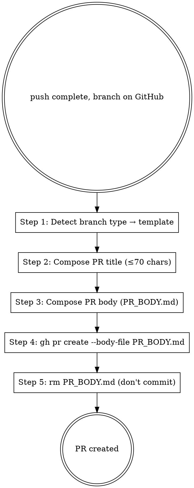

# Marketplace Git PR

## Overview

Creates a marketplace PR using `gh pr create --body-file` pattern (non-interactive; avoids editor opens that fail in scripted environments). Picks the right PR template based on branch type, fills the 6-section structure including dual-section self-review (本地验证 / AI 自检) per HITL Standard §4.7.

**Reference**: [[../../../docs/rule/[STANDARD]_AI_Engineering_Execution_HITL_Prompt|HITL Standard]] §4.9 + `.github/PULL_REQUEST_TEMPLATE/<type>.md`.

**Workflow position**: Stage 8 step 3 of HITL Prompt 11-stage flow.

## Workflow



## Step 1: Branch Type → Template

```bash
branch=$(git branch --show-current)
type=$(echo "$branch" | cut -d/ -f1)
```

| Branch Type | Template Path | Base Branch |
|---|---|---|
| `feature/*` | `.github/PULL_REQUEST_TEMPLATE/feature.md` | develop |
| `bugfix/*` | `.github/PULL_REQUEST_TEMPLATE/bugfix.md` | develop |
| `documentation/*` | `.github/PULL_REQUEST_TEMPLATE/documentation.md` | develop |
| `maintain/*` | `.github/PULL_REQUEST_TEMPLATE/maintain.md` | develop |
| `hotfix/*` | `.github/PULL_REQUEST_TEMPLATE/hotfix.md` | main |
| `release/*` | `.github/PULL_REQUEST_TEMPLATE/release.md` | main |

## Step 2: PR Title

格式: `<type>(<scope>): <summary>`，复用最新 commit 的 message header (用 `git log -1 --format=%s`)。

**约束**:
- ≤ 70 字符
- 与 commit message header 一致（或浓缩；不必逐字）
- 不以句号结尾

**示例**:
- `feat(marketplace): add 18 mp-* workflow skills + HITL v1.1`
- `fix(learn-kit): plugin.json repository must be string`
- `docs(docs-rule): introduce Documentation Framework STANDARD`
- `infra(release): bump marketplace 4.0.0 → 4.1.0`

## Step 3: Compose PR Body

读取对应模板:

```bash
cp .github/PULL_REQUEST_TEMPLATE/<type>.md PR_BODY.md
```

填入 6 段:

1. **Summary** — 一段话说 what + why
2. **Affected Areas** — bullet 列改动 (plugin / docs / CI / marketplace metadata)
3. **Verification** — 列出 Level A read-only + Level B side-effect 验证命令
4. **Self-review (dual-section)** — 复用 `/mp-flow-self-review` Stage 7 输出的两段:
   - 「本地验证」段（人类客观）
   - 「AI 自检」段（生成内容可信度）
5. **Risk / Rollback** — risk level + 缓解 + rollback 步骤
6. **Related** — Issue / ADR / Plan / 上游 PR 链接

**示例 PR_BODY.md** (feature template填法):

```markdown
## Summary
Add 18 mp-* workflow skills to `.claude/skills/` covering flow / git / doc families, and upgrade HITL Standard to v1.1 referencing the new skills throughout §4 and §5.

## Affected Areas
- `.claude/skills/mp-flow-*/SKILL.md` (9 new)
- `.claude/skills/mp-git-*/SKILL.md` (6 new)
- `.claude/skills/mp-doc-*/SKILL.md` (3 new)
- `docs/rule/[STANDARD]_AI_Engineering_Execution_HITL_Prompt.md` (v1.0 → v1.1)
- `docs/guide/[GUIDE]_Marketplace_Agent_Execution_Checklist.md` (Skill column filled)
- `CLAUDE.md` (root: new section)
- `CHANGELOG.md`, `VERSION` (4.0.0 → 4.1.0), `marketplace.json`

## Verification
- Level A (read-only): `Get-ChildItem .claude/skills/` shows 18 dirs; `git diff --stat`; cat updated files
- Level B (side-effect): `/plugin-dev:plugin-validator` (agent) on learn-kit — no critical issues; `/plugin-dev:skill-reviewer` on each new SKILL.md — passes

## Self-review

### 本地验证段（人类客观）
- 18 个 `.claude/skills/mp-*/SKILL.md` 文件存在 ✅
- 每个 SKILL.md 含 frontmatter name + description ✅
- HITL Standard §5.1 矩阵无「—」（除 stage 8 拆 3 skill 的特殊行） ✅
- VERSION = 4.1.0, marketplace.json metadata.version = 4.1.0 ✅
- CHANGELOG.md v4.1.0 entry 含 18 skill 名 + HITL v1.1 ✅

### AI 自检段（生成内容可信度）
- Scope drift = None（vs ~/.claude/plans/<topic>.md）
- 无硬编码 / secret / 残留调试代码
- SKILL.md description 双语 trigger phrases 完整
- Cross-references 链接路径有效（wikilinks 都解析到现存文件）
- commit type/scope 符合 marketplace 矩阵

## Risk
- Level: Medium
- Risk areas: HITL Standard 大范围 refactor；new skill 触发率不确定（dogfood 验证基本通过）
- Mitigation: dogfood 验证已跑；外部 plugin skill 仍作为 fallback

## Rollback
- 单 PR revert：`git revert <merge-commit>` then `git push`
- 若 HITL Standard 改动有人 review 反对：拆出 v1.1 部分单独 revert，保留 .claude/skills/

## Related
- Plan: `~/.claude/plans/d-workspace-...ethereal-anchor.md`
- ADR: (none for this PR; doc framework comes in PR 2)
- HITL Standard §4.5 §5.3 (现代化为 mp-* 引用)
```

## Step 4: Execute gh pr create

```bash
gh pr create \
  --base <base-branch> \
  --head <branch-name> \
  --title "<title>" \
  --body-file PR_BODY.md \
  --repo MJ-AgentLab/mj-agentlab-marketplace
```

不用 `--template`（会打开编辑器）。
不把 PR title / body 嵌入命令行（特殊字符 escape 问题）。

## Step 5: Clean Up PR_BODY.md

```bash
rm PR_BODY.md
# 或 if commit accidentally staged:
git restore --staged PR_BODY.md && rm PR_BODY.md
```

**绝不** commit PR_BODY.md 进仓库。

## Output Format

```markdown
## PR Plan

### Branch & Template
- Branch: feature/X
- Base: develop
- Template: .github/PULL_REQUEST_TEMPLATE/feature.md

### Title (≤ 70 chars)
"feat(marketplace): add 18 mp-* workflow skills + HITL v1.1"

### PR_BODY.md (content)
<full markdown as Step 3 example>

### Ready Commands
```bash
# 1. Compose body
cat > PR_BODY.md <<'EOF'
<content>
EOF

# 2. Create PR
gh pr create --base develop --head feature/X --title "..." --body-file PR_BODY.md --repo MJ-AgentLab/mj-agentlab-marketplace

# 3. Clean up
rm PR_BODY.md
```

### Post-create
- 监控 `gh pr checks <NN>` — CI 6 步全过
- 等 review
- → /mp-git-merge-gate (Stage 9)
```

## What This Skill DOES NOT DO

- ❌ 不 merge PR（用 `/mp-git-merge-gate` Stage 9 决策）
- ❌ 不删 PR_BODY.md 之前 commit / push 它
- ❌ 不用 `--body` 直接 inline（HEREDOC 转义麻烦）
- ❌ 不打开 editor mode（`--body-file` 一锤定音）
- ❌ 不设 PR target = main 除非 hotfix / release

## Sub-skill / Tool Calls

| Tool | 用途 |
|---|---|
| Bash `gh pr create --body-file` | Step 4 |
| Bash `cp` / `cat > PR_BODY.md <<EOF` | Step 3 compose |
| Bash `rm PR_BODY.md` | Step 5 cleanup |
| Read | Template + Stage 7 self-review 输出 |

## Reference Files

- [[../../../docs/rule/[STANDARD]_AI_Engineering_Execution_HITL_Prompt|HITL Standard]] §4.9
- `.github/PULL_REQUEST_TEMPLATE/<type>.md` (6 templates)
- [[../../../docs/CONTRIBUTING.md|CONTRIBUTING]]

## Anti-patterns

- **不要** commit PR_BODY.md 进仓库
- **不要** PR title > 70 字符 (浓缩到 header)
- **不要** PR target = main（除 hotfix / release）
- **不要** PR body 缺 dual-section 自检
- **不要** 用 `gh pr create --template`（会开 editor，scripted 环境失败）

## Handoff to Next Stage

```text
PR created
→ 监控 CI 6 步
→ Review approve 后 → /mp-git-merge-gate (Stage 9)
```
