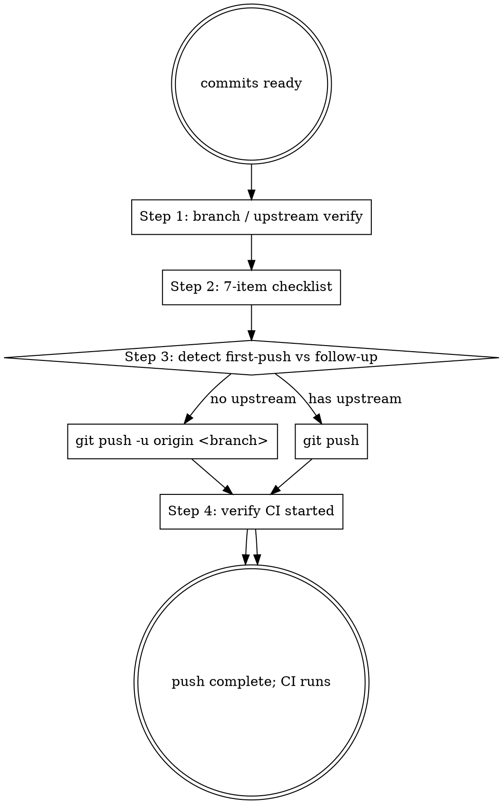

# Marketplace Git Push

## Overview

Pushes a marketplace branch to GitHub origin after running a 7-item pre-push safety checklist. Refuses dangerous operations (direct push to main/develop, force-push on protected branches, push with secrets in HEAD).

**Reference**: [[../../../docs/rule/[STANDARD]_AI_Engineering_Execution_HITL_Prompt|HITL Standard]] §4.9 + [[../../../docs/guide/[GUIDE]_Contributing.md|GUIDE_Contributing]].

**Workflow position**: Stage 8 step 2 of HITL Prompt 11-stage flow.

## Pre-Push Checklist (8 items)

| # | Check | How | Block? |
|---|---|---|---|
| 1 | 当前分支非 main / develop | `git branch --show-current` | YES |
| 2 | HEAD 内无 secret | `git log -1 -p | grep -E 'BEGIN.*KEY|api[_-]?key|password='` | YES |
| 3 | HEAD 内无 .env / *.key / *.pem 路径 | `git diff HEAD~1..HEAD --name-only | grep -E '\\.env$|\\.(key|pem|p12)$'` | YES |
| 4 | HEAD 内无 PR_BODY.md / 临时文件 | `git diff HEAD~1..HEAD --name-only | grep -E 'PR_BODY|\\.tmp$|\\.bak$'` | YES |
| 5 | 无 > 10 MB 大文件 | `git ls-tree -r HEAD --long | awk '$4>10485760'` | YES |
| 6 | 与 origin 同分支无 conflict（首次 push 跳） | `git log @{u}..HEAD` 看 ahead；`git log HEAD..@{u}` 看 behind | WARN |
| 7 | 与 base 分支没有意外 diverge | `git log origin/develop..HEAD --oneline` 行数合理 | WARN |
| 8 | **Commit message PATTERN 合规** (v1.1+ NEW) | `sh scripts/validate-commits.sh origin/<base>..HEAD` 返回 0 failures | **YES** |

任一 BLOCK → STOP；WARN → 提示用户确认。

**Item 8 详解**：跑标准化的 `scripts/validate-commits.sh`（CI 同源 PATTERN regex；catches `chore` type / `docs` as scope / summary > 72 chars / 其他格式错误）。FAIL 时脚本输出会精确指出违规 commit + 修正建议（`git rebase -i --reword` / cherry-pick 重建）。FAIL 必须修复后才允许 push——pre-push hook（如已装）也会拦截，但本 checklist 项确保 skill 主动检查不依赖 hook。参考 [`docs/rule/[STANDARD]_Commit_Message_Convention.md`](../../../docs/rule/[STANDARD]_Commit_Message_Convention.md) §11 Common Mistakes。

## Workflow



## Step 1 — Branch & Upstream Verify

```bash
git branch --show-current
# 确认是 feature/bugfix/documentation/maintain/hotfix/release/* 之一

git rev-parse --abbrev-ref --symbolic-full-name '@{u}' 2>/dev/null
# 如返回 origin/<branch> → 已有 upstream，用 `git push`
# 如返回 错误 → 首次 push，用 `git push -u origin <branch>`
```

## Step 2 — Run 7-item Checklist

```bash
# Check 1
br=$(git branch --show-current)
echo "$br" | grep -Eq '^(main|develop)$' && echo "BLOCK: cannot push to $br directly" && exit 1

# Check 2-4
git diff origin/develop..HEAD --name-only 2>/dev/null | grep -E '\.(env|key|pem|p12)$|^PR_BODY.md' && echo "BLOCK: forbidden file in commit" && exit 1
git log origin/develop..HEAD -p 2>/dev/null | grep -E 'BEGIN (RSA|DSA|EC|OPENSSH) PRIVATE KEY|api[_-]?key=|password=' && echo "BLOCK: secret in HEAD" && exit 1

# Check 5
git ls-tree -r HEAD --long | awk '$4 > 10485760 { print "LARGE:", $5, $4 " bytes" }'

# Check 6 / 7 (when upstream exists)
if git rev-parse --abbrev-ref --symbolic-full-name '@{u}' 2>/dev/null; then
  ahead=$(git log @{u}..HEAD --oneline | wc -l)
  behind=$(git log HEAD..@{u} --oneline | wc -l)
  echo "Ahead: $ahead, Behind: $behind"
  [ "$behind" -gt 0 ] && echo "WARN: behind upstream; consider git pull --rebase first"
fi
```

## Step 3 — Detect First Push vs Follow-up

```bash
if git rev-parse --abbrev-ref --symbolic-full-name '@{u}' &>/dev/null; then
  echo "follow-up push"
else
  echo "first push"
fi
```

## Step 4 — Execute

```bash
# First push
git push -u origin "$(git branch --show-current)"

# Follow-up push
git push

# Force-push (DANGEROUS; only on feature/bugfix/documentation/maintain)
# 用户必须明确确认
git push --force-with-lease  # 推荐用 --force-with-lease 而非 --force
```

force-push 规则:
- `main` / `develop`: **NEVER**
- `hotfix/*` / `release/*`: **NEVER** (push 后 PR review 中)
- `feature/bugfix/documentation/maintain/*`: 仅当 squash 后 / rebase 后 / 个人 review 修；必须明确确认；用 `--force-with-lease`

## Step 5 — Verify CI Started

```bash
# 等几秒让 CI 触发
sleep 5
gh pr checks <PR-number> 2>/dev/null || gh run list --branch "$(git branch --show-current)" --limit 1
```

如未触发 CI → 检查 `.github/workflows/ci.yml` 的 `on:` triggers。

## Output Format

```markdown
## Push Plan

### Branch State
- current: feature/X
- upstream: origin/feature/X (or "none — first push")

### Pre-Push Checklist
| # | Check | Result | Block? |
|---|---|---|---|
| 1 | branch ≠ main/develop | ✅ feature/X | — |
| 2 | no secrets | ✅ no match | — |
| 3 | no .env / *.key | ✅ | — |
| 4 | no PR_BODY.md | ✅ | — |
| 5 | no large files | ✅ | — |
| 6 | not behind upstream | ✅ ahead 3, behind 0 | — |
| 7 | base diff sane | ✅ 18 commits | — |

### Push Mode
- First push (set upstream) / Follow-up / Force-with-lease

### Ready Command
```bash
git push -u origin feature/X
```

### Post-push
- Wait ~5s
- `gh pr checks` or `gh run list --branch feature/X --limit 1`
- 如已有 PR: 监控 CI 6 步
- 如无 PR: → /mp-git-pr (Stage 8 step 3)
```

## What This Skill DOES NOT DO

- ❌ 不创建 PR（用 `/mp-git-pr`）
- ❌ 不 force-push main / develop / hotfix / release（never）
- ❌ 不绕 pre-push hook（如有）
- ❌ 不 push tags（release.yml 自动创建 tag；手工 push tag race condition）

## Sub-skill / Tool Calls

| Tool | 用途 |
|---|---|
| Bash (`git push` / `git rev-parse @{u}`) | 主流程 |
| Bash (`git log -p`) | secret 扫描 |
| Bash (`git ls-tree`) | 大文件扫描 |
| Bash (`gh pr checks` / `gh run list`) | CI 触发验证 |

## Reference Files

- [[../../../docs/rule/[STANDARD]_AI_Engineering_Execution_HITL_Prompt|HITL Standard]] §4.9
- [[../../../docs/guide/[GUIDE]_Contributing.md|GUIDE_Contributing]]
- `.github/workflows/ci.yml`

## Anti-patterns

- **不要** 直接 push main / develop（必经过 PR）
- **不要** force-push 公开分支
- **不要** push 前不跑 7-item checklist（secret leak 不可逆）
- **不要** 用 `--force` 而非 `--force-with-lease`（后者更安全）
- **不要** push tag（让 release.yml 处理）

## Handoff to Next Stage

```text
Push complete + CI started
→ 如无 PR: /mp-git-pr (Stage 8 step 3)
→ 如有 PR: 监控 CI → /mp-git-merge-gate (Stage 9)
```
