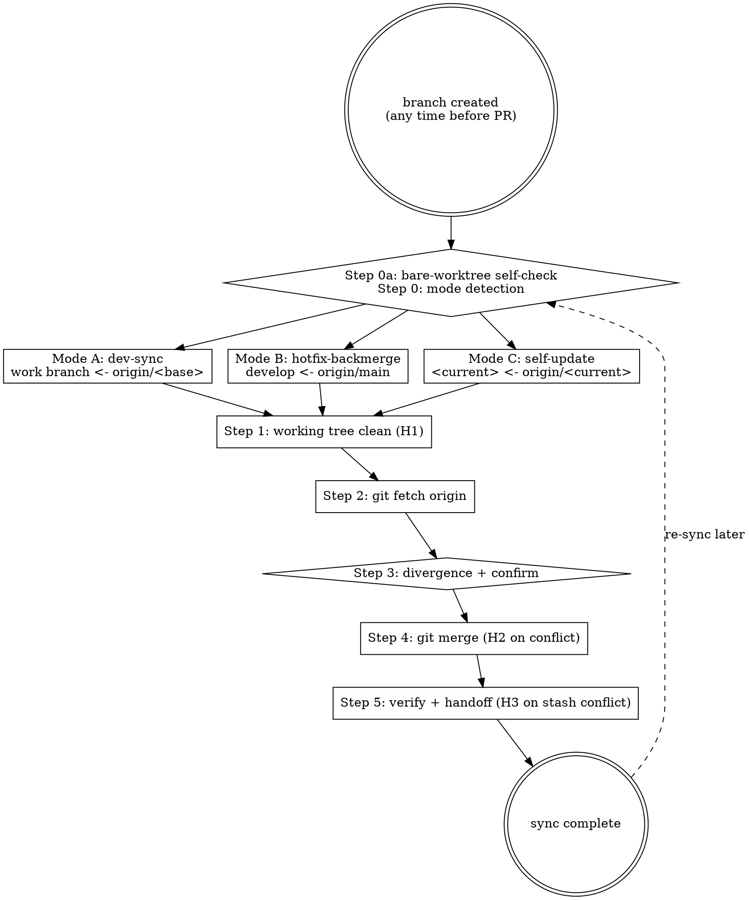

# Marketplace Git Sync

## Overview

Syncs baseline branch (`develop` / `main`) latest commits into the current marketplace working branch, **or** pulls `origin/<current>` into the local copy. **Side-loop helper** — not a numbered HITL stage; may be invoked multiple times between `/mp-git-branch` (Stage 8 pre-step) and `/mp-git-pr` (Stage 8 step 3).

```text
/mp-git-branch -> [development] -> sync (loops) -> /mp-git-commit -> /mp-git-push -> /mp-git-pr
                                      ^      |
                                      \------/  (callable any time)
```

**Three modes**:

| Mode | When | Source | Destination |
|---|---|---|---|
| **A. Dev-sync** | Working branch falls behind base | `origin/develop` (or `origin/main` for `hotfix/*`) | current work branch |
| **B. Hotfix-backmerge** | Hotfix PR merged to `main`, need to bring fix into `develop` | `origin/main` | `develop` |
| **C. Self-update** | Multi-machine / collaborator commits / PR squash-merged to current branch | `origin/<current>` | local `<current>` |

**Reference**: [[../../../docs/rule/[STANDARD]_AI_Engineering_Execution_HITL_Prompt|HITL Standard]] §3 (HITL triggers) + §4 (stages — note: sync is side-loop, not a numbered stage).

## 前置条件

- 在 marketplace bare-repo worktree 内执行（不能在 `.bare/` 根目录）— `git rev-parse --is-inside-work-tree` 必须返回 `true`（否则触发 H8）
- 单 remote 模型：marketplace 仅有 `origin`
- **禁止跨分支 merge 到 `main`**（H4 硬阻断）；自更新 `origin/main → main` 例外
- **统一 merge 策略**：项目禁止 `git rebase`，理由：团队协作安全 / 历史一致 / 无 force-push 风险（H5 引导）
- 用户已了解 mp-git-sync **不会自动 push**（除 Mode B Hotfix-backmerge 收尾一次 `git push origin develop`）

## 快速开始（交互模式）

| 已知信息 | 行动 |
|---|---|
| "同步" 但未指定 base/source | `git branch --show-current` 自动推导 |
| 用户说 "rebase" | 引导 merge（H5） |
| 用户在 `develop` 且意图明确 | 进 Hotfix-backmerge 或 Self-update 模式 |
| 用户在 `main` 且意图为跨分支 merge | H4 硬阻断 |
| 信息完整 | 直接执行 6-step workflow |

### 意图识别（概念区分）

| 概念 | 定义 | 触发信号 |
|---|---|---|
| **Self-update** | `origin/<current>` → local `<current>`（同名） | "origin 有新提交" / "协作者推了" / "另一台机器" / "self-update" |
| **跨分支同步** (Mode A / B) | `origin/<base>` → local `<current>`（不同名） | "develop 有新代码" / "main 有 hotfix" / "落后" / "behind" |
| **意图模糊** | 无法分辨 | 由 H4a / H4b / Smart H7 数据驱动消歧 |

> Mode A 和 Mode B 都是"跨分支同步"，区别只是当前分支位置不同（work branch vs `develop`）。

## Sync Workflow（6 步）



### Step 0a — 工作树自检（H8 触发点，自动）

```bash
git rev-parse --is-inside-work-tree
```

- `true` → 继续 Step 0
- `false` → **H8**（worktree 缺 `config.worktree`，`core.bare=true` 回退导致工作树命令被拒）

> marketplace 用 `scripts/clone-bare.ps1` 克隆 bare repo + 多 worktree，是 git bare-worktree 模型已知的 config 漂移风险。详见 §H8 详细流程。

### Step 0 — 环境检测（三模式自动判定 + Smart H7，自动）

```bash
git branch --show-current
git worktree list
```

**决策树**：

```text
意图 = Self-update
  -> 任何分支 -> Mode C: base = origin/<current>

意图 = 跨分支同步
  -> main         -> H4 硬阻断
  -> develop      -> Mode B (Hotfix-backmerge): base = origin/main
  -> work branch  -> Mode A (Dev-sync), base 由前缀决定:
                       feature/<x>        -> origin/develop
                       bugfix/<x>         -> origin/develop
                       documentation/<x>  -> origin/develop
                       maintain/<x>       -> origin/develop
                       release/<x>        -> origin/develop  (release/* base on develop)
                       hotfix/<x>         -> origin/main
                       其他前缀           -> H6 询问

意图 = Hotfix-backmerge
  -> develop -> Mode B
  -> 其他    -> 提示先 cd 到 develop worktree

意图 = 模糊
  -> main         -> H4a (Self-update from origin/main or 取消)
  -> develop      -> H4b (3 选 1)
  -> work branch  -> Smart H7 数据驱动路由
```

#### Smart H7 — 数据驱动路由

工作分支 + 意图模糊时执行：

```bash
git fetch origin
current=$(git branch --show-current)
SELF_GAP=$(git rev-list --count HEAD..origin/${current} 2>/dev/null || echo 0)
```

- `origin/<current>` 不存在 → 跳过 Self-update，直接 Mode A
- `SELF_GAP = 0` → 默认 Mode A
- `SELF_GAP > 0` → 询问 4 选项：(1) 先 Self-update 再 Mode A（推荐）/ (2) 仅 Mode A / (3) 仅 Self-update / (4) 取消

> **Solo 开发者** SELF_GAP 几乎永远 0，H7 不触发；仅协作者推送 / 另一台机器提交 / PR squash-merge 后 force-pushed 等场景才会非零。

### Step 1 — 工作目录干净检查（H1 触发点）

```bash
git status --short
```

- 输出为空 → 继续 Step 2
- 有变更 → **H1**（3 选 1: commit / stash / 取消）

### Step 2 — 远程最新

```bash
git fetch origin
```

> Smart H7 已 fetch 时跳过本步。

### Step 3 — 展示分歧 + 确认

```bash
git rev-list --count HEAD..origin/<base>      # 基线领先多少
git rev-list --count origin/<base>..HEAD      # 当前领先多少
git log --oneline HEAD..origin/<base>         # 即将合并的提交摘要
```

- count = 0 → "已是最新，无需 sync"，结束
- count > 0 → 展示提交清单 + 询问确认；选"继续"进 Step 4，选"取消"终止
- 用户要 rebase → H5

> Step 3 的"是否继续合并？"是常规交互确认，**不属 H-code**。

### Step 4 — 执行合并（H2 触发点）

```bash
# Mode A: Dev-sync
git merge origin/develop   # feature/bugfix/documentation/maintain/release
git merge origin/main      # hotfix

# Mode B: Hotfix-backmerge（在 develop 上）
git merge origin/main

# Mode C: Self-update
git merge origin/<current>
```

- 无冲突 → Step 5
- 有冲突 → **H2**（详见 §H2 冲突解决流程）

> **VERSION 文件 merge 特别说明**（per [`[ADR]_Develop_PreBump_Adoption`](../../../docs/adr/[ADR]_Develop_PreBump_Adoption.md) `develop >= main` 不变式）：Mode B 若 develop 已 post-release pre-bumped（typical: develop `X.Y.(Z+1)`，main `X.Y.Z`），`git merge origin/main` 通常不会产生 VERSION 冲突 —— develop 端版本号更大，三路合并保留 develop。**但若 main 上有 hotfix 让版本号反超 develop pre-bump 值** —— [`[RUNBOOK]_Release_Operations`](../../../docs/runbook/[RUNBOOK]_Release_Operations.md) §4.5 已记录该 TODO 场景，明文"当前未预设处理方案" —— **触发 HITL，由用户裁决**（不擅自取主端较小版本号，否则违反 ADR 不变式）。

### Step 5 — 同步后验证（H3 触发点 + handoff）

```bash
git status --short
git log --oneline -3
```

**Mode A (Dev-sync) 收尾**：
- 若 Step 1 走的是 stash → `git stash pop`（pop 冲突 → **H3**）
- Handoff: "Dev-sync 完成 ✓；继续开发，完成后 → `/mp-git-commit` → `/mp-git-push` → `/mp-git-pr`"

**Mode B (Hotfix-backmerge) 收尾**（额外推 develop）：

```bash
git push origin develop
```

- Handoff: "Hotfix 已 backmerge 到 develop 并推 origin ✓"

**Mode C (Self-update) 收尾**：
- main / develop / 工作分支自更新都 **不** push
- 若 H7 选 (1)（先 Self-update 再 Mode A）→ 回 Step 3 进 Mode A
- Handoff: "Self-update 完成 ✓"

## 人工介入场景（STOP & ASK）

| # | 触发 | 行为 | 级别 |
|---|---|---|---|
| **H1** | `git status --short` 显示未提交变更 | 3 选: (1) commit / (2) `git stash push -m "pre-sync-<date>"` / (3) 取消 | Soft |
| **H2** | Step 4 `git merge` 产生冲突 | Claude 提案 → user 每区确认 → `git add` → `git commit -m "merge: <base> → <current>"`（详 §H2 流程）| Soft |
| **H3** | Step 5 `git stash pop` 冲突 | 告知 "stash pop 冲突 ≠ merge 冲突 —— 手动解 + `git add` + `git stash drop`，不再 commit" | Soft |
| **H4** | 当前 `main` + 跨分支 merge 意图 | 硬拒：marketplace `main` 仅接受 PR merge | Hard |
| **H4a** | 当前 `main` + 意图模糊 | 2 选: (1) Self-update `origin/main → main` / (2) 取消 | Soft |
| **H4b** | 当前 `develop` + 意图模糊 | 3 选: (1) Self-update / (2) Hotfix-backmerge / (3) 取消 | Soft |
| **H5** | 用户要求 rebase | 引导 merge：告知 marketplace 统一 merge 策略（团队协作安全 / 历史一致 / 无 force-push） | Info |
| **H6** | 当前分支前缀 ∉ {feature, bugfix, documentation, maintain, release, hotfix} | 询问 base：(1) develop / (2) main / (3) 取消 | Soft |
| **H7** | 工作分支 + 模糊 + `SELF_GAP > 0` | 4 选（详 Step 0 Smart H7） | Soft |
| **H8** | Step 0a 返回 `false`（worktree config 漂移） | 3 选: (1) 自动写 `config.worktree` (推荐) / (2) 重 clone / (3) 取消（详 §H8 流程）| Soft |

> Step 3 "是否继续合并？" 常规对话确认不属 H-code。

### H2 冲突解决流程

> Claude 是**提案者**，不是决策者：每个冲突区域的最终方案必须 user 显式确认后才能 `git add`。

1. **概览**:

   ```bash
   git diff --name-only --diff-filter=U
   git status --short | Select-String -Pattern '^(UU|AA|DD|AU|UA|DU|UD)'
   ```

2. **用户路径选择**: 3 选: (1) Claude 逐文件分析提方案（推荐，<10 冲突文件时）/ (2) 用户自解（Claude 仅展示 `git diff`） / (3) 放弃 `git merge --abort`

3. **Claude 提案**（仅路径 1）：
   - 逐文件读冲突区
   - 解释双方语义差异
   - 给建议方案 + 理由
   - **marketplace 高风险文件**：
     - `VERSION` → 见 Step 4 ADR 注（`develop >= main` 不变式）
     - `.claude-plugin/marketplace.json` → plugins 数组结构变化 → HITL（HITL Standard §3.1）
     - `plugins/*/.claude-plugin/plugin.json` → version / repository 字段冲突 → HITL
     - `CLAUDE.md` plugin 行 + `README.md` badge → Version Quintangle 5-site 一致性（参考 `mp-doc-bump-version`）
     - `CHANGELOG.md` → `[Unreleased]` 段两端累加 → 合并双方

4. **用户每区确认**: 接受 / 修改 / 跳过

5. **执行**:

   ```bash
   git add <resolved-files>
   git commit -m "merge: 合并 origin/<base> 到 <current>，解决 <N> 处冲突"
   ```

**安全出口**: 任何步骤说"放弃" → `git merge --abort`，告知"合并已中止，分支恢复 sync 前状态"。

### H8 详细流程（bare worktree config 漂移修复）

**诊断**:

```bash
git rev-parse --git-dir         # 期望: <repo>/.bare/worktrees/<wt-name>
git rev-parse --git-common-dir  # 期望: <repo>/.bare
```

告知用户："当前 worktree 缺 `config.worktree`，git 回退读 `.bare/config` 的 `core.bare = true`，所有需要 work tree 的命令（status / merge / commit）都被拒。常见原因：手动 `rm -rf <worktree>` 后重建 / 跨机器同步 `.bare/` 时未携带 worktree 子目录。"

**3 选路径**：
- **(1) 自动修复（推荐）**: 执行下方 PowerShell 块；~5 秒
- **(2) 手动修复**: 重 clone (`scripts/clone-bare.ps1 -Branches <branch>`) 或手动编辑 `.bare/worktrees/<wt-name>/config.worktree`
- **(3) 取消**: 不动，结束 sync skill

**自动修复（PowerShell，路径 1）**：

```powershell
$wtAbs   = (Get-Location).Path -replace '\\','/'
$wtName  = (Split-Path -Leaf $wtAbs)
$bareDir = (git rev-parse --git-common-dir) -replace '\\','/'
$cfgPath = "$bareDir/worktrees/$wtName/config.worktree"

@"
[core]
`tbare = false
`tworktree = $wtAbs
"@ | Set-Content -Path $cfgPath -NoNewline -Encoding utf8

Write-Host "Wrote $cfgPath" -ForegroundColor Green
```

**语义说明**：
- `core.bare = false` 覆盖 `.bare/config` 的 `core.bare = true`（worktree-scoped config 优先级 > common config）
- `core.worktree = $wtAbs` 显式告诉 git 该 git-dir 对应的 work tree 路径

**回归验证**：

```bash
git rev-parse --is-inside-work-tree  # 期望 true
git status                            # 期望干净输出
```

修复成功 → 回 Step 0 重启 sync；失败 → 走路径 (2) 或 STOP 求人工。

## 安全规则

1. **`main` 上禁止跨分支 merge**（H4 硬阻断）—— 例外: 自更新 `origin/main → main`
2. **`develop` 上仅允许 Self-update 和 Hotfix-backmerge**（H4b 三选一）
3. **强制 merge 策略**（H5）—— rebase 引导 merge
4. **冲突保护**（H2）—— Claude 不擅自 `git add`，每区方案 user 确认
5. **VERSION 不变式** —— `develop >= main` 始终成立（per `[ADR]_Develop_PreBump_Adoption`）；Mode B 若冲突且 main 端版本号 > develop → HITL
6. **单 remote** —— 用 `git push origin <branch>`，不构造任何自定义双推命令
7. **不自动 push**（除 Mode B Hotfix-backmerge 推 develop）

## Anti-patterns

- **不要** 在 `main` 上跨分支 merge（H4 硬阻断 —— main 仅接受 PR merge）
- **不要** 用 `git rebase`（H5 强引导 merge）
- **不要** 跳过 Step 0a 自检（bare-worktree config 漂移会让后续命令静默失败）
- **不要** H2 冲突时不展示方案就 `git add`（必先 user 确认每区）
- **不要** 在 Mode C 后 push（远端已经是源，再 push 是 no-op 浪费 CI）
- **不要** 在 Mode B 后忘记 `git push origin develop`（hotfix 修复留本地不会到远端）
- **不要** 在 Mode B VERSION 冲突时按 main 端取较小版本号（违反 develop >= main 不变式 —— HITL）
- **不要** 把 mp-git-sync 当 stage 写入 plan 文档（side-loop，无 stage 编号）

## What This Skill DOES NOT DO

- ❌ 不创建 branch / worktree（用 `/mp-git-branch`）
- ❌ 不 commit 用户工作变更（用 `/mp-git-commit`；H1 stash 是内部辅助）
- ❌ 不 push（除 Mode B 一次 `git push origin develop`）
- ❌ 不创建 PR（用 `/mp-git-pr`）
- ❌ 不删 branch / worktree（用 `/mp-git-cleanup`）
- ❌ 不 force-push（任何模式都不需）
- ❌ 不 `git rebase`（H5 引导 merge）
- ❌ 不 bump VERSION / 改 marketplace.json schema（属 release 流程，独立 PR）

## Sub-skill / Tool Calls

| Tool | 用途 |
|---|---|
| Bash `git rev-parse --is-inside-work-tree` | Step 0a H8 自检 |
| Bash `git branch --show-current` / `git worktree list` | Step 0 模式 + 分支检测 |
| Bash `git status --short` | Step 1 / Step 5 干净检查 |
| Bash `git fetch origin` | Step 2 远程最新 |
| Bash `git rev-list --count` / `git log --oneline` | Step 3 分歧展示 |
| Bash `git merge` / `git merge --abort` | Step 4 + H2 安全出口 |
| Bash `git stash push -m` / `git stash pop` / `git stash drop` | H1 / H3 |
| Bash `git diff --name-only --diff-filter=U` | H2 冲突列表 |
| PowerShell `Set-Content $cfgPath` | H8 自动修复 |
| Bash `git push origin develop` | Mode B 收尾（单 remote） |

## Reference Files

- [[../../../docs/rule/[STANDARD]_AI_Engineering_Execution_HITL_Prompt|HITL Standard]] §3 (HITL 通用规则) + §4 (11 阶段 —— sync 为 side-loop，非编号 stage)
- [[../../../docs/runbook/[RUNBOOK]_Release_Operations.md|Release Operations RUNBOOK]] §4.4 "合并后同步 develop"（hotfix 合并后手工流程，本 skill 自动化）+ §3.7 (Post-release develop 预 bump，关联 VERSION 不变式) + §4.5 (Hotfix 与预 bump 冲突 TODO，Mode B HITL 触发依据)
- [[../../../docs/adr/[ADR]_Develop_PreBump_Adoption.md|ADR Develop PreBump Adoption]] (develop >= main VERSION 不变式)
- [[../../../CONTRIBUTING.md|CONTRIBUTING]] (branch strategy + bare-repo worktree 模式)
- [[../../../CLAUDE.md|Project CLAUDE.md]] §"Project-Local Skills" (本 skill 在 mp-* family 中的位置)
- `scripts/clone-bare.ps1` (bare-repo + worktree 创建脚本 —— H8 漂移可重 clone 修复)
- Sibling skills: `/mp-git-branch` (前置) / `/mp-git-commit` (Mode A 后续) / `/mp-git-push` (Mode A 后续) / `/mp-git-pr` (Mode A 后续) / `/mp-git-cleanup` (PR merge 后)

## Handoff to Next Stage

```text
Sync complete
  Mode A (Dev-sync): -> 继续开发，完成后 /mp-git-commit -> /mp-git-push -> /mp-git-pr (Stage 8)
  Mode B (Hotfix-backmerge): -> develop 已 push origin ✓；任务闭环（hotfix 修复路径完成）
  Mode C (Self-update): -> 本地已最新；继续原任务 / 或 STOP

可能再次调用 mp-git-sync: 收到 PR review 后远端有新 commit / develop 期间又有人合并 / 切换机器
```
