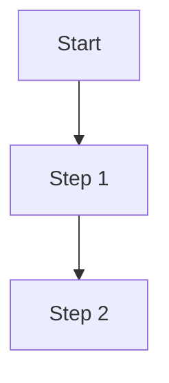

# [STANDARD] GitHub Markdown

## §1 Scope & Canonical Rendering Environment

This STANDARD applies to every `.md` file in the marketplace repository (`docs/**/*.md`, `plugins/**/*.md`, root-level `*.md`, `.github/**/*.md`).

**Canonical rendering environment**: GitHub web pages (github.com).
- VS Code / Obsidian / IntelliJ / RStudio previews are bonuses but not the design target
- If a feature renders correctly on GitHub but not in another viewer, the doc is still compliant
- If a feature renders incorrectly on GitHub, the doc must be fixed

This decision drives most rules below: ATX headings (universal), GFM tables (GitHub native), `> [!NOTE]` alerts (GitHub native, 2023+), avoid Wikilinks in user-facing docs (GitHub renders as raw text).

## §2 Headings

### §2.1 ATX Only

Use ATX-style headings only. Setext (`===` / `---` underlines) forbidden.

```markdown
# H1 Title           ✅
## H2 Section        ✅
### H3 Subsection    ✅
#### H4 Detail       ✅
##### H5             ✅ (rare)
###### H6            ⚠️ (almost never; consider restructure)
```

### §2.2 One H1 Per Document

Every doc has exactly one H1, at the top of the body (after frontmatter). The H1 typically matches or paraphrases `frontmatter.summary`.

### §2.3 No Level Skipping

Don't skip heading levels (e.g., `## H2` → `#### H4` without an `### H3` in between). Reader experience degrades; TOC tools fail.

### §2.4 Space After `#`

Exactly one space between `#` markers and heading text.

```markdown
## Section       ✅
##Section        ❌ (no space)
##  Section      ❌ (two spaces)
```

## §3 Anchor IDs (Auto-Generated)

GitHub auto-generates anchor IDs from heading text using this transform:

1. Lowercase ASCII letters
2. Replace spaces with `-`
3. Drop most punctuation (`?`, `!`, `.`, `,`, `:`, `;`, `(`, `)`, etc.)
4. Keep Chinese characters as-is
5. For duplicate headings, append `-1`, `-2`, etc.

Examples:

| Heading | Anchor ID |
|---------|-----------|
| `## §3.2 Anchor ID Generation` | `#§32-anchor-id-generation` |
| `## 2. 总体流程` | `#2-总体流程` |
| `## §4.1 Intake Prompt` | `#§41-intake-prompt` |
| `## Examples` (1st) | `#examples` |
| `## Examples` (2nd) | `#examples-1` |

Reference an anchor with `[link text](./file.md#§32-anchor-id-generation)`.

## §4 Lists

### §4.1 Unordered Lists

Use `-` consistently. Don't mix with `*` or `+`.

```markdown
- Item A             ✅
- Item B
  - Sub-item B.1     ✅ (2-space indent)
  - Sub-item B.2

* Item A             ❌ inconsistent
+ Item B             ❌
```

### §4.2 Ordered Lists

Use `1.` `2.` `3.` (GFM auto-increments, so `1.` `1.` `1.` also renders as 1-2-3, but explicit numbering is clearer in source).

```markdown
1. First
2. Second
3. Third
```

## §5 Links

### §5.1 Relative Paths Preferred

For cross-references within the repo, use relative paths:

```markdown
See [Commit Convention](./[STANDARD]_Commit_Message_Convention.md)
See [HITL Standard §4.1](./[STANDARD]_AI_Engineering_Execution_HITL_Prompt.md#§41-intake-prompt)
See [Plugin README](../plugins/learn-kit/README.md)
```

### §5.2 Absolute URLs for External

External links use the full HTTPS URL:

```markdown
See [Keep a Changelog](https://keepachangelog.com/zh-CN/)
```

### §5.3 Wikilinks `[[...]]` Allowed but Limited

`[[../path/to/doc|Display Text]]` syntax is acceptable inside `SKILL.md` (where it improves AI agent context retrieval), but on GitHub these render as literal text `[[...]]`. So:

- ✅ Wikilinks in `.claude/skills/<name>/SKILL.md` (AI-facing)
- ⚠️ Wikilinks in `docs/**/*.md` (visible to humans on GitHub — prefer relative paths)
- ❌ Wikilinks in `README.md` (public-facing — never)

## §6 Code Blocks

### §6.1 Fenced Code Blocks

Use triple-backtick fences (`` ``` ``) with a language hint:

````markdown
```bash
git status
```

```python
def hello():
    return "world"
```

```yaml
type: standard
scope: marketplace
```

```json
{"name": "learn-kit"}
```

```text
plain text — no syntax highlighting
```
````

Languages used in marketplace docs: `bash`, `powershell`, `python`, `yaml`, `json`, `markdown`, `text`, `mermaid`, `diff`.

**Indented code blocks** (4-space indent) are discouraged — use fenced for clarity.

### §6.2 Inline Code

Use single backticks for short identifiers / commands:

```markdown
The `git status` command shows ...
Field `plugin.json.version` must be a string.
File `[STANDARD]_Commit_Message_Convention.md` is canonical.
```

### §6.3 Long Code References

For code blocks > 30 lines or code that lives in actual source files, reference by `path:lineno` instead of embedding:

```markdown
See `scripts/bump-version.ps1:42-60` for the version-triangle sync logic.
See `plugins/learn-kit/skills/init/SKILL.md` for the discovery skill pattern.
```

Avoids staleness when code evolves.

## §7 Tables

GFM table syntax:

```markdown
| Header A | Header B | Header C |
|----------|:--------:|---------:|
| left     | center   | right    |
| cell     | cell     | cell     |
```

**Rules**:

- Pipe `|` delimiters on each row, including outer edges
- Header separator row uses `---` (min 3 dashes); alignment markers: `:---` left, `:---:` center, `---:` right
- Escape literal pipe in cell content as `\|`
- All cells in a column rendered consistent width by GitHub

## §8 Alerts (GitHub Native, 2023+)

5 alert types — use sparingly for important callouts:

```markdown
> [!NOTE]
> Useful information that users should know.

> [!TIP]
> Helpful advice for doing things better.

> [!IMPORTANT]
> Key information necessary for users.

> [!WARNING]
> Urgent info that needs immediate attention.

> [!CAUTION]
> Negative consequences if action taken.
```

**Rules**:

- Each alert is a single blockquote — no nesting
- Alert title (`> [!NOTE]`) on first line; content on subsequent `>`-prefixed lines
- Don't use HTML `<aside>` or custom Markdown extensions — these 5 are the only natively rendered alerts

## §9 Emphasis

```markdown
*italic* or _italic_       (both render same)
**bold** or __bold__
***bold italic***
~~strikethrough~~
```

Convention: prefer `*` for italic and `**` for bold (Markdown widespread default). Avoid `_` because it can collide with identifiers (e.g., `snake_case`).

## §10 Images

```markdown


```

For marketplace docs, prefer relative paths to local assets. External image URLs only when the source is stable (avoid hot-linking to third-party CDNs).

## §11 Math (when needed)

GitHub renders LaTeX math with MathJax-compatible syntax:

```markdown
Inline: $x^2 + y^2 = r^2$

Block:

$$
\int_{a}^{b} f(x) \, dx
$$
```

**Caveat**: inline `$x$` interacts with underscores; if your math has `_`, use `\_` to escape.

## §12 Mermaid Diagrams (when needed)

```markdown

```

GitHub renders Mermaid natively. Use for flow diagrams in RUNBOOKs and ADRs. For complex skill workflows, prefer DOT (see §13).

## §13 DOT Diagrams (skill workflows)

`.claude/skills/<name>/SKILL.md` workflow diagrams use DOT (Graphviz):

````markdown

````

**Note**: GitHub does NOT render DOT natively (renders as plain code block). This is acceptable for SKILL.md because AI agents read the DOT source. Human reviewers can paste into [Graphviz online viewer](https://dreampuf.github.io/GraphvizOnline/) for visualization.

## §14 YAML Frontmatter Syntax

Per `[STANDARD]_Documentation_Framework.md` §2.2, every tag-prefixed doc starts with YAML frontmatter. Syntax constraints:

- **Position**: lines 1 and N of the file, delimited by `---`
- **Casing**: all keys lowercase; all enum values lowercase (`active` not `Active`)
- **Lists**: block style with each item on a new line preceded by `- `:
  ```yaml
  tags:
    - documentation
    - framework
  ```
  Not flow style `tags: [documentation, framework]`.
- **Dates**: ISO-8601 `YYYY-MM-DD` only (no `2026/05/15` or `15-May-2026`)
- **Strings**: no quotes unless the value contains `:`, `#`, `[`, `]`, `{`, `}` or starts with a special char
- **Multi-line strings**: `|` (preserve newlines) or `>` (fold newlines)
- **Indentation**: 2 spaces; tabs forbidden

Example:

```yaml
---
type: adr
scope: marketplace
summary: Adopt 6 tag prefixes for marketplace doc framework v1.0
owner: marketplace-maintainers
created: 2026-05-15
updated: 2026-05-15
state: active
version: v1.0
domain: governance
related:
  - ./[STANDARD]_Documentation_Framework.md
---
```

## §15 Special Characters

| Character | Use | Escape If |
|-----------|-----|-----------|
| `*` `_` | emphasis | inside identifier; use `\*` `\_` |
| `` ` `` | inline code | use double backtick `` `` `text` `` `` to wrap if content has backtick |
| `|` | table delimiter | escape as `\|` in cell content |
| `<` `>` | HTML / wikilink | escape as `&lt;` `&gt;` when literal |
| `[` `]` | links | escape as `\[` `\]` when literal |
| `\` | escape | use `\\` for literal backslash |

## §16 Examples

### §16.1 Compliant snippet

```markdown
# [GUIDE] Plugin Development Workflow

| Field | Value |
|-------|-------|
| Status | Active |
| Version | v1.0 |

## §1 Audience

This guide is for **plugin authors** working with `mj-agentlab-marketplace`.
See [Marketplace Overview](./[GUIDE]_Marketplace_Project_Overview.md) for repo structure.

## §2 Walkthrough

1. Create a worktree (see `/mp-git-branch`)
2. Run `/plugin-dev:create-plugin` to scaffold
3. Validate with `/plugin-dev:plugin-validator`

> [!IMPORTANT]
> Always commit `plugin.json` and `SKILL.md` together — they form the plugin contract.

```bash
gh pr create --base develop --body-file PR_BODY.md
```
```

### §16.2 Non-Compliant snippet

```markdown
GUIDE — Plugin Development     ❌ no `#` H1
===============================

| Field | Value             ❌ missing trailing pipe
|-------|------------------ ❌ no separator dashes
| Status| Active            ❌ inconsistent spacing

# Audience                   ❌ no §-style numbering (style guide allows but prefer)

* Step 1                     ❌ asterisk for unordered list (use -)
* Step 2

`some inline code` and __bold__ and _italic_       ⚠️ `__` and `_` discouraged; prefer `**` and `*`
```

## §17 Verification

### §17.1 Manual

- [ ] Single H1 per doc
- [ ] No heading-level skips
- [ ] All headings have anchor that resolves (auto-generated, just verify cross-references work)
- [ ] All fenced code blocks have language hints
- [ ] All links resolve (no 404)
- [ ] No mixed `-` and `*` for unordered lists
- [ ] No raw `<aside>` / custom HTML alert tags (use `> [!NOTE]` etc.)
- [ ] No raw frontmatter syntax issues (no flow-style lists, no non-ISO dates)

### §17.2 Skill-Backed

`/mp-doc-validate` checks frontmatter syntax and some markdown patterns. Full markdown lint is deferred to future CI (v1.1+).

### §17.3 Future CI Gates

v1.1+ may add `.github/workflows/markdown-lint.yml` running [markdownlint-cli](https://github.com/igorshubovych/markdownlint-cli) with a `.markdownlint.json` config aligned with this STANDARD.

## §18 Change History

| Version | Date | Summary |
|---------|------|---------|
| v1.0 | 2026-05-15 | Initial GitHub-Flavored Markdown STANDARD. Adopted in PR #75 (v4.2.0). Adapted from mj-agent `[STANDARD]_GitHub_Markdown.md` v1.0 (~95% verbatim); path examples adjusted for marketplace (e.g., `plugins/learn-kit/skills/init/SKILL.md` instead of `src/mj_agent/skills/`); removed mj-agent-specific mermaid extension exposition. |
