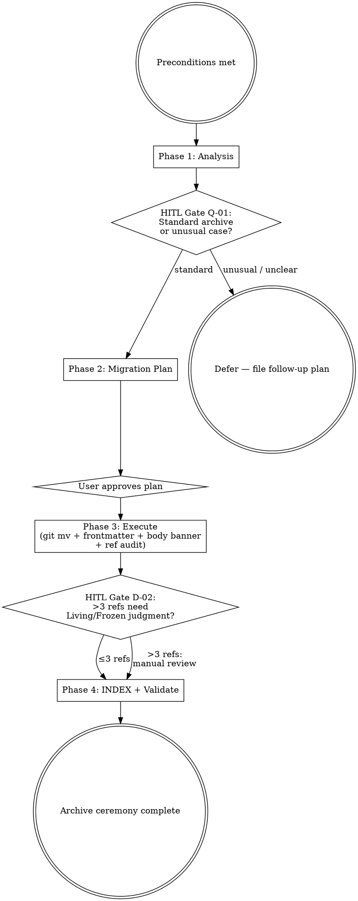

# [RUNBOOK] Doc Archive Procedure

> 操作步骤：把一个 `state: active` 的文档迁移到 `state: archived` 状态，物理放进 `docs/archive/`（flat layout per Framework v1.4 §2.3.5——不分 subtype 子目录）。本 RUNBOOK 是 Documentation Framework v1.4 §2.3.1-§2.3.5 的运行时执行手册。

## §1 Preconditions

执行本 RUNBOOK 之前，必须**全部**满足:

- [ ] 目标 doc 当前 `state: active`（已 merged 到 develop / main）
- [ ] 至少一个 §2.3.1 Archive Trigger 已发生:
  - [ ] (1) Framework / STANDARD major version bump (vN.x → v(N+1).x)
  - [ ] (2) Structural rewrite (≥50% 章节重组 / 模板变更 / scope 重定义)
  - [ ] (3) ≥70% 内容替换 (substantive rewrite)
  - [ ] (4) Split / merge / rename (1→N, N→1, scope 重命名)
- [ ] 已有 active 后继 doc (绝大多数场景)；如无后继 (纯退役无替代)，仍可走本 RUNBOOK 但 `replaced-by:` 留空 + 说明 (rare case)
- [ ] 在一个 feature/* 或 maintain/* worktree 中操作 (不在 develop / main 上直接改)

**Not preconditions** (i.e., 这些情况**不**走本 RUNBOOK):

- 文件名 `_vX.Y` 后缀清理 (drop-suffix rename) — 这是 §2.4 path stability，不是 archive
- 同 doc 的 minor/patch version bump (v1.0 → v1.1) — frontmatter `version:` 字段递增即可，不归档
- doc 内容微调 / typo 修复 — 直接 edit + commit

## §2 Workflow (4 phases + 2 HITL Gates)



### Phase 1: Analysis

读取目标 doc 的 frontmatter 与 body；识别 trigger；评估常规 vs 异常。

```bash
# Step 1.1 — Read target doc frontmatter
TARGET="docs/rule/[STANDARD]_Example_To_Archive.md"   # replace with actual path
head -30 "$TARGET"

# Step 1.2 — Identify which §2.3.1 trigger applies
# Document this in HITL output for Q-01

# Step 1.3 — Read successor (if exists)
SUCCESSOR="docs/rule/[STANDARD]_Example_v2.md"        # replace with actual
head -30 "$SUCCESSOR" 2>/dev/null
```

**HITL Gate Q-01** (mandatory pause; user confirms):

```text
Q-01: Standard archive case?

- 当前观察: <TARGET> 是 state:active, 版本 vX.Y
- 触发条件: §2.3.1 trigger #N (<trigger name>)
- 后继 doc: <SUCCESSOR> (state:active, version: vN'.Y') / or "none — pure retirement"
- 为什么重要: archive 是不可逆物理移动 (`git mv` 后原路径不复存在；引用需要更新)
- 可选方案:
  A. Standard archive — 按本 RUNBOOK 4 phases 执行
  B. Defer — 现在不归档，作为 follow-up plan (e.g., 等批量 archive)
  C. Unusual case — 需特殊处理 (例如 split/merge 涉及多个文件，或 framework v2.0 级别大事件) — 升级到 ADR + 单独决策
- 我的建议: A (standard) — if trigger #1/#2/#3 fired and only 1 target doc
- 默认假设: A
- 是否必须等待人工确认: 是
```

### Phase 2: Migration Plan

计算 archive 目标路径、新 filename、references 审计范围；输出迁移计划等用户 approve。

**Step 2.1 — Compute archive destination**:

| Component | Rule | Example |
|-----------|------|---------|
| Archive root | always `docs/archive/` (flat — no subtype subdir per Framework v1.4 §2.3.5) | `docs/rule/` / `docs/adr/` → `docs/archive/` |
| Filename prefix | `[DEPRECATED]_` (uppercase, literal) | `[DEPRECATED]_` |
| Original tag + topic | preserve verbatim | `[STANDARD]_Example_To_Archive` |
| Version suffix | `_v<major>.<minor>` (patch dropped) | `_v1.2` |
| Final filename | concatenation | `[DEPRECATED]_[STANDARD]_Example_To_Archive_v1.2.md` |
| Full archive path | `docs/archive/` + filename | `docs/archive/[DEPRECATED]_[STANDARD]_Example_To_Archive_v1.2.md` |

**Step 2.2 — Reference audit scope**:

```bash
# Find all references to the target doc
TARGET_BASENAME="[STANDARD]_Example_To_Archive"
grep -rln "$TARGET_BASENAME" --include='*.md' --exclude-dir='.git' .
```

Report:
- Total references found: N
- By file count: docs/**/*.md M files, plugins/**/*.md K files, .claude/**/*.md L files
- Each will be classified Living / Frozen in Phase 3

**Step 2.3 — Output migration plan to user; wait for approval**.

### Phase 3: Execute

逐步执行 git mv、frontmatter 更新、body banner 添加、引用审计。

**Step 3.1 — `git mv` to archive**:

```bash
git mv "docs/<subtype>/<original>.md" "docs/archive/[DEPRECATED]_<original>_v<X.Y>.md"
```

(Per CLAUDE.md worktree convention: `git mv` is allowed; `git checkout` is forbidden.)

**Step 3.2 — Update archived file frontmatter**:

```yaml
# Before
state: active
version: v1.2
# (no archived: / replaced-by: yet)

# After (edit the just-moved file)
state: archived
version: v1.2
archived: 2026-05-15                                # ISO date of move
replaced-by: ../rule/[STANDARD]_New_Successor.md     # relative from archive location to active successor (1 level shallower under flat layout per Framework v1.4 §2.3.5)
```

**Step 3.3 — Add Archive Banner to archived file body**:

Per Framework §2.3.3 canonical template; insert immediately after H1, before any other body:

```markdown
# [<TAG>] <Original Title>

> **Archived**: This doc is `state: archived` (frozen at v<X.Y>). Superseded by [<new doc title>](<../rule/[TAG]_NewSuccessor.md>) (v<new version>).
> **Archive reason**: <one-line per §2.3.1 trigger; e.g., "Framework major version bump v1.x → v2.0">.
> **Archived on**: <YYYY-MM-DD>. Content frozen — do not modify except for typo corrections.

<rest of body unchanged>
```

**Step 3.4 — Update successor's `supersedes:` field**:

```yaml
# successor doc (docs/rule/[STANDARD]_New_Successor.md) gains
supersedes:
  - ../archive/[DEPRECATED]_[STANDARD]_Example_To_Archive_v1.2.md
```

(If multiple archived predecessors, list-form: one entry per predecessor.)

**Step 3.5 — Reference audit** (per §2.3.4 Living vs Frozen):

For each file containing a reference to the archived doc (found in Step 2.2):

1. Read the sentence containing the reference
2. Apply §2.3.4 decision procedure:
   - **Living reference** ("per X §A, the rule is...") → upgrade to successor path
   - **Frozen reference** ("v1.0 introduced Y in 2026-05-...") → preserve, update path to archive location
3. Edit the file accordingly

**HITL Gate D-02** (only fires if >3 references need judgment):

```text
D-02: Reference judgment escalation

- 当前观察: 发现 N (>3) 处引用需要 Living vs Frozen 判断
- 不确定点: 部分引用上下文模糊 (e.g., "see X" 没明确是 current state 还是 historical event)
- 为什么重要: 误判 Living → Frozen 会让 doc 看起来过时；误判 Frozen → Living 会丢失历史 context
- 可选方案:
  A. 我逐一报告每条引用 + 建议判断，user approve each
  B. 我按 §2.3.4 默认规则 (ambiguous → Living + parenthetical archive pointer) 自动处理 N 条
  C. Defer — 先归档，后续再单独审计
- 我的建议: A (审慎处理) — 4-10 处引用时；B 当 >10 处且大多明确
- 默认假设: A
- 是否必须等待人工确认: 是
```

### Phase 4: INDEX & Validate

更新 `docs/INDEX.md` Archived Documents 表 + 跑 `/mp-doc-validate` 全量审计。

**Step 4.1 — Update `docs/INDEX.md`**:

在「## Archived Documents」段表格添加新行:

```markdown
| [<TAG> Original Title](<../archive/[DEPRECATED]_<name>_vX.Y.md>) | `docs/<subtype>/<original>.md` | [<successor>](<./<subtype>/<successor>.md>) | 2026-05-15 | §2.3.1 trigger #N |
```

**Step 4.2 — Verify successor INDEX entry** (if successor is new):

确保 successor 在 `docs/INDEX.md` 的对应 type 段已列出 (`docs/rule/` STANDARDs 表 / `docs/adr/` ADRs 表 / etc.)

**Step 4.3 — Run validate**:

```bash
# Via skill
/mp-doc-validate

# Or manual: verify the 6-item checklist
```

**Step 4.4 — verification checklist**:

- [ ] Archived file exists at expected path
- [ ] Archived file has Archive Banner at top of body
- [ ] Archived file has `state: archived` + `archived: <date>` + `replaced-by: <path>` in frontmatter
- [ ] Successor has `supersedes: [...]` listing the archive path
- [ ] All references in audit scope have been classified + updated (Living upgraded; Frozen preserved with archive path)
- [ ] `docs/INDEX.md` Archived Documents table has new row
- [ ] No broken links in `docs/INDEX.md` (`grep '<original-basename>'` doesn't hit any non-archive paths except in CHANGELOG / MIGRATION_GUIDE / [STANDARD] history)

## §3 Archive Banner Template

Canonical reference (also at `[STANDARD]_Documentation_Framework.md` §2.3.3):

```markdown
# [<TAG>] <Original Title>

> **Archived**: This doc is `state: archived` (frozen at v<X.Y>). Superseded by [<new doc title>](<relative path to successor>) (v<new version>).
> **Archive reason**: <one-line per §2.3.1 trigger>.
> **Archived on**: <YYYY-MM-DD>. Content frozen — do not modify except for typo corrections.
```

**Banner rules**:
- GitHub-native blockquote (not `> [!CAUTION]`) — keep banner format consistent across all archived docs for AI agent pattern matching
- Banner is the **first** body element after H1; nothing precedes it
- Relative paths in `Superseded by [...]` link computed from archive location

## §4 Living vs Frozen Quick Reference

| Reference example | Living / Frozen | Action |
|-------------------|------|--------|
| "Per `[STANDARD]_X` §2.3, do Y" | Living (cites current state) | upgrade to successor's path |
| "X §2.3 currently requires Y" | Living | upgrade |
| "X §2.3 is the canonical rule for Y" | Living | upgrade |
| "v1.0 introduced X concept" | Frozen (historical event) | preserve, point to archive |
| "Before v2.0, the rule was Y (see archive)" | Frozen | preserve, archive path |
| "Pre-v4.3.0 marketplace used different scope set" | Frozen | preserve, archive path |
| "see X for background" (ambiguous) | Default to Living + parenthetical archive pointer | upgrade + add `(see also [archive copy](path) for v1.x history)` |

## §5 Verification Checklist

After all 4 phases:

- [ ] `find docs/archive -type f -name '*.md' | wc -l` shows +1 (new archived doc present)
- [ ] `head -5 docs/archive/[DEPRECATED]_<name>_v<X.Y>.md` shows YAML frontmatter with `state: archived` + `archived: <date>` + `replaced-by: <path>`
- [ ] `grep '^> \*\*Archived\*\*' docs/archive/[DEPRECATED]_<name>_v<X.Y>.md` matches the Archive Banner line
- [ ] Successor file's `supersedes:` field includes archive path (`grep -A5 '^supersedes:' docs/<subtype>/<successor>.md`)
- [ ] `git status` shows the `git mv` rename (`R` status) cleanly; not duplicated `D` + `??`
- [ ] `docs/INDEX.md` Archived Documents table has new row
- [ ] `/mp-doc-validate` reports Critical=0 (Warning OK)
- [ ] CHANGELOG entry filed under current release noting the archive (Removed / Changed section)

## §6 Rollback

如归档过程出错（错档了文件 / banner 错写 / 引用更新引入回归）:

```powershell
# 整笔回滚 (preferred — atomic ceremony reversal)
git reset --hard HEAD~N    # N = number of commits in this archive ceremony

# Or selective revert (if commits were granular)
git revert <commit-hash>
```

**Note**: 归档若已 push 到 develop 或 merged: 走标准 revert PR 流程；不直接 reset。

## §7 Change History

| Version | Date | last-verified | Summary |
|---------|------|---------------|---------|
| v1.1 | 2026-05-17 | 2026-05-17 | **Flat archive layout adoption**. Framework v1.4 §2.3.5 引入 flat archive layout：§1 intro 描述同步 `docs/archive/`（no subtype）；§2.1 Step 2.1 表「Subtype directory」行改「Archive root」/「Full archive path」示例去 subtype；§3 Step 3.1 git mv 路径去 `<subtype>/`；§3 Step 3.2 `replaced-by:` 示例少一层 `..`；§3 Step 3.3 banner Superseded by 路径示例同步；§3 Step 3.4 `supersedes:` 示例同步；Step 4.1 INDEX 表行模板同步；§5 Verification Checklist 两条 path 同步。无归档 ceremony 实施过，无 migration。配套 Framework v1.3 → v1.4 + mp-doc-validate description 同步。Adopted in PR-A (v4.X.Y). |
| v1.0 | 2026-05-15 | 2026-05-15 | Initial RUNBOOK. Adopted in PR #83 (v4.4.0). Adapted from mj-agent `.claude/skills/mj-agent-doc-migrate/SKILL.md` (6-phase workflow) — compressed to 4 phases + 2 HITL gates for marketplace's smaller scope. Skeleton-first archive mode (mj-agent Meta v2.1 §5.8 for multi-doc cascade) intentionally **not** included in v1.0; will add as v1.1 if marketplace ever has a cascade case. |
