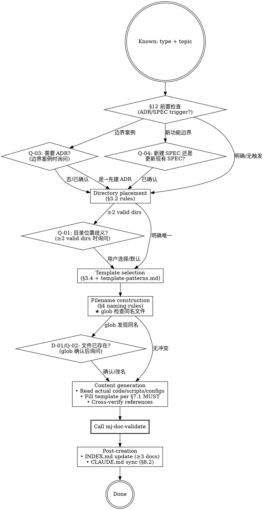

# MJ Document Author

## Overview

Creates a single Framework v4.5-compliant document from code analysis through to validation. Code is the source of truth — always verify against actual files, never trust legacy docs alone.

## Prerequisite

Document type and scope should be clear. If not, use `mj-doc-plan` first.

## Workflow

## Quick Reference

| Type | Directory | Template | Naming |
|------|-----------|----------|--------|
| `[GUIDE]` | `guide/` or `infrastructure/{domain}/` | TEMPLATE_GUIDE.md | `[GUIDE]_Description.md` |
| `[RUNBOOK]` | `design/{Service}/` or `infrastructure/{domain}/` | TEMPLATE_RUNBOOK.md | `[RUNBOOK]_Subject_Description.md` |
| `[ADR]` | `adr/` | TEMPLATE_ADR.md | `[ADR]_NNN_Decision_Title.md` |
| `[SPEC]` | `design/{Service}/` | TEMPLATE_SPEC.md | `[SPEC]_Abbr_Description.md` |
| `[POSTMORTEM]` | `postmortem/` | TEMPLATE_POSTMORTEM.md | `[POSTMORTEM]_Abbr_Incident.md` |
| `[STANDARD]` | `rule/` or `infrastructure/{domain}/` | TEMPLATE_STANDARD.md | `[STANDARD]_Description.md` |
| `[ISSUE]` | `issues/` | TEMPLATE_ISSUE.md | `[ISSUE]_NNN_DomainAbbr_Description.md` |
| `[ASSESSMENT]` | `assessments/` | TEMPLATE_ASSESSMENT.md | `[ASSESSMENT]_DomainAbbr_Optimization_Topic.md` |

## Key Principles

1. **Code is source of truth** — Legacy docs may be outdated. Always verify paths, params, secrets against actual files.
2. **RUNBOOK uses imperative mood** — Readers execute under pressure; clear commands save time.
3. **Start as `status: 草案`** — All new docs enter review before becoming authoritative.
4. **Template adaptation allowed** — Sections can rename/reorder, but MUST preserve: frontmatter, blockquote header, related docs section.

## Directory Placement Rules (§3.2)

Priority: **belongs to specific domain → domain directory** > **cross-domain general → type directory**

- Service-specific docs → `design/{Service}/`
- Infrastructure domain docs → `infrastructure/{domain}/`
- Cross-domain guides → `guide/`
- Cross-domain standards → `rule/`
- Decisions → `adr/`
- Postmortems → `postmortem/`
- Deferred problems → `issues/`
- Optimization evaluations → `assessments/`

## ADR Numbering

Scan `docs/adr/` for max existing `[ADR]_NNN_*` number, new = max + 1 (zero-padded to 3 digits). Start at 001 if empty.

## ISSUE Numbering

Same convention: scan `docs/issues/` for max `[ISSUE]_NNN_*` number, new = max + 1. Independent sequence from ADR numbering.

## Filename Construction — 文件冲突检查（必须）

在构建目标文件名后、生成内容前，执行以下检查：

1. 拼出完整目标路径（目录 + 文件名）
2. 使用 `glob` 检查该路径是否已存在文件
3. 若存在 → 触发 **D-01/Q-02**（见"人工交互节点"）
4. 若不存在 → 直接进入内容生成

## 人工交互节点

使用 `AskUserQuestion` 工具在以下时机暂停并询问用户。
若用户未在原始请求中提供相关信息，且满足触发条件，则提问；
若满足抑制条件，跳过提问直接使用默认行为。

| 时机 | 触发条件摘要 | 抑制条件摘要 | 问题 ID |
|------|------------|------------|---------|
| §12 前置检查后（边界案例） | §12.2 有匹配项但非核心架构变更 | 用户说"不需要 ADR"或纯 bug fix | Q-03 |
| §12 前置检查后（新功能边界） | 变更含"新功能"但范围限于单服务内部 | 用户已确认"更新/创建 SPEC" | Q-04 |
| 目录确定前 | §3.2 规则映射出 ≥2 个有效目录 | 用户已在请求中指定路径 | Q-01 |
| 写文件前（文件已存在） | glob 检测到目标路径同名文件 | 用户说"覆盖/替换" | D-01/Q-02 |
| 同名文件处理方式 | 同上（Q-02 是 D-01 的提问界面） | 同上 | Q-02 |
| §12 前置检查后（问题文档） | 问题分析文档但发现方式不明确（主动 vs 被动） | 用户已指定"写 ISSUE"或"写 POSTMORTEM" | Q-10 |

详细模板: `../mj-doc-shared/question-patterns.md`

## REQUIRED SUB-SKILL

`mj-doc-validate` — Run on completed document before declaring done.

## Reference Files

- **type-decision-reference.md** — §2.3 decision tree, confusion pairs, content boundaries
- **template-patterns.md** — Template paths, RUNBOOK adaptation patterns, INDEX.md pattern
