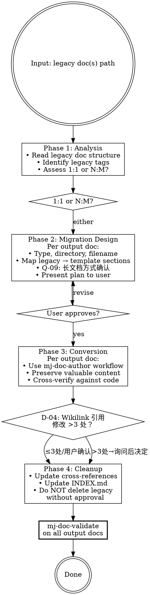

# MJ Documentation Migrator

## Overview

Converts legacy documents into Framework v5.0-compliant format. Primary use cases:

1. **v4.5 → v5.0 migration**: Convert canonical docs from v4.5 frontmatter to v5.0 schema
2. **`docs_old/` migration**: Convert unstructured legacy docs into v5.0 format
3. **Tag migration**: Map old tags (`[MANUAL]`, `[API]`, `[DEPRECATED]`) to v5.0 types

Output targets follow v5.0 three-layer model:
- Canonical doc → `docs/**`
- Working plan → `plans/**`
- Historical evidence → `docs/archive/legacy/**`

Always cross-verifies content against actual code — legacy docs may be outdated.

## Workflow

## Phase 1: Analysis

1. Read legacy document(s) — extract structure, content sections, metadata
2. Identify legacy tags and map to Framework v5.0 types (see migration-rules.md)
3. Assess: 1:1 conversion or N:M split/merge needed?
   - **Split**: If >800 lines or covers >2 Framework v5.0 types
   - **Merge**: If multiple legacy docs cover same topic with <100 lines each

## Phase 2: Migration Design

For each output doc:
1. Determine type (§2.3 decision tree)
2. Determine directory (§3.2 placement rules)
3. Determine filename (§4 naming rules)
4. Map legacy sections to Framework v5.0 template sections
5. **Q-09 触发检查**: 若文档 600–900 行且覆盖 2 种 Framework v5.0 类型（模糊区间），在制定方案前触发 Q-09 向用户确认迁移方式
6. **Present migration plan to user for approval before proceeding**

## Phase 3: Conversion

For each output doc, use `mj-doc-author` workflow:
1. Create from template
2. Fill with content restructured from legacy doc
3. **Cross-verify every claim against actual code** — legacy docs may have drifted
4. All new docs start as `state: draft`

## Phase 4: Cleanup

**执行前检查 D-04**：统计迁移后需修改的 Wikilink 引用数量，若 >3 处 → 触发 D-04 询问处理方式

1. Update cross-references pointing to legacy doc names
2. Update INDEX.md entries for new docs
3. **Do NOT delete legacy docs without explicit user approval**
4. If user approves deletion, move to `docs/archive/legacy/` (no `[DEPRECATED]` prefix — v5.0 uses `state: deprecated` instead)

## 人工交互节点

使用 `AskUserQuestion` 工具在以下时机暂停并询问用户。
若用户未在原始请求中提供相关信息，且满足触发条件，则提问；
若满足抑制条件，跳过提问直接使用默认行为。

| 时机 | 触发条件摘要 | 抑制条件摘要 | 问题 ID |
|------|------------|------------|---------|
| Phase 2 制定方案时 | 文档 600–900 行且覆盖 2 种 v4 类型（模糊区间） | 用户已指定"拆分"或"整体迁移" | Q-09 |
| Phase 4 前（Cleanup 开始前） | 迁移后需修改的 Wikilink >3 处 | 用户说"先不改引用"或"我来处理" | D-04 |

详细模板: `../mj-doc-shared/question-patterns.md`

## REQUIRED SUB-SKILLS

- `mj-doc-author` — For creating each output document
- `mj-doc-validate` — Final compliance gate on all output docs

## Reference Files

- **migration-rules.md** — Tag mapping table, split/merge heuristics, content preservation rules
