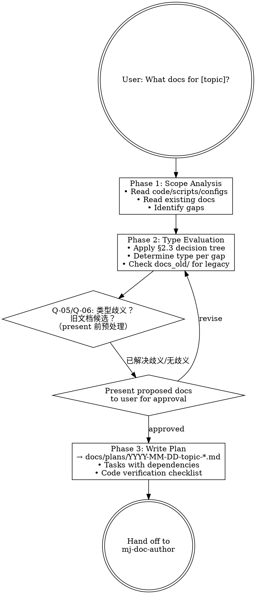

# MJ Documentation Planner

## Overview

Analyzes a topic scope, evaluates existing docs against Framework v4.5 requirements, determines which document types are needed, and produces an implementation plan. This is the "what docs do we need?" skill.

## When to Use

- Evaluating documentation needs for a service, infrastructure area, or feature
- Planning multi-document work before authoring
- Assessing documentation gaps in a specific area
- Asked "what docs do we need for X?"

Do NOT use for writing a single known document — use `mj-doc-author` instead.

## Workflow



## Phase 1: Scope Analysis

1. Read relevant code, scripts, configs for the topic
2. Read existing docs in related directories (`docs/design/{Service}/`, `docs/infrastructure/{domain}/`, etc.)
3. Identify what's documented vs what's missing
4. Check `docs_old/` for legacy content that could be migrated

## Phase 2: Type Evaluation

For each identified gap, apply the decision tree (see plan-checklist.md):

1. What type should this doc be? (§2.3 decision tree)
2. Does this trigger §12 前置检查? (ADR/SPEC requirements)
3. Is there legacy content in `docs_old/` to migrate? (→ `mj-doc-migrate`)
4. Can an existing doc be updated instead of creating new?

**在 present 前触发 Q-05/Q-06**（若满足触发条件）：
- Q-05: 若某缺口内容既含架构/设计理由（>30%）又含操作指导（>30%），在提案中标注类型歧义，触发 Q-05 向用户确认
- Q-06: 若 `docs_old/` 下存在与主题匹配的文件，在提案中列出候选，触发 Q-06 询问是否纳入迁移任务

## Phase 3: Implementation Plan

Write plan to `docs/plans/YYYY-MM-DD-<topic>-documentation-plan.md`:

```markdown
# [Topic] Documentation Plan

## Context
Why these docs are needed.

## Proposed Documents

| # | Type | Filename | Directory | Sources |
|---|------|----------|-----------|---------|
| 1 | [GUIDE] | [GUIDE]_X.md | infrastructure/x/ | code: ..., legacy: ... |

## Task List
1. Create [doc1] — depends on: none
2. Create [doc2] — depends on: doc1
3. Update INDEX.md — depends on: all above

## Code Verification Checklist
- [ ] Verify X against actual code at path Y
```

## Key Principles

- Always present proposed document set to user before writing the plan
- Consider updating existing docs before creating new ones
- Check `docs_old/` for migration candidates
- Each service should have ≥1 SPEC + relevant RUNBOOKs
- Each infrastructure area should have ≥1 GUIDE + relevant RUNBOOKs
- Each significant optimization round should have ≥1 ASSESSMENT
- Cross-module deferred problems should have an ISSUE if >10 lines of analysis needed

## 人工交互节点

使用 `AskUserQuestion` 工具在以下时机暂停并询问用户。
若用户未在原始请求中提供相关信息，且满足触发条件，则提问；
若满足抑制条件，跳过提问直接使用默认行为。

| 时机 | 触发条件摘要 | 抑制条件摘要 | 问题 ID |
|------|------------|------------|---------|
| Phase 2 结束、present 前 | 文档内容兼含架构说明与操作指导（各>30%） | 用户明确说"写 GUIDE"或"写 SPEC" | Q-05 |
| Phase 2 结束、present 前 | docs_old/ 下存在主题匹配的遗留文件 | 用户明确说"忽略旧文档" | Q-06 |
| Phase 2 中（问题文档） | 问题分析文档但发现方式不明确（主动 vs 被动） | 用户已指定"写 ISSUE"或"写 POSTMORTEM" | Q-10 |
| Phase 2 中（问题深度） | 发现需延后处理的问题但分析深度不确定 | 问题分析明显 >10 行 | Q-11 |

详细模板: `../mj-doc-shared/question-patterns.md`

## RECOMMENDED SUB-SKILL

`mj-doc-author` — For executing the plan (creating each document).

## Reference Files

- **plan-checklist.md** — §2.3 decision tree, §12 protocol, coverage heuristics, plan format
