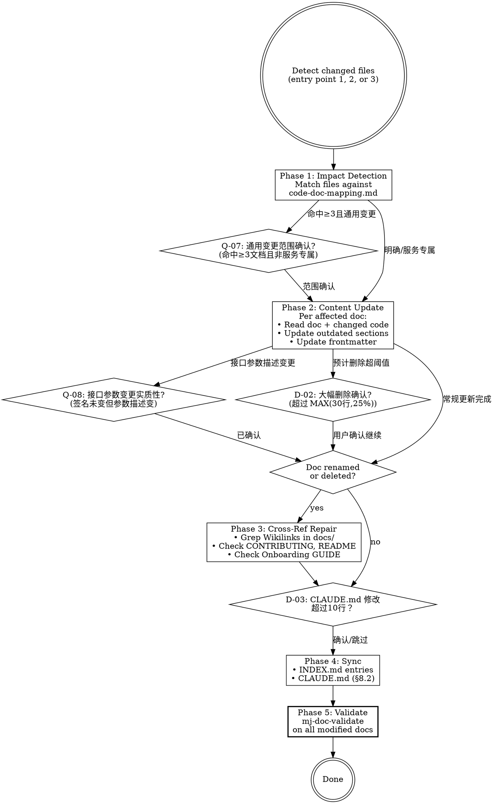

# MJ Documentation Sync

## Overview

Detects documentation impact from code changes, executes updates, repairs cross-references, and syncs INDEX.md + CLAUDE.md. Handles the maintenance lifecycle after initial authoring.

## Entry Points

1. **User-provided**: "I changed X, update docs" → use provided file list
2. **Git-based**: Run `git diff --name-only main...HEAD` to detect changed files
3. **Drift scan**: Compare doc claims against current code state (for periodic audits)

## Workflow

## Phase 1: Impact Detection

Match changed files against the code-doc-mapping.md table. For each match:
- Identify which docs are affected
- Determine change type (endpoint change, config change, schema change, etc.)

**若命中 ≥3 个文档且变更为通用工具/配置类** → 触发 **Q-07** 确认同步范围

## Phase 2: Content Update

For each affected doc:
1. Read the doc and the changed code side by side
2. Identify which sections are outdated
3. Update content while preserving document structure
4. Update frontmatter: `updated` (if substantive per §5.4), `version` (if appropriate)

**中途触发条件**：
- 若接口参数描述变更但函数签名未变 → 触发 **Q-08** 确认实质性
- 若预计删除超过 MAX(30行, 25%原文) → 触发 **D-02** 确认大幅删除

**Substantive change rule** (§5.4): Update `updated` field only when the change affects semantic meaning or behavioral guidance. Typo fixes, formatting adjustments → do NOT update `updated`.

## Phase 3: Cross-Reference Repair

If any doc was renamed or deleted:
1. Grep for old Wikilinks across `docs/`, `CONTRIBUTING.md`, `README.md`, `.github/`
2. **Always check**: `docs/guide/[GUIDE]_Developer_Onboarding.md` (high-traffic cross-reference target)
3. Update all found references to new name/location

## Phase 4: Sync

**执行前检查 D-03**：若 CLAUDE.md 需修改超过 10 行 → 触发 **D-03** 确认

1. **INDEX.md**: Add/remove/update entries per §6.2 format: `- [[doc|Title]] — ≤60 char description`
2. **CLAUDE.md**: Check §8.2 mapping table. If changed content maps to a CLAUDE.md section, sync it.

## Phase 5: Validate

**REQUIRED SUB-SKILL**: `mj-doc-validate` — Run on every modified document.

## 人工交互节点

使用 `AskUserQuestion` 工具在以下时机暂停并询问用户。
若用户未在原始请求中提供相关信息，且满足触发条件，则提问；
若满足抑制条件，跳过提问直接使用默认行为。

| 时机 | 触发条件摘要 | 抑制条件摘要 | 问题 ID |
|------|------------|------------|---------|
| Phase 1 后 | 命中 ≥3 个文档且变更为通用工具/配置 | 用户已提供受影响文档列表 | Q-07 |
| Phase 2 中（接口描述变更） | 参数类型/名称描述变但函数签名未变 | 用户说"只改格式/注释" | Q-08 |
| Phase 2 中（大幅删除） | 单文档删除超过 MAX(30行, 25%原文) | 用户说"大幅修改/重写" | D-02 |
| Phase 4 前 | CLAUDE.md 需修改超过 10 行 | 用户说"不用更新 CLAUDE.md" | D-03 |

详细模板: `../mj-doc-shared/question-patterns.md`

## Reference Files

- **code-doc-mapping.md** — §9.4 mapping table with glob patterns for detection
