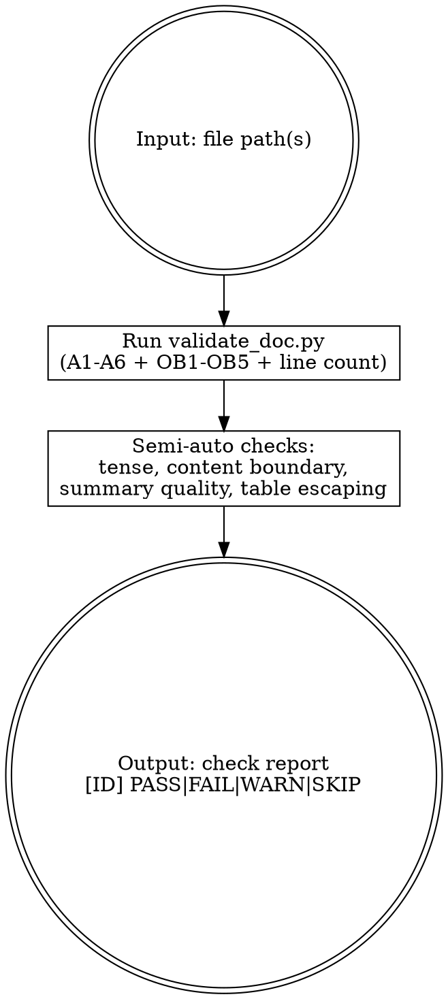

# MJ Documentation Validator

## Overview

Validates MJ System documentation against Framework v5.0:
- **A1-A6**: Schema and existence checks (blocking)
- **OB1-OB5**: Obsidian Markdown format checks (non-blocking WARN)
- **Advisory**: Line count, tense, content boundary (non-blocking WARN)

Returns `PASS` / `FAIL` / `WARN` / `SKIP` per check. v4.5 documents are unsupported and must be migrated first using `mj-doc-migrate`.

> **v2.0 compatibility boundary**: Only supports repositories that have completed the Framework v5.0 migration.

## When to Use

- After creating or editing any `docs/**/*.md` file
- Before submitting a PR with documentation changes
- When auditing documentation quality across a directory

## Workflow



## Checks

**Script** (validate_doc.py):
- A1 path + filename legality · A2 frontmatter completeness · A3 state + enum validation · A4 internal link resolution · A5 INDEX managed-block sync · A6 CLAUDE.md allowlist trigger
- OB1 anchor links · OB2 heading format · OB3 list markers · OB4 code block tags · OB5 callout types
- Line count (advisory WARN)

**Semi-auto** (instruction-based): Tense consistency · Content boundary (MUST NOT) · Summary quality · OB6 table pipe escaping

## Running Automated Checks

```bash
# Basic validation
python "${CLAUDE_PLUGIN_ROOT}/skills/mj-doc-validate/scripts/validate_doc.py" <file_path>

# With repo root (required for A4, A5, A6)
python "${CLAUDE_PLUGIN_ROOT}/skills/mj-doc-validate/scripts/validate_doc.py" <file_path> --repo-root <repo>

# Generate/update managed INDEX blocks
python "${CLAUDE_PLUGIN_ROOT}/skills/mj-doc-validate/scripts/validate_doc.py" <file_path> --repo-root <repo> --write-managed-indexes

# PR-mode validation (A6 enabled)
python "${CLAUDE_PLUGIN_ROOT}/skills/mj-doc-validate/scripts/validate_doc.py" <file_path> --repo-root <repo> --pr-mode --base-ref <ref> [--head-ref <ref>]
```

Output: per-check `{id, status, message}`. Add `--json` for JSON. Merge with semi-auto results below.

## Semi-Automated Checks

- **Tense consistency**: Scan text against tense word lists in validation-rules.md
- **Content boundary**: Compare sections against type's MUST NOT list (§7.1). Edge → WARN; clear violation → FAIL
- **Summary quality**: Check summary field adequacy
- **OB6**: In table cells with Wikilinks, verify `|` escaped as `\|`

## Output Format

```
[A1]  PASS — Path and filename valid for [GUIDE] in docs/
[A2]  PASS — 7/7 required frontmatter fields present
[A3]  PASS — state=active, type=guide, domain=QCM all valid
[A4]  PASS — 5 internal links resolved
[A5]  SKIP — Not an INDEX.md file
[A6]  SKIP — Not in PR mode
[OB1] PASS — No GitHub-style anchor links found
[OB2] PASS — All headings properly formatted
```

## Reference Files

- **validation-rules.md** — A1-A4 field lists, regex patterns, line ranges, tense words
- **obsidian-rules.md** — OB1-OB6 syntax quick reference
- **scripts/validate_doc.py** — Automated checker for A1-A3 + OB1-OB5
