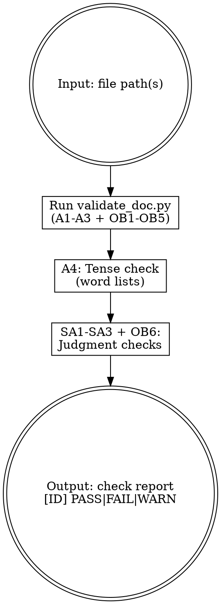

# MJ Documentation Validator

## Overview

Validates MJ System documentation against Framework v4.5 (A1-A4, SA1-SA3) and Obsidian Markdown (OB1-OB6) rules. Deterministic checks use the bundled `validate_doc.py` script; judgment-based checks use instruction analysis.

## When to Use

- After creating or editing any `docs/**/*.md` file
- Before submitting a PR with documentation changes
- When auditing documentation quality across a directory

## Workflow



## Checks

**Script** (validate_doc.py): A1 frontmatter fields · A2 filename regex · A3 line count · OB1 Wikilink syntax · OB2 heading format · OB3 list consistency · OB4 code block tags · OB5 callout types

**Semi-auto** (instruction-based): A4 tense consistency · SA1 content boundary (MUST NOT → FAIL, edge → WARN) · SA2 duplicate detection (§6.3) · SA3 audience match · OB6 table pipe escaping

## Running Automated Checks

```bash
python "${CLAUDE_PLUGIN_ROOT}/skills/mj-doc-validate/scripts/validate_doc.py" <file_path>
```

Output: per-check `{id, status, message}`. Add `--json` for JSON. Merge with semi-auto results below.

## Semi-Automated Checks (A4, SA1-SA3, OB6)

- **A4**: Scan text against tense word lists in validation-rules.md
- **SA1**: Compare sections against type's MUST NOT list (§7.1). Edge → WARN with §7.3 cite; clear violation → FAIL
- **SA2**: Check for detailed info that belongs in authority source (§6.3). CLAUDE.md exempt (§8)
- **SA3**: If `[GUIDE]`, scan for production commands (`ssh`, `kubectl`, `psql -h prod`). Flag as WARN
- **OB6**: In table cells with Wikilinks, verify `|` escaped as `\|`

## Output Format

```
[A1]  PASS — 7/7 required frontmatter fields present
[A2]  FAIL — Filename "guide_foo.md" does not match [TYPE]_Description pattern
[OB1] PASS — No GitHub-style anchor links found
[SA1] WARN — §7.3: Line 45 contains deployment steps; borderline for [GUIDE]
```

## Reference Files

- **validation-rules.md** — A1-A4 field lists, regex patterns, line ranges, tense words
- **obsidian-rules.md** — OB1-OB6 syntax quick reference
- **scripts/validate_doc.py** — Automated checker for A1-A3 + OB1-OB5
