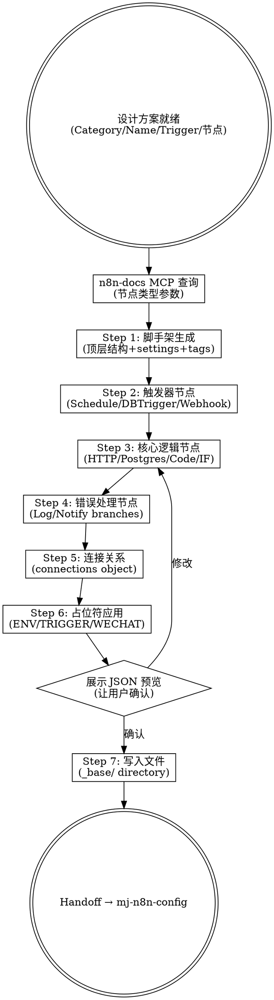

# MJ N8N Workflow Author

## Overview

本技能从设计方案直接生成完整的 n8n workflow JSON 模板（Path B），产出 `_base/` 目录下的模板文件，其中环境相关值全部使用占位符。无需 n8n UI — Claude Code 程序化构建整个工作流。

生成的模板通过 `scripts/render_n8n_workflows.py` 渲染为各环境（dev/test/production）的实际 workflow JSON。

## Prerequisites

开始前确认以下信息已就绪（若缺失，提示用户先使用 `/mj-n8n-plan`）：

- **Category**: 节点类型（CollectionNodes / ProcessingNodes / ServiceNodes / TaskNodes）
- **Name**: 工作流名称（PascalCase，如 `RawDataCollection`）
- **TriggerType**: 触发方式（Schedule / Scheduled（旧称，仅限 Interval 模式，新工作流推荐使用 Schedule）/ DBTrigger / Webhook / Manual）
- **节点结构**: 至少明确触发方式、核心逻辑、输出方式

## Main Workflow



---

### Step 1 — Scaffold Generation（脚手架生成）

生成 workflow JSON 顶层结构：

```json
{
  "id": "wf_{category_abbr}_{name_abbr}_{seq}",
  "name": "{{ENV_PREFIX}}-{Category}-{Name}-{TriggerType}",
  "nodes": [],
  "pinData": {},
  "connections": {},
  "active": false,
  "settings": { "executionOrder": "v1" },
  "versionId": "<generate-uuid>",
  "tags": [
    { "name": "{{ENV_TAG}}" },
    { "name": "trigger:{type}" },
    { "name": "domain:{category-kebab}" },
    { "name": "tech:{technologies}" },
    { "name": "function:{function}" }
  ]
}
```

**重要规则**：
- 生成语义化顶层 `id`，格式 `wf_{category_abbr}_{name_abbr}_{seq}`（如 `wf_cn_missnotif_01`）。缩写：cn=CollectionNodes, pn=ProcessingNodes, sn=ServiceNodes, tn=TaskNodes
- `active` 始终为 `false`（模板状态）
- `versionId` 生成一个 UUID
- Tags 规范：
  - `{{ENV_TAG}}` — 渲染时替换为 `env:dev` / `env:test` / `env:production`
  - `trigger:{type}` — `schedule` / `database` / `webhook` / `manual`
  - `domain:{category-kebab}` — `collection-nodes` / `processing-nodes` / `service-nodes` / `task-nodes`
  - `tech:{technologies}` — `postgres` / `api` / `wechat` 等（可多个）
  - `function:{function}` — `data-collection` / `notification` / `monitoring` / `data-loading` / `etl` 等
  - 可选：`schedule:cron-daily` / `schedule:interval-30min` / `schedule:realtime`

---

### Step 2 — Trigger Node（触发器节点）

根据 TriggerType 选择节点模板：

| TriggerType | Node Type | typeVersion | Key Parameters | Position |
|-------------|-----------|-------------|----------------|----------|
| Schedule (Cron) | `n8n-nodes-base.scheduleTrigger` | 1.2 | `rule.interval[0].field: "cronExpression"`, `expression: "{{TRIGGER_CRON_{Name}}}"` | [-200, 0] |
| Schedule (Interval) | `n8n-nodes-base.scheduleTrigger` | 1.2 | `rule.interval[0].field: "minutes"`, `minutesInterval: {{TRIGGER_INTERVAL_{Name}}}` | [-200, 0] |
| DBTrigger | `n8n-nodes-base.postgresTrigger` | 1 | `schema`, `tableName`, credential: `Postgres-MJ-DataWarehouse` | [-400, 100] |
| Webhook | `n8n-nodes-base.webhook` | 2 | `httpMethod`, `path` | [-200, 0] |
| Manual | `n8n-nodes-base.manualTrigger` | 1 | (无参数) | [-200, 0] |

**注意**：
- Cron 表达式占位符 `{{TRIGGER_CRON_{Name}}}` 放在引号内（字符串值）
- Interval 占位符 `{{TRIGGER_INTERVAL_{Name}}}` 为裸整数（不在引号内），因模板不是合法 JSON
- `{Name}` 使用工作流名称去掉 TriggerType 后缀（如 `MissingDataNotification`、`RawDataCollection`）
- DBTrigger 的 schema/tableName 使用 `__rl` 格式（含 `mode: "list"`, `cachedResultName`）

节点命名示例：
- `Trigger_ScheduledStart` — 定时启动
- `Trigger_ScheduledDataCheck` — 定时检查
- `Trigger_ArchiveDataChange` — 数据库变更
- `Trigger_DataFileChange` — 文件变更
- `Trigger_WebhookReceive` — Webhook 接收
- `Trigger_ManualExecution` — 手动执行

详细模板见 `→ node-patterns.md` Section 3a-3e。

---

### Step 3 — Core Logic Nodes（核心逻辑节点）

根据设计方案生成核心节点。可用 `mcp__n8n-docs__search_n8n_knowledge_sources` 查询节点参数。

**常用节点类型**：

| Node Type | 用途 | typeVersion | 命名模式 |
|-----------|------|-------------|----------|
| HTTP Request (POST) | 调用 MJ System API | 4.3 | `Execute_{ServiceName}` |
| HTTP Request (GET) | 获取数据 | 4.3 | `Fetch_{ResourceName}` |
| HTTP Request (POST to WeChat) | 发送通知 | 4.3 | `Send_WeChatNotification` |
| PostgreSQL Query | 查询数据库 | 2.6 | `Query_{DataName}` / `Fetch_{DataName}` |
| Code (JavaScript) | 数据转换 | 2 | `Transform_{DataName}` |
| IF (Condition) | 条件分支 | 2 | `Validate_{ConditionName}` / `Filter_{DataType}` |

**MJ System API 调用规则**：
- 所有 URL 使用 Docker 内部 DNS：`http://mj-app:8000{prefix}{endpoint}`
- 必须设置 `timeout`（API 调用 60s-300s，WeChat 通知 10s）
- POST 请求设置 `sendBody: true`, `specifyBody: "json"`

**PostgreSQL 查询规则**：
- 必须使用 credential `Postgres-MJ-DataWarehouse`（`id: "PLACEHOLDER"`）
- Schema/tableName 使用 `__rl` 格式或 `executeQuery` 模式

详细模板见 `→ node-patterns.md` Section 3f-3j。

---

### Step 4 — Error Handling（错误处理节点）

每个工作流必须包含错误/跳过处理：

**必需模式**：
1. **IF FALSE 分支** → Log 节点（记录跳过原因）
2. **API 调用后 IF 验证** → FALSE 分支记录错误
3. **末端 Log 节点** → 记录整体执行结果

**Log 节点命名规范**：
- `Log_ExecutionResult` — 工作流末端，记录整体结果
- `Log_ValidationSkipped` — 输入验证失败
- `Log_DataTypeSkipped` — 数据类型不匹配
- `Log_CollectorError` / `Log_ValidatorError` — 特定步骤错误
- `Log_NoDataFound` — 查询无结果

**Log 节点 JSON 输出格式**：
```javascript
// 所有 Log/Code 节点使用统一格式
return [{
  json: {
    logType: 'WORKFLOW_EXECUTION',           // 或 VALIDATION_SKIPPED, STEP_ERROR, DATA_TYPE_SKIPPED, NO_DATA_FOUND
    workflowName: '{{ENV_PREFIX}}-{Category}-{Name}-{TriggerType}',
    executionId: $execution.id,
    timestamp: new Date().toISOString(),
    status: 'SUCCESS',                       // SUCCESS, SKIPPED, ERROR, NO_ACTION, COMPLETED_WITH_WARNINGS, FAILED
    environment: '{{ENV_NAME}}',
    // ... context-specific fields
  }
}];
```

**Code 节点头部注释规范**（所有 Code 节点必须包含）：
```javascript
// ============================================================
// Node: {NodeName}
// Purpose: {一行描述}
// Input: {输入数据来源}
// Output: {输出数据格式}
// ============================================================
```

---

### Step 5 — Connections（连接关系）

构建 `connections` 对象，定义节点间数据流：

**标准单输出**：
```json
"SourceNode": {
  "main": [
    [{ "node": "TargetNode", "type": "main", "index": 0 }]
  ]
}
```

**IF 节点双输出**（`main[0]` = TRUE, `main[1]` = FALSE）：
```json
"Validate_InputData": {
  "main": [
    [{ "node": "TruePathNode", "type": "main", "index": 0 }],
    [{ "node": "FalsePathNode", "type": "main", "index": 0 }]
  ]
}
```

**扇出（一个输出到多个目标）**：
```json
"SourceNode": {
  "main": [
    [
      { "node": "Target1", "type": "main", "index": 0 },
      { "node": "Target2", "type": "main", "index": 0 }
    ]
  ]
}
```

**验证检查**：
- 每个非末端节点都应出现在 connections 的 source 中
- 每个非触发器节点都应出现在某个 target 中
- IF 节点必须有两个输出分支（TRUE 和 FALSE）
- 连接中的节点名称必须与 `nodes` 数组中的 `name` 完全匹配

---

### Step 6 — Placeholder Application（占位符应用）

确保所有环境相关值使用占位符。渲染脚本 `scripts/render_n8n_workflows.py` 负责替换。

**占位符清单**：

| 占位符 | 用途 | 渲染值示例 |
|--------|------|-----------|
| `{{ENV_PREFIX}}` | 工作流名称前缀 | `DEV` / `TEST` / `PROD` |
| `{{ENV_TAG}}` | 环境标签（tags 内） | `env:dev` / `env:test` / `env:production` |
| `{{ENV_NAME}}` | Code 节点中的环境变量 | `dev` / `test` / `production` |
| `{{WECHAT_WEBHOOK_URL}}` | 企微通知 URL | `https://qyapi.weixin.qq.com/...` |
| `{{TRIGGER_CRON_{Name}}}` | Cron 表达式（引号内字符串） | `0 11,17,21,23 * * *` |
| `{{TRIGGER_INTERVAL_{Name}}}` | 间隔分钟数（裸整数） | `30` |

**占位符规则**：
- 所有占位符匹配正则 `\{\{[A-Z][A-Z0-9_]+\}\}`（区分于 n8n 表达式 `{{ $json.x }}`）
- 渲染后若残留未替换占位符会报错
- Credential `id` 值始终为 `"PLACEHOLDER"`（不通过渲染替换，由 n8n 导入时处理）
- `workflowName` 字符串中的 `{{ENV_PREFIX}}` 也需替换

**检查要点**：
1. 搜索所有 `"url"` 值 — WeChat URL 必须是 `{{WECHAT_WEBHOOK_URL}}`
2. 搜索所有 `workflowName` — 必须包含 `{{ENV_PREFIX}}`
3. 搜索所有 `environment` — 必须是 `{{ENV_NAME}}`
4. 搜索 tags — 必须包含 `{{ENV_TAG}}`
5. 搜索 trigger parameters — 必须使用 `{{TRIGGER_*}}` 占位符

---

### Step 7 — Write File（写入文件）

**目录结构**：
```
n8n/workflows/_base/{Category}/{Name}-{TriggerType}/
  workflow.json
```

示例：
```
n8n/workflows/_base/CollectionNodes/RawDataArchiveNotification-DBTrigger/
  workflow.json
```

**写入前检查**：
1. 确认目录路径正确（`_base/` 下按 Category 分组）
2. 若目录已存在且有 `workflow.json`，触发 H6 询问是否覆盖
3. 写入文件后验证 JSON 格式正确性

---

## Node Position Layout Strategy（节点布局策略）

```
x 轴（从左到右）：
  Trigger:    x = -400 ~ -200
  Validate:   x = -176 ~ 0
  Process:    x = 0 ~ 272
  Transform:  x = 272 ~ 480
  Send:       x = 480 ~ 688
  Log:        x = 688 ~ 896

y 轴（从上到下）：
  主流程:     y = 0 ~ 100
  分支流程:   y += 200 per branch
```

- 水平间距约 200px（触发器到验证、验证到处理等）
- 垂直间距约 200px（TRUE 分支在上，FALSE 分支在下）
- 实际项目中触发器使用 x=-400（DBTrigger）或 x=-200/-176（Schedule）
- 注意保持对齐：同一层级节点 y 值相同

**实际布局示例**（RawDataArchiveNotification-DBTrigger）：
```
Trigger (-400, 96) → Validate (-176, 96)
                        ├─ TRUE  → Transform (48, 0)   → Send (272, 0) → Log (496, 0)
                        └─ FALSE → Log_Skip  (48, 192)
```

---

## Human Intervention Points（人工交互节点）

| # | 触发条件 | 行为 |
|---|---------|------|
| H1 | 节点结构不够具体 | 询问："核心逻辑是查询数据库、调用 API、还是处理数据？需要几个步骤？" |
| H2 | 需要调用 MJ System API 但不确定哪个端点 | 展示 6 个可用服务端点（见 node-patterns.md Section 6），让用户选择 |
| H3 | SQL 查询节点需要具体 SQL | 询问查询逻辑，或展示已有 SQL 模式供参考 |
| H4 | 需要 WeChat 通知但消息格式不明确 | 展示已有的 markdown/markdown_v2 通知模板（见 node-patterns.md Section 7） |
| H5 | JSON 预览有问题 | 让用户指出需要修改的节点，迭代调整 |
| H6 | 目标目录已有 workflow.json | 询问："目标路径已存在 workflow.json，是否覆盖？" |

---

## MCP Tool Usage

生成节点时如遇不熟悉的节点类型或需要确认参数格式，使用 `mcp__n8n-docs__search_n8n_knowledge_sources` 查询：

```
# 示例查询
- "scheduleTrigger node parameters" — 确认定时触发器参数
- "postgres trigger node configuration" — DB 触发器参数
- "IF node conditions format" — 条件节点格式
- "HTTP Request node timeout" — HTTP 请求超时设置
- "Code node JavaScript" — Code 节点 JS 写法
```

仅在以下情况使用 MCP 查询：
1. 使用不常见的节点类型（如 Switch、Merge、SplitInBatches）
2. 需要确认新版本节点的参数变更
3. 用户请求使用未在 node-patterns.md 中列出的节点

---

## Output & Handoff（输出与交接）

生成完成后输出摘要：

```
工作流 JSON 生成完成 ✓
  路径：n8n/workflows/_base/{Category}/{Name}-{TriggerType}/workflow.json
  节点数：N 个
  连接数：M 条
  占位符：已全部应用

占位符清单：
  - {{ENV_PREFIX}} — 工作流名称、logType 中的 workflowName
  - {{ENV_TAG}} — tags
  - {{ENV_NAME}} — Code 节点中的 environment 字段
  - {{WECHAT_WEBHOOK_URL}} — 通知 URL（若有）
  - {{TRIGGER_*}} — 触发器参数（若有）

下一步：
  1. 使用 /mj-n8n-config 配置环境触发器参数（Cron/Interval → 必须配置；DBTrigger/Webhook/Manual → 跳过此步）
  2. 使用 /mj-n8n-doc 生成工作流 README.md 和 CHANGELOG.md
  3. 使用 /mj-n8n-render 渲染并验证各环境文件
  4. 使用 /mj-n8n-promote 执行 DEV 测试 → TEST → PROD 晋升
```

---

## Checklist（自检清单）

生成 JSON 后逐项验证：

- [ ] 顶层 `id` 使用 Workflow ID 格式（`wf_{category_abbr}_{name_abbr}_{seq}`）
- [ ] `active: false`
- [ ] `settings.executionOrder: "v1"`
- [ ] 所有节点有唯一 `id`（UUID 格式）
- [ ] 所有节点有唯一 `name`（`{Action}_{Target}` 格式）
- [ ] 触发器节点在 `nodes` 数组第一个
- [ ] IF 节点在 connections 中有两个输出分支
- [ ] 所有 credential `id` 为 `"PLACEHOLDER"`
- [ ] 所有环境相关值已用占位符替换
- [ ] Code 节点包含头部注释块
- [ ] Log 节点使用统一 JSON 格式
- [ ] `workflowName` 包含 `{{ENV_PREFIX}}`
- [ ] 节点位置不重叠
- [ ] connections 中所有节点名称与 nodes 数组匹配

---

## Reference

- `→ node-patterns.md` — 完整节点类型模板和连接格式参考
- `scripts/render_n8n_workflows.py` — 渲染脚本（了解占位符替换逻辑）
- `n8n/workflows/_config/*.yaml` — 环境配置（了解可用配置项）
- `n8n/workflows/_base/` — 已有模板（了解实际项目约定）
