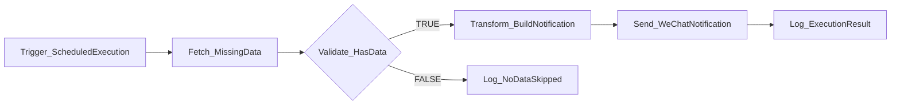

# MJ n8n Workflow Documentation Generator

## Overview

本技能为 n8n 工作流生成 README.md 和 CHANGELOG.md 文档。通过读取项目文档模板并分析 `_base/` 目录下的 workflow.json 模板，自动填充 9 个 README 章节和初始 CHANGELOG 条目。输出文件保存在 workflow.json 同级目录中。

## Prerequisites

- `workflow.json` 模板已存在于 `n8n/workflows/_base/{Category}/{Name}-{TriggerType}/`
- 了解工作流的业务场景、节点结构和触发方式

## Workflow

```text
Step 1: 读取项目文档模板
    ↓
Step 2: 分析 workflow.json 模板
    ↓
Step 3: 填充 README.md（9 个章节）
    ↓
Step 4: 填充 CHANGELOG.md（初始版本）
    ↓
Step 5: 写入文件
```

---

## Step 1 — 读取项目文档模板

加载以下两个模板文件，作为文档结构的基础：

- `n8n/_templates/TEMPLATE_WORKFLOW_README.md` — Quick Reference + 9 个编号章节 README 模板（Quick Reference, 概述, 架构设计, 配置说明, 使用指南, 监控, 故障排查, 依赖项, 相关工作流, 变更历史）
- `n8n/_templates/TEMPLATE_WORKFLOW_CHANGELOG.md` — Keep a Changelog 格式模板

---

## Step 2 — 分析 workflow.json 模板

从 `n8n/workflows/_base/{Category}/{Name}-{TriggerType}/workflow.json` 提取以下信息：

| 提取项 | JSON 路径 | 用途 |
|--------|-----------|------|
| 节点列表 | `nodes[*].name`, `nodes[*].type` | 节点说明表、流程图 |
| 节点连接 | `connections` | Mermaid 流程图生成 |
| 凭据依赖 | `nodes[*].credentials` | 配置说明、依赖项 |
| 触发器类型 | 首个节点的 `type`（`scheduleTrigger` / `postgresTrigger` / `webhook` / `manualTrigger`） | Quick Reference、使用指南 |
| 触发器参数 | 触发器节点的 `parameters` | 配置说明（Cron 表达式、表名等） |
| API 端点 | HTTP Request 节点的 `parameters.url` | 依赖项、配置说明 |
| 标签信息 | `tags[*].name` | Quick Reference |
| 数据流 | `connections` 对象的链式关系 | 架构设计中的数据流描述 |

---

## Step 3 — 填充 README.md

基于模板结构填充所有章节。各章节内容来源：

| 章节 | 内容来源 |
|------|---------|
| Quick Reference | 工作流元数据：名称模式、Category、触发类型、凭据、标签 |
| 概述（目的 / 主要功能 / 业务价值 / 适用范围） | 从节点组合和 API 端点推断业务逻辑；不足时触发 H1 |
| 架构设计（流程图 / 节点说明 / 数据流） | Mermaid flowchart + 节点描述表（见下文生成规则） |
| 配置说明（前置条件 / 凭证 / 环境变量 / 参数） | 凭据列表（`Postgres-MJ-DataWarehouse` 等）、触发器参数、HTTP 超时 |
| 使用指南（触发方式 / 预期行为 / 边界情况 / 执行频率） | 触发器配置、节点链中的 IF 分支逻辑 |
| 监控（健康检查 / 关键指标 / 告警） | 基于节点类型的通用指标（执行成功率、执行时长、漏执行次数） |
| 故障排查（常见问题 / 日志查看 / 调试模式） | 按节点类型生成典型故障（HTTP 超时、DB 连接失败、空数据） |
| 依赖项（服务依赖 / 外部依赖） | MJ System API 端点、PostgreSQL、企业微信 Webhook |
| 相关工作流 | 同 Category 下的上下游工作流关系 |
| 变更历史 | 链接至 `CHANGELOG.md`，初始版本条目 |

### Mermaid 流程图生成规则

基于 workflow.json 的 `connections` 对象，生成 Mermaid flowchart：

1. 遍历 `connections` 获取所有节点间的连接关系
2. 根据节点 `type` 选择形状：
   - IF 节点（`n8n-nodes-base.if`）：使用菱形 `{...}`
   - 其他节点：使用方框 `[...]`
3. IF 节点的两条输出分支标注 `|TRUE|` 和 `|FALSE|`
4. 使用 `flowchart LR` 横向布局

**生成示例**：



**节点数 > 10 时**：考虑使用 `subgraph` 按层分组（触发层、处理层、输出层、错误处理层），或触发 H2 询问用户偏好。

### 节点说明表格式

| 序号 | 节点名称 | 节点类型 | 功能描述 |
|------|---------|---------|---------|
| 1 | `{node.name}` | `{node.type 可读名称}` | 从节点 parameters 推断的功能说明 |

节点类型映射参考：
- `n8n-nodes-base.httpRequest` → HTTP Request
- `n8n-nodes-base.postgres` → PostgreSQL 查询
- `n8n-nodes-base.postgresTrigger` → PostgreSQL Trigger
- `n8n-nodes-base.scheduleTrigger` → Schedule Trigger
- `n8n-nodes-base.if` → IF 条件判断
- `n8n-nodes-base.code` → Code 节点
- `n8n-nodes-base.manualTrigger` → Manual Trigger

---

## Step 4 — 填充 CHANGELOG.md

基于模板创建初始版本条目：

```markdown
# 变更日志 — {Name}-{TriggerType}

本文档记录 `{Name}-{TriggerType}` 工作流的所有重要变更。

格式基于 [Keep a Changelog](https://keepachangelog.com/zh-CN/1.1.0/)，
版本号遵循 [语义化版本 (Semantic Versioning)](https://semver.org/lang/zh-CN/)。

> **版本号约定**:
> - **主版本号 (MAJOR)**: 不兼容的结构性变更
> - **次版本号 (MINOR)**: 向后兼容的功能新增
> - **修订号 (PATCH)**: 向后兼容的问题修复

---

## [Unreleased]

---

## [0.1.0] - {today's date, YYYY-MM-DD}

> 初始版本

### Added（新增）

- 初始工作流创建
- {从节点列表提取的关键功能点，每个一行}
- {触发类型和频率说明}

### Technical Details（技术细节）

- **n8n 版本**: 2.10.0+
- **节点数量**: {workflow.json 中 nodes 数组长度}
- **触发方式**: {TriggerType 中文名}
- **依赖凭据**: {从 nodes credentials 中提取}
- **工作流文件**: `n8n/workflows/_base/{Category}/{Name}-{TriggerType}/workflow.json`

---

## 版本历史总览

| 版本 | 发布日期 | 变更类型 | 摘要 | 作者 |
|------|---------|---------|------|------|
| 0.1.0 | {today's date} | 初始发布 | {一句话摘要} | MJ Team |
```

---

## Step 5 — 写入文件

将生成的文档写入 `_base/{Category}/{Name}-{TriggerType}/` 目录：

- `README.md`
- `CHANGELOG.md`

写入前检查文件是否已存在 —— 若已存在，触发 H3。

---

## 人工交互节点

| # | 触发条件 | 行为 |
|---|---------|------|
| H1 | 无法从 workflow.json 推断出充分的业务描述（如节点全是通用名称，无明确 API 端点） | 询问："请描述这个工作流的业务场景和预期行为，例如：定时检查缺失数据并发送企业微信通知" |
| H2 | 节点数 > 10，Mermaid 图可能过长 | 询问："此工作流有 {N} 个节点，流程图是否需要按层分组（subgraph）还是保持完整展示？" |
| H3 | 目标目录中 README.md 或 CHANGELOG.md 已存在 | 展示变更 diff，询问："文档已存在，是否覆盖更新？请确认。" |

---

## 输出与交接

文档生成完成后，输出以下摘要：

```
文档创建完成 ✓
  路径：
    n8n/workflows/_base/{Category}/{Name}-{TriggerType}/README.md
    n8n/workflows/_base/{Category}/{Name}-{TriggerType}/CHANGELOG.md
  README 章节：Quick Reference + 9 个编号章节（概述, 架构设计, 配置说明, 使用指南, 监控, 故障排查, 依赖项, 相关工作流, 变更历史）
  CHANGELOG 版本：v0.1.0 (初始版本)
下一步：使用 /mj-n8n-render 渲染并验证所有环境。
```

---

## 现有文档参考

生成文档时，参考以下已有工作流 README 的风格和详细程度：

- `n8n/workflows/_base/CollectionNodes/MissingDataNotification-Schedule/README.md` — Schedule 触发、PostgreSQL 查询 + 企业微信通知模式
- `n8n/workflows/_base/CollectionNodes/RawDataCollection-Scheduled/README.md` — Scheduled 触发、多服务编排模式（含 subgraph 分组）

关键风格要求：
- 章节标题使用中文（括号内附英文），如 `## 架构 (Architecture)`
- 节点说明按序号列出，每个节点独立的 `####` 子标题
- SQL 查询、JSON 示例使用代码块完整展示
- Mermaid 图使用 `flowchart LR` 格式
- 文档末尾包含文档版本和最后审核日期

---

## Reference Files

- `n8n/_templates/TEMPLATE_WORKFLOW_README.md` — README 文档模板（Quick Reference + 9 个编号章节）
- `n8n/_templates/TEMPLATE_WORKFLOW_CHANGELOG.md` — CHANGELOG 文档模板（Keep a Changelog 格式）
- `docs/infrastructure/n8n/[STANDARD]_N8N_Workflow_Naming_Convention.md` — 工作流命名规范
- `docs/rule/[STANDARD]_N8N_Workflow_Generation_Convention.md` — 工作流生成规范
