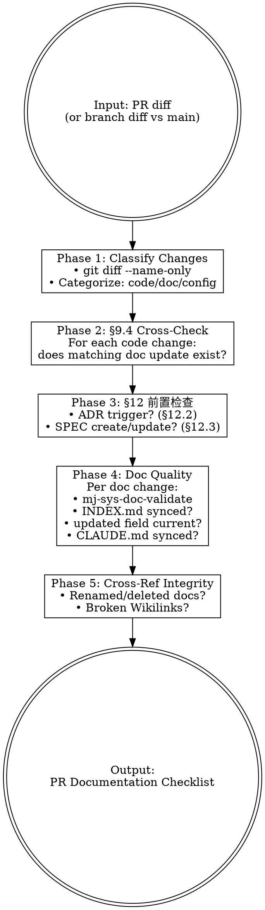

# MJ Documentation Review

## Overview

PR-scope quality gate — verifies that a PR satisfies all Framework v5.0 documentation requirements (§9.3). Distinct from `mj-sys-doc-validate` which checks individual files; this skill checks the PR holistically.

## Workflow



## Phase 1: Classify Changes

```bash
git diff --name-only main...HEAD
```

Categorize each changed file:
- **Code**: `src/`, `main.py`, `scripts/`
- **SQL**: `sql/`
- **Config**: `docker-compose*.yml`, `.env`, `.github/workflows/`
- **Docs**: `docs/`, `README.md`, `CONTRIBUTING.md`, `CLAUDE.md`

## Phase 2: §9.4 Cross-Check

For each code/config change, check if a corresponding doc update exists in the PR. Use the code-doc-mapping from `mj-sys-doc-sync` skill as reference. Flag missing doc updates.

## Phase 3: §12 前置検査

Check if PR triggers ADR/SPEC requirements (see quality-gate.md for full conditions):

- **ADR** (§12.2): New endpoint/service/pipeline, arch change, DB schema change, CI/CD change, cross-project change
- **SPEC new** (§12.3): New interface, new DB table, new user-visible capability
- **SPEC update**: Bug fix changing interface/model/process

## Phase 4: Doc Quality

For each documentation change in the PR:
1. Run `mj-sys-doc-validate` on the file
2. Check: new docs indexed in INDEX.md?
3. Check: modified docs have updated `updated` field (if substantive)?
4. Check: CLAUDE.md synced per §8.2 mapping?

## Phase 5: Cross-Reference Integrity

1. Any renamed/deleted docs? Search for stale Wikilinks
2. Scan changed doc files for broken internal links

## Output Format

```markdown
## PR Documentation Review

### §9.3 Quality Gate
- [x] YAML frontmatter complete (A1) — N/N docs pass
- [x] Filenames compliant (A2)
- [ ] INDEX.md updated — {specific issue}
- [x] CLAUDE.md synced
- [x] `updated` dates current

### §12 Pre-Check
- [x] No ADR trigger detected
- [ ] SPEC update needed — {specific issue}

### Cross-References
- [x] No broken Wikilinks detected

### Per-File Validation
| File | A1 | A2 | A3 | A4 | A5 | A6 | OB1-5 | Notes |
|------|----|----|----|----|----|----|----- -|-------|
| doc1.md | PASS | PASS | PASS | PASS | SKIP | SKIP | PASS | — |

### Review Semantics
- `FAIL` — blocks merge
- `WARN` — requires reviewer comment but does not block
- `SKIP` — acceptable when check is not applicable (e.g., A6 outside PR mode)
```

## REQUIRED SUB-SKILL

`mj-sys-doc-validate` — For per-file checks within Phase 4.

## Reference Files

- **quality-gate.md** — §9.3 checklist, §12 trigger conditions, quick reference mapping
