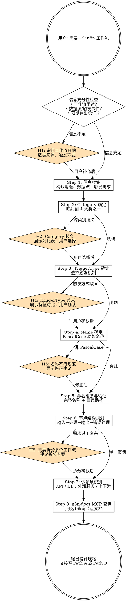

# MJ n8n Workflow Planner

## Overview

本技能处理 n8n 工作流生命周期的**第一步** —— 需求分析、命名规范校验和结构规划。产出设计规格，供后续技能使用：

- **Path A**（UI 导出转换）：使用 `/mj-sys-n8n-template` 将 n8n UI 导出的 JSON 转为标准模板
- **Path B**（从零生成）：使用 `/mj-sys-n8n-author` 自动构建 workflow JSON

## Prerequisites

无（本技能是入口技能）。

## Workflow



## 信息充分性检查

在开始规划前，检查用户是否已提供以下信息。若缺失，触发 H1 询问。

| 信息项 | 说明 | 示例 |
|--------|------|------|
| 工作流用途 | 要解决什么问题？自动化什么任务？ | "定时检查缺失数据并发送通知" |
| 数据源/触发事件 | 什么触发这个工作流？数据从哪里来？ | "数据库 INSERT 事件"、"每天 9 点" |
| 预期输出/动作 | 执行后产生什么结果？ | "发送企业微信通知"、"调用 API 加载数据" |

---

## Step 1 — 信息收集

确认以下内容（用户已提供则跳过）：

1. **业务目的**：这个工作流要解决什么业务问题？
2. **数据流**：数据从哪里来、到哪里去？涉及哪些 MJ System 服务？
3. **触发需求**：何时/什么事件触发执行？执行频率？
4. **通知需求**：是否需要发送通知？通知渠道（企业微信）？
5. **上下游关系**：是否依赖或被其他工作流依赖？

---

## Step 2 — Category 确定

根据工作流功能映射到 4 个类别之一。完整对照表见 `→ naming-reference.md`。

**快速判断规则**：

| 功能特征 | Category | 缩写 |
|----------|----------|------|
| 数据收集（邮件、下载、API 抓取）| CollectionNodes | cn |
| 监控告警（缺失检查、状态通知）| CollectionNodes | cn |
| 数据处理（ETL、转换、加载）| ProcessingNodes | pn |
| 系统维护（健康检查、清理）| ServiceNodes | sn |
| 批量调度（定期批处理任务）| TaskNodes | tn |

**歧义判断**：若工作流同时涉及"收集"和"处理"，以**主要功能**为准：
- 侧重**获取**数据 → CollectionNodes
- 侧重**加工/写入**数据 → ProcessingNodes

若仍无法判断，触发 H2。

---

## Step 3 — TriggerType 确定

根据触发需求选择触发类型。完整对照表见 `→ naming-reference.md`。

| TriggerType | n8n 节点 | 适用场景 |
|-------------|----------|---------|
| Schedule | `scheduleTrigger` (Cron) | 每天固定时间点执行（如 9:00, 18:00） |
| Scheduled | `scheduleTrigger` (Interval) | 固定间隔执行（如每 30 分钟）。**注意**：新建工作流推荐使用 `Schedule`，`Scheduled` 仅为历史兼容 |
| DBTrigger | `postgresTrigger` | 数据库表 INSERT 事件驱动 |
| Webhook | `webhook` | HTTP 请求触发 |
| Manual | `manualTrigger` | 仅手动执行（开发/调试用） |

**选择依据**：

```text
触发需求是什么？
├── 需要定时执行？
│   ├── 特定时间点（如 9:00, 18:00）→ Schedule (Cron)
│   └── 固定间隔（如每 30 分钟）→ Scheduled (Interval) 或 Schedule (Cron)
├── 数据库事件驱动？
│   └── 某表有 INSERT → DBTrigger
├── 外部系统调用？
│   └── HTTP 请求触发 → Webhook
└── 仅人工操作？
    └── Manual
```

若用户对 Schedule 和 DBTrigger 犹豫不决，触发 H4。

---

## Step 4 — Name 确定

构建 PascalCase 功能名称。

**命名规则**：
- 使用 **PascalCase**（大驼峰）
- 简洁描述核心功能，2-4 个单词
- **避免**冗余词：`Workflow`、`Process`、`Job`、`Task`
- **避免**缩写：使用 `Notification` 而非 `Notif`、使用 `Collection` 而非 `Col`
- 多个单词直接连接，不使用分隔符

**现有命名参考**：

| Name | 功能 |
|------|------|
| `MissingDataNotification` | 缺失数据通知 |
| `RawDataArchiveNotification` | 原始数据归档通知 |
| `RawDataCollection` | 原始数据收集 |
| `DataLoader` | 数据加载 |

若用户提供的名称不符合 PascalCase，触发 H3 提供修正建议。

---

## Step 5 — 命名组装与验证

将 Step 2-4 的结果组装为完整命名，并验证。

### 组装

```
工作流全名: {ENV}-{Category}-{Name}-{TriggerType}
模板目录:   n8n/workflows/_base/{Category}/{Name}-{TriggerType}/
模板文件:   n8n/workflows/_base/{Category}/{Name}-{TriggerType}/workflow.json
Workflow ID: wf_{category_abbr}_{name_abbr}_{seq}
```

### 验证清单

| 检查项 | 规则 | 示例 |
|--------|------|------|
| Name 是否 PascalCase | 每个单词首字母大写 | `MissingDataNotification` |
| Name 无冗余词 | 不含 Workflow/Process/Job | -- |
| TriggerType 在允许列表内 | Schedule/Scheduled/DBTrigger/Webhook/Manual | `Schedule` |
| Category 在允许列表内 | CollectionNodes/ProcessingNodes/ServiceNodes/TaskNodes | `CollectionNodes` |
| 目录不与现有冲突 | glob 检查 `_base/{Category}/{Name}-{TriggerType}/` | 无重复 |

验证通过后，使用 glob 检查目标目录是否已存在：

```
n8n/workflows/_base/{Category}/{Name}-{TriggerType}/
```

若已存在，告知用户该工作流模板已存在，询问是修改还是新建。

---

## Step 6 — 节点结构规划

规划工作流的节点组成，遵循标准四层结构：

### 四层结构

```text
[1. 输入层]          触发器节点
      ↓
[2. 处理层]          核心逻辑节点（HTTP Request, PostgreSQL, Code, IF）
      ↓
[3. 输出层]          通知、日志、数据写入
      ↓
[4. 错误处理层]      IF FALSE 分支 → Log 节点
```

### 节点组合决策树

```text
工作流需要什么？
├── 调用 MJ System API？
│   └── HTTP Request → Validate_*Response (IF) → Log_*Error (False)
├── 直接查询数据库？
│   └── Postgres 查询 → Validate_QueryResults (IF) → Log_NoDataFound (False)
├── 需要企业微信通知？
│   └── Transform_Build* (Code) → Send_WeChatNotification (HTTP)
└── 所有工作流必须有
    └── Log_ExecutionResult (Code) 作为终结节点
```

### 节点命名模式

节点使用 `{Action}_{Target}` 格式。常用 Action 参考：

| Action | 适用场景 | 示例 |
|--------|---------|------|
| Trigger | 触发器 | `Trigger_ScheduledDataCheck` |
| Execute | API 调用 | `Execute_AutoEmailCollector` |
| Fetch | 数据查询 | `Fetch_MissingDataReport` |
| Validate | 条件验证 | `Validate_CollectorResponse` |
| Filter | 数据筛选 | `Filter_DataType` |
| Transform | 数据转换 | `Transform_BuildMarkdownTable` |
| Send | 发送通知 | `Send_WeChatNotification` |
| Log | 日志记录 | `Log_ExecutionResult` |
| Check | 状态检查 | `Check_ServiceHealth` |
| Build | 构建内容 | `Build_NotificationPayload` |
| Format | 格式化 | `Format_ReportData` |

若需求过于复杂（节点超过 10 个或涉及多种不相关功能），触发 H5 建议拆分。

---

## Step 7 — 依赖项识别

识别工作流运行所需的外部依赖：

### API 端点

MJ System 内部 API 地址格式：`http://mj-app:8000/{service-prefix}/{endpoint}`

| 服务 | 路由前缀 | 常用端点 |
|------|---------|---------|
| AutoEmailCollector | `/auto-email-collector` | `POST /collect` |
| DataQualityValidator | `/data-quality-validator` | `POST /process` |
| StageAreaCleaner | `/stage-area-cleaner` | `POST /clean` |
| QueryVolumeLoader | `/query-volume-loader` | `POST /load` |
| QueryCommonMetrics | `/query-common-metrics` | `POST /calculate` |
| FileCleaner | `/file-cleaner` | `POST /clean` |

### 数据库凭据

- PostgreSQL: `Postgres-MJ-DataWarehouse`（credential `id` 在模板中为 `"PLACEHOLDER"`）

### 外部服务

- 企业微信 Webhook: `{{WECHAT_WEBHOOK_URL}}`

### 上下游工作流

检查是否存在依赖关系：
- **上游**：哪个工作流的输出触发本工作流？（如 DQV 分发完成 → 触发 DataLoader）
- **下游**：本工作流完成后是否触发其他工作流？

---

## Step 8 — n8n-docs MCP 查询（可选）

当需要确认 n8n 节点的具体配置参数或 API 时，使用 MCP 工具查询：

```
mcp__n8n-docs__search_n8n_knowledge_sources
```

**典型查询场景**：
- 确认触发器节点的参数结构（如 postgresTrigger 的 schema/tableName 配置）
- 查询特定节点的 typeVersion 及其行为差异
- 了解新节点类型的可用参数

此步骤非必须 —— 若基于现有模板（Step 6 节点库）即可满足需求，可跳过。

---

## 人工交互节点

在以下时机暂停并询问用户。若用户已在原始请求中提供了足够信息，跳过对应节点。

| # | 触发条件 | 行为 |
|---|---------|------|
| H1 | 用户未说明工作流用途 | 询问："这个工作流要解决什么问题？处理什么数据？触发方式是什么？" |
| H2 | Category 有歧义（功能跨类别） | 展示 `naming-reference.md` 中的 Category 对比表，请用户选择 |
| H3 | Name 不符合 PascalCase 或含冗余词 | 展示修正后的名称建议，说明命名规则 |
| H4 | TriggerType 选择有歧义 | 展示各类型特征和适用场景，请用户确认 |
| H5 | 需求涉及多个不相关功能 | 建议拆分为多个工作流，展示各工作流的职责范围 |

---

## 输出与交接

规划完成后，输出以下设计规格摘要：

```
设计完成 ✓
  工作流名称：{ENV}-{Category}-{Name}-{TriggerType}
  Workflow ID：wf_{category_abbr}_{name_abbr}_{seq}
  模板目录：n8n/workflows/_base/{Category}/{Name}-{TriggerType}/
  节点结构：{简要节点流描述}
  依赖项：{已识别的依赖项}
  标签：{env:*, trigger:*, domain:*, ...}

下一步（选择一条路径）：
  Path A — 已在 n8n UI 中完成设计？使用 /mj-sys-n8n-template 将导出 JSON 转为模板。
  Path B — 需要从零生成？使用 /mj-sys-n8n-author 自动构建 workflow JSON。
```

---

## Examples

### 示例 1：定时检查缺失数据并发送通知

**用户输入**："我需要一个定时检查缺失数据并发送通知的工作流"

**规划结果**：

| 项目 | 结果 |
|------|------|
| Category | CollectionNodes（主功能是监控/通知） |
| Name | `MissingDataNotification` |
| TriggerType | `Schedule`（定时执行） |
| 完整名称 | `{ENV}-CollectionNodes-MissingDataNotification-Schedule` |
| Workflow ID | `wf_cn_missnotif_01` |
| 模板目录 | `n8n/workflows/_base/CollectionNodes/MissingDataNotification-Schedule/` |
| 节点结构 | Trigger → Fetch_MissingDataReport (Postgres) → Validate_QueryResults (IF) → Transform_BuildMarkdownTable (Code) → Send_WeChatNotification (HTTP) → Log_ExecutionResult (Code) |
| 依赖项 | PostgreSQL (`ops_dwd` schema), 企业微信 Webhook |

### 示例 2：数据文件到达后自动触发数据加载

**用户输入**："数据文件到达后自动触发数据加载"

**规划结果**：

| 项目 | 结果 |
|------|------|
| Category | ProcessingNodes（主功能是数据加载/处理） |
| Name | `DataLoader` |
| TriggerType | `DBTrigger`（数据库事件驱动） |
| 完整名称 | `{ENV}-ProcessingNodes-DataLoader-DBTrigger` |
| Workflow ID | `wf_pn_dl_01` |
| 模板目录 | `n8n/workflows/_base/ProcessingNodes/DataLoader-DBTrigger/` |
| 节点结构 | Trigger_DataFileChange (postgresTrigger) → Validate_InputData (IF) → Execute_DataLoader (HTTP) → Validate_LoaderResponse (IF) → Log_ExecutionResult (Code) |
| 依赖项 | PostgreSQL trigger on `ops_dwd.dwd_dqv_distributed_file`, MJ System API `/query-volume-loader/load` |

---

## Reference Files

- **naming-reference.md** — Category/TriggerType/Tag 完整查询表、节点命名规范、API 地址规范、超时参考
- **`docs/infrastructure/n8n/[STANDARD]_N8N_Workflow_Naming_Convention.md`** — 工作流命名规范（权威文档）
- **`docs/rule/[STANDARD]_N8N_Workflow_Generation_Convention.md`** — 工作流生成规范（Flow A / Flow B 完整清单）
