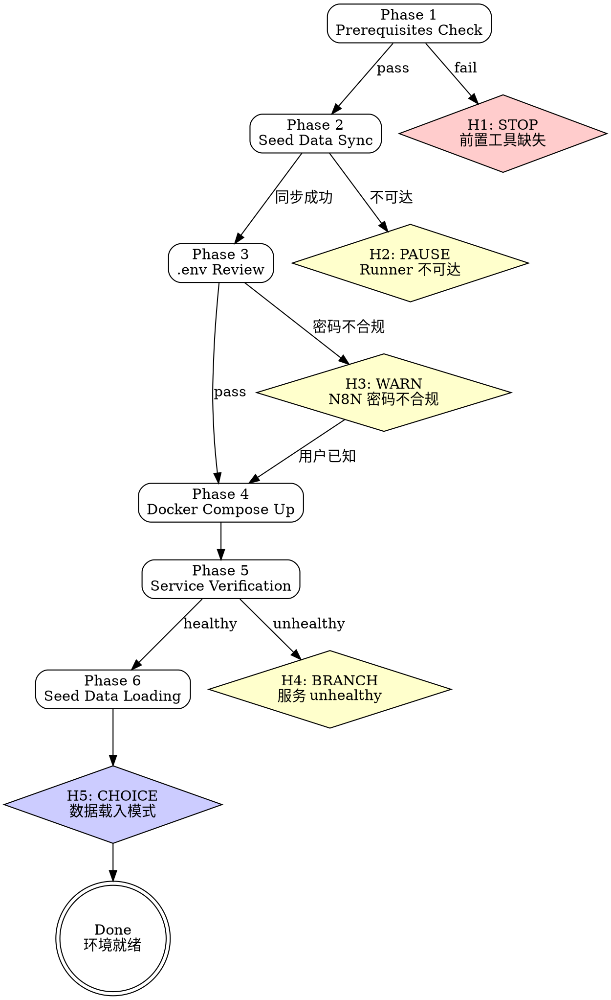

# MJ Env Setup

## Overview

引导完成 MJ System 本地开发环境全栈搭建：Docker 容器启动 → 数据库初始化 → n8n 自动配置 → 种子数据加载。面向新人入职场景设计，每个阶段都有明确的检查点和错误处理。

**范围**：Docker 全栈（mj-app + mj-postgres + mj-n8n + 两个 init 容器），含 Seed Data 完整冷启动。

**互补 skill**：环境清除使用 `mj-sys-ops-env-teardown`。

## 前置条件

- Docker Desktop >= 20.10（含 Docker Compose V2）
- Git
- 磁盘可用空间 >= 20 GB
- 内网或 VPN 可访问 Runner 服务器 192.168.0.126（用于同步种子数据）

## 快速开始（交互模式）

用户触发此技能时，先判断已有信息是否充足，再决定直接执行还是追问。

| 已知信息 | 行动 |
|---------|------|
| 用户说"搭建环境"但未说明进度 | 从 Phase 1 开始完整执行 |
| 用户说"容器起来了但数据库没数据" | 跳到 Phase 6（Seed Data Loading） |
| 用户说"docker compose up 失败" | 先检查 Phase 1 前置条件，再查 troubleshooting.md |
| 用户说"上次 Level 3 清理了，需要重建" | 从 Phase 2 开始（需重新同步 + build） |
| 用户已有 .env 且 Docker 正常 | 跳到 Phase 4 或 Phase 6 |

---

## Main Workflow



### Phase 1: Prerequisites Check

检查前置工具是否就绪。这一步很重要——前置条件缺失会导致后续步骤出现难以诊断的错误（例如缺少 Docker Compose V2 会导致 `docker compose` 命令不识别）。

```bash
# Docker 版本（需 >= 20.10）
docker --version

# Docker Compose V2（需内置于 docker CLI）
docker compose version

# Git
git --version

# 磁盘空间（需 >= 20 GB 可用）
# Windows:
powershell -c "Get-PSDrive C | Select-Object Free"
# macOS/Linux:
df -h .
```

- **[H1] Hard Block**: 任一工具缺失或版本不满足 → 阻断，提示安装方法，不继续。

### Phase 2: Seed Data Sync

从 Runner 服务器同步种子数据到本地。这一步必须在 Docker Up 之前执行，因为 `.env` 文件（含数据库凭据和 n8n 密码）来自 Runner——没有它 Docker Compose 启动会失败。

- **[H2] Conditional**: 检查 Runner 192.168.0.126 是否可达

```bash
# 检查网络可达性
ping -c 1 192.168.0.126    # macOS/Linux
ping -n 1 192.168.0.126    # Windows
```

- 可达 → 执行同步：
```bash
# Linux/macOS（需 rsync）
./scripts/sync-seed-data.sh
# 同步内容：.env + data/（含 seed/ 种子数据）+ staging_area/

# Windows 备选（rsync 通常不可用，使用 scp 替代）
scp mingjian@192.168.0.126:/opt/mj-seed-data/.env .env
scp -r mingjian@192.168.0.126:/opt/mj-seed-data/data/ data/
scp -r mingjian@192.168.0.126:/opt/mj-seed-data/staging_area/ staging_area/
```

> WHY 提供 scp 备选：Windows 上 rsync 几乎不存在（需额外安装），而 scp 通过 Git for Windows 自带的 OpenSSH 即可使用。先尝试 `sync-seed-data.sh`，若报 `rsync: command not found` 则自动切换到 scp 方式。

- 不可达 → 暂停，提示：需要 VPN 或内网访问权限才能连接 Runner 服务器。

### Phase 3: .env Review & Customize

检查同步来的 `.env` 是否存在，并引导自定义。`.env` 控制所有容器的配置——数据库连接、n8n 账号、邮件服务等。

```bash
# 确认 .env 存在
ls -la .env
```

- **[H3] Warning**: 检查 `N8N_OWNER_PASSWORD` 是否满足要求（8-64 字符，含大写字母 + 数字）。不合规的密码会导致 `mj-n8n-setup` 容器注册失败。

**N8N_OWNER_PASSWORD 检查方式**（`.env` 含敏感信息，Read/Grep 工具可能被权限设置阻止）：

```bash
# 尝试用 Bash 命令检查（不暴露密码值）
N8N_PASS=$(grep -oP 'N8N_OWNER_PASSWORD=\K.*' .env 2>/dev/null)
if [ -z "$N8N_PASS" ]; then echo "NOT_FOUND"
elif [ ${#N8N_PASS} -lt 8 ] || [ ${#N8N_PASS} -gt 64 ]; then echo "FAIL_LENGTH"
elif ! echo "$N8N_PASS" | grep -qP '[A-Z]'; then echo "FAIL_NO_UPPERCASE"
elif ! echo "$N8N_PASS" | grep -qP '[0-9]'; then echo "FAIL_NO_DIGIT"
else echo "PASS"; fi
```

若 Bash 命令也被拒绝 → 使用 AskUserQuestion 让用户自行确认密码合规性。

引导用户按需自定义（大部分变量使用 Runner 同步的默认值即可）。详见 `env-reference.md` 获取完整变量清单。

### Phase 4: Docker Compose Up

在当前 worktree 目录下启动 Docker 全栈。

```bash
docker compose up -d --build
```

**预期行为**：
- 5 个容器启动：`mj-system-app`、`mj-system-postgres`、`mj-system-n8n`、`mj-system-n8n-import`、`mj-system-n8n-setup`
- `mj-n8n-import`（导入 workflow 种子）和 `mj-n8n-setup`（注册 Owner + 配置凭据）完成后**自动退出**，属正常行为
- 预计等待 ~45 秒完成全部初始化

### Phase 5: Service Verification

验证所有服务是否正常运行。这一步能发现 Phase 4 中的隐性问题（如数据库 init 脚本失败、端口冲突等）。

```bash
# 容器状态（3 个应为 running，2 个 init 容器 exited 0）
docker ps -a --format "table {{.Names}}\t{{.Status}}\t{{.Ports}}"

# App 健康检查
curl http://localhost:8000/health

# 数据库 Schema 验证（应有 ops_ods, ops_dwd, ops_dws, biz_ods, biz_dwd, biz_dws 等 schema）
docker exec mj-system-postgres psql -U admin -d mj_system_db -c "\dn"

# n8n Web UI
# 浏览器访问 http://localhost:5678
```

- **[H4] Conditional**: 任一服务 unhealthy → 引导到 `troubleshooting.md` 排查。

### Phase 6: Seed Data Loading + End-to-End Verification

加载业务数据到数据库。分两步：先加载维度表（所有模式必需），再选择 ODS 数据载入模式。

**Step 1 — 加载维度表**（必须）：
```bash
uv run python scripts/biz_dim_cold_start.py
# 加载 biz_dwd.dwd_dim_product_interface + biz_dwd.dwd_dim_institution
```

> WHY 使用 `uv run python`：Windows 上 `python` 可能指向 Windows Store stub（exit code 49），`uv run python` 使用项目虚拟环境，确保依赖可用。

**Step 2 — [H5] Choice: 数据载入模式选择**（AskUserQuestion）：

| 模式 | 命令 | 耗时 | 数据量 | 适用场景 |
|------|------|------|--------|---------|
| 热启动 | 跳过 ODS 加载 | 0 | 已有数据 | Docker volume 未清除，数据库已有历史数据 |
| 部分载入（推荐新人） | `uv run python scripts/biz_ods_cold_start.py --part` | ~5 min | ~7.5 MB | 首次搭建、快速验证功能 |
| 全量载入 | `uv run python scripts/biz_ods_cold_start.py` | ~30 min | ~250 MB | 需要完整数据做测试/分析 |

**Step 3 — 验证数据入库**（通过 `mcp__postgres-dev__query` 执行）：
```sql
SELECT COUNT(*) FROM biz_dwd.dwd_qvl_downstream_query;
```

> 如 DWD 表为空，ODS 数据需经过 ETL 处理后才会出现在 DWD。可使用 `mj-sys-ops-etl-ods-to-dwd` skill 手动触发 ETL。

---

## 人工介入场景

| ID | 类型 | 触发条件 | 行为 |
|----|------|---------|------|
| **H1** | Hard Block | 前置工具缺失（Docker/Git/磁盘） | 阻断，提示具体安装方法 |
| **H2** | Conditional | Runner 192.168.0.126 不可达 | 暂停，提示获取 VPN/内网访问权限 |
| **H3** | Warning | N8N_OWNER_PASSWORD 不合规 | 警告但可继续（用户知晓风险） |
| **H4** | Conditional | 服务 unhealthy | 引导到 troubleshooting.md 排查 |
| **H5** | Choice | Phase 6 数据载入 | AskUserQuestion：热启动 / 部分载入 / 全量载入 |

---

## Handoff

搭建完成后输出：

```
环境搭建完成 ✓

服务地址：
  App:      http://localhost:8000 (Swagger: /docs, ReDoc: /redoc)
  n8n:      http://localhost:5678
  Postgres: localhost:5432 (mj_system_db)

下一步：
  - 如 DWD 表为空，使用 mj-sys-ops-etl-ods-to-dwd 手动触发 ODS→DWD ETL
  - 如需 DWS 指标，再使用 mj-sys-ops-etl-dwd-to-dws 触发 DWD→DWS
  - 关闭/清理环境使用 mj-sys-ops-env-teardown
```

---

## 示例

### 示例 1：全新入职（完整流程）

```
用户：我是新来的开发，刚 clone 了项目，怎么把环境跑起来？
→ 从 Phase 1 开始，逐步执行 Phase 1-6
→ Phase 6 推荐"部分载入"模式
→ 完成后展示 Handoff 消息
```

### 示例 2：Level 3 清理后重建

```
用户：上次 Level 3 清理了环境，现在需要重新搭建
→ Phase 1 前置条件应已满足（跳过工具安装提示）
→ Phase 2 重新同步种子数据
→ Phase 3-6 完整执行
```

### 示例 3：仅加载种子数据

```
用户：Docker 已经跑着了，但数据库里没有业务数据
→ 跳到 Phase 6
→ 先运行 biz_dim_cold_start.py 加载维度表
→ 询问 ODS 载入模式
→ 完成后提示使用 ETL skill 触发数据转换
```

## 支撑文件

- **`env-reference.md`** — .env 变量完整清单 + 分组说明 + 格式要求（Phase 3 参考）
- **`troubleshooting.md`** — 8 个常见问题的 症状→原因→诊断→修复（H4 引导目标）
